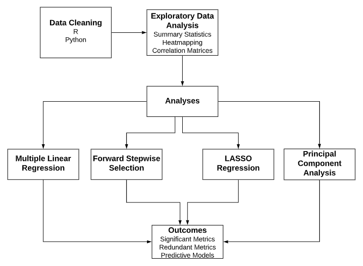

# CMU Capstone: Systems Synthesis Project

As part of the final semester of my Master in Information Systems Management (MISM) program at Carnegie Mellon University, I was placed randomly in a group and assigned a real-world client to work with on a data-heavy project. Our client was the healthcare company Highmark, who asked us to use their data to evaluate the performance of their "pay-for-value" arrangement between insurers and providers (see [the proposal document](<Highmark Inc. Proposal.docx>)).

An overview of our findings can be seen in [the poster](<highmark_poster.pdf>), or for more in-depth information check out the [presentation](<highmark_presentation.pdf>).

My role involved primarily data science/machine learning tasks, including tasks and tools such as:

- exploratory data analysis
- visualization with matplotlib/seaborn/etc
- multiple linear regression
- LASSO regression
- dimensionality reduction (using PCA)
- clustering
- statistical evaluation (correlation, significance, etc)

The data and certain other documents have been removed for privacy reasons.