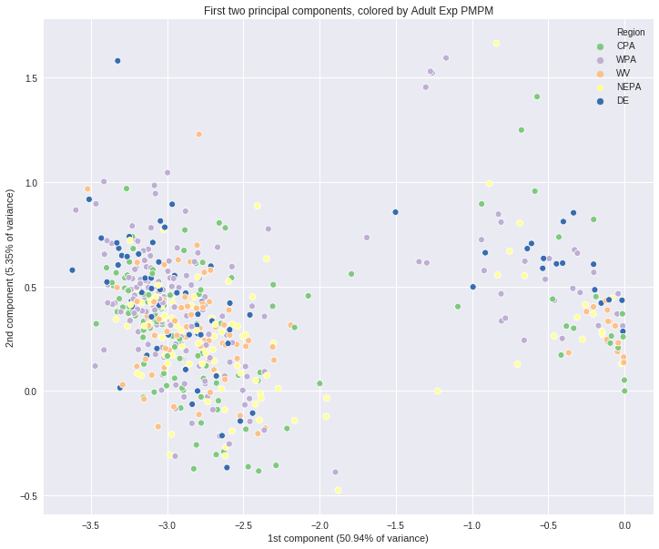
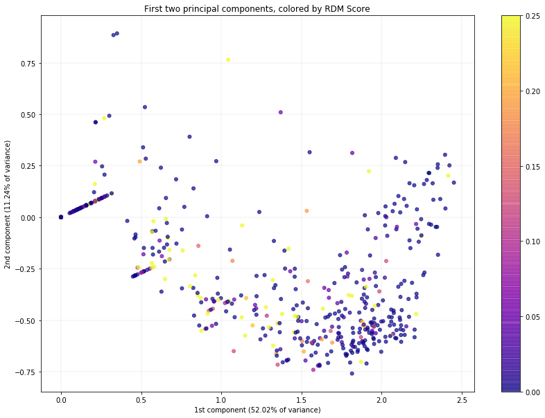

```python
import pandas as pd
import numpy as np
import matplotlib.pyplot as plt
```


```python
pd.options.display.max_rows = 999
pd.options.display.max_columns = 100
```

# Data Cleaning


```python
metrics = pd.read_excel('data/metrics.xlsx')
metrics.head()
```


<div>
<style scoped>
    .dataframe tbody tr th:only-of-type {
        vertical-align: middle;
    }

    .dataframe tbody tr th {
        vertical-align: top;
    }

    .dataframe thead th {
        text-align: right;
    }
</style>
<table border="1" class="dataframe">
  <thead>
    <tr style="text-align: right;">
      <th></th>
      <th>EntityID</th>
      <th>Program</th>
      <th>Region</th>
      <th>Population</th>
      <th>Order</th>
      <th>Class</th>
      <th>ID</th>
      <th>Name</th>
      <th>Weight</th>
      <th>Key_Master</th>
      <th>Denominator</th>
      <th>Numerator</th>
      <th>Trend_Numerator</th>
      <th>Gaps_Population</th>
      <th>Predicted_Numerator</th>
      <th>Observed</th>
      <th>Expected</th>
      <th>Rate</th>
      <th>Min</th>
      <th>Mid</th>
      <th>Max</th>
      <th>Metric</th>
      <th>Points</th>
      <th>Count</th>
      <th>Total_Metrics</th>
      <th>Total_Scored</th>
      <th>Total_Points</th>
      <th>Score</th>
      <th>Total</th>
    </tr>
  </thead>
  <tbody>
    <tr>
      <th>0</th>
      <td>Provider 1</td>
      <td>TP</td>
      <td>WPA</td>
      <td>Adult</td>
      <td>1</td>
      <td>Static</td>
      <td>QN02_3</td>
      <td>Comprehensive Diabetes Care: Medical Attention...</td>
      <td>1.0</td>
      <td>QN02_3</td>
      <td>745.0</td>
      <td>703.0</td>
      <td>NaN</td>
      <td>NaN</td>
      <td>NaN</td>
      <td>NaN</td>
      <td>NaN</td>
      <td>0.94</td>
      <td>0.90</td>
      <td>0.92</td>
      <td>0.97</td>
      <td>0.7</td>
      <td>0.7</td>
      <td>1.0</td>
      <td>17</td>
      <td>11.7</td>
      <td>11.7</td>
      <td>69</td>
      <td>17</td>
    </tr>
    <tr>
      <th>1</th>
      <td>Provider 1</td>
      <td>TP</td>
      <td>WPA</td>
      <td>Adult</td>
      <td>2</td>
      <td>Static</td>
      <td>QN02_4</td>
      <td>Comprehensive Diabetes Care: Eye Exam (retinal...</td>
      <td>1.0</td>
      <td>QN02_4</td>
      <td>745.0</td>
      <td>498.0</td>
      <td>NaN</td>
      <td>NaN</td>
      <td>NaN</td>
      <td>NaN</td>
      <td>NaN</td>
      <td>0.67</td>
      <td>0.52</td>
      <td>0.57</td>
      <td>0.65</td>
      <td>1.0</td>
      <td>1.0</td>
      <td>1.0</td>
      <td>17</td>
      <td>11.7</td>
      <td>11.7</td>
      <td>69</td>
      <td>17</td>
    </tr>
    <tr>
      <th>2</th>
      <td>Provider 1</td>
      <td>TP</td>
      <td>WPA</td>
      <td>Adult</td>
      <td>3</td>
      <td>Static</td>
      <td>QN08</td>
      <td>Breast Cancer Screening</td>
      <td>1.0</td>
      <td>QN08</td>
      <td>1998.0</td>
      <td>1724.0</td>
      <td>NaN</td>
      <td>NaN</td>
      <td>NaN</td>
      <td>NaN</td>
      <td>NaN</td>
      <td>0.86</td>
      <td>0.79</td>
      <td>0.82</td>
      <td>0.86</td>
      <td>1.0</td>
      <td>1.0</td>
      <td>1.0</td>
      <td>17</td>
      <td>11.7</td>
      <td>11.7</td>
      <td>69</td>
      <td>17</td>
    </tr>
    <tr>
      <th>3</th>
      <td>Provider 1</td>
      <td>TP</td>
      <td>WPA</td>
      <td>Adult</td>
      <td>4</td>
      <td>Static</td>
      <td>QN09</td>
      <td>Colorectal Cancer Screening</td>
      <td>1.0</td>
      <td>QN09</td>
      <td>3913.0</td>
      <td>3186.0</td>
      <td>NaN</td>
      <td>NaN</td>
      <td>NaN</td>
      <td>NaN</td>
      <td>NaN</td>
      <td>0.81</td>
      <td>0.68</td>
      <td>0.70</td>
      <td>0.75</td>
      <td>1.0</td>
      <td>1.0</td>
      <td>1.0</td>
      <td>17</td>
      <td>11.7</td>
      <td>11.7</td>
      <td>69</td>
      <td>17</td>
    </tr>
    <tr>
      <th>4</th>
      <td>Provider 1</td>
      <td>TP</td>
      <td>WPA</td>
      <td>Adult</td>
      <td>5</td>
      <td>Static</td>
      <td>QN10</td>
      <td>Cervical Cancer Screening</td>
      <td>1.0</td>
      <td>QN10</td>
      <td>3781.0</td>
      <td>3081.0</td>
      <td>NaN</td>
      <td>NaN</td>
      <td>NaN</td>
      <td>NaN</td>
      <td>NaN</td>
      <td>0.81</td>
      <td>0.77</td>
      <td>0.79</td>
      <td>0.82</td>
      <td>0.7</td>
      <td>0.7</td>
      <td>1.0</td>
      <td>17</td>
      <td>11.7</td>
      <td>11.7</td>
      <td>69</td>
      <td>17</td>
    </tr>
  </tbody>
</table>
</div>


```python
metrics.columns
```


    Index(['EntityID', 'Program', 'Region', 'Population', 'Order', 'Class', 'ID',
           'Name', 'Weight', 'Key_Master', 'Denominator', 'Numerator',
           'Trend_Numerator', 'Gaps_Population', 'Predicted_Numerator', 'Observed',
           'Expected', 'Rate', 'Min', 'Mid', 'Max', 'Metric', 'Points', 'Count',
           'Total_Metrics', 'Total_Scored', 'Total_Points', 'Score', 'Total'],
          dtype='object')


```python
# len(metrics[metrics['Denominator'] > 300])
len(metrics)
```


    38488


```python
data = metrics.copy()
data = data[['EntityID', 'Region', 'Population', 'ID', 'Name', 'Denominator', 'Rate', 'Score']]
data.head()
```


<div>
<style scoped>
    .dataframe tbody tr th:only-of-type {
        vertical-align: middle;
    }

    .dataframe tbody tr th {
        vertical-align: top;
    }

    .dataframe thead th {
        text-align: right;
    }
</style>
<table border="1" class="dataframe">
  <thead>
    <tr style="text-align: right;">
      <th></th>
      <th>EntityID</th>
      <th>Region</th>
      <th>Population</th>
      <th>ID</th>
      <th>Name</th>
      <th>Denominator</th>
      <th>Rate</th>
      <th>Score</th>
    </tr>
  </thead>
  <tbody>
    <tr>
      <th>0</th>
      <td>Provider 1</td>
      <td>WPA</td>
      <td>Adult</td>
      <td>QN02_3</td>
      <td>Comprehensive Diabetes Care: Medical Attention...</td>
      <td>745.0</td>
      <td>0.94</td>
      <td>69</td>
    </tr>
    <tr>
      <th>1</th>
      <td>Provider 1</td>
      <td>WPA</td>
      <td>Adult</td>
      <td>QN02_4</td>
      <td>Comprehensive Diabetes Care: Eye Exam (retinal...</td>
      <td>745.0</td>
      <td>0.67</td>
      <td>69</td>
    </tr>
    <tr>
      <th>2</th>
      <td>Provider 1</td>
      <td>WPA</td>
      <td>Adult</td>
      <td>QN08</td>
      <td>Breast Cancer Screening</td>
      <td>1998.0</td>
      <td>0.86</td>
      <td>69</td>
    </tr>
    <tr>
      <th>3</th>
      <td>Provider 1</td>
      <td>WPA</td>
      <td>Adult</td>
      <td>QN09</td>
      <td>Colorectal Cancer Screening</td>
      <td>3913.0</td>
      <td>0.81</td>
      <td>69</td>
    </tr>
    <tr>
      <th>4</th>
      <td>Provider 1</td>
      <td>WPA</td>
      <td>Adult</td>
      <td>QN10</td>
      <td>Cervical Cancer Screening</td>
      <td>3781.0</td>
      <td>0.81</td>
      <td>69</td>
    </tr>
  </tbody>
</table>
</div>


```python
# look for very low denominators--this will be important later on
gb = adult[adult['Denominator']<100].groupby('ID')
for k in gb.groups.keys():
  group = gb.get_group(k)
  if len(group[group['Denominator'] < 30]) > 0.8*len(group):
    print(k)

```

    QN39
    QN44
    QN45
    QN46
    QN49
    QN58
    QN64
    QN69
    QN70
    QN71_1
    QN71_2
    QN71_3
    


```python
# change ID to an integer so we can use as a decent index
data['EntityID'] = data['EntityID'].apply(lambda x: int(x.split()[1]))
```


```python
data.head()
```


<div>
<style scoped>
    .dataframe tbody tr th:only-of-type {
        vertical-align: middle;
    }

    .dataframe tbody tr th {
        vertical-align: top;
    }

    .dataframe thead th {
        text-align: right;
    }
</style>
<table border="1" class="dataframe">
  <thead>
    <tr style="text-align: right;">
      <th></th>
      <th>EntityID</th>
      <th>Region</th>
      <th>Population</th>
      <th>ID</th>
      <th>Name</th>
      <th>Denominator</th>
      <th>Rate</th>
      <th>Score</th>
    </tr>
  </thead>
  <tbody>
    <tr>
      <th>0</th>
      <td>1</td>
      <td>WPA</td>
      <td>Adult</td>
      <td>QN02_3</td>
      <td>Comprehensive Diabetes Care: Medical Attention...</td>
      <td>745.0</td>
      <td>0.94</td>
      <td>69</td>
    </tr>
    <tr>
      <th>1</th>
      <td>1</td>
      <td>WPA</td>
      <td>Adult</td>
      <td>QN02_4</td>
      <td>Comprehensive Diabetes Care: Eye Exam (retinal...</td>
      <td>745.0</td>
      <td>0.67</td>
      <td>69</td>
    </tr>
    <tr>
      <th>2</th>
      <td>1</td>
      <td>WPA</td>
      <td>Adult</td>
      <td>QN08</td>
      <td>Breast Cancer Screening</td>
      <td>1998.0</td>
      <td>0.86</td>
      <td>69</td>
    </tr>
    <tr>
      <th>3</th>
      <td>1</td>
      <td>WPA</td>
      <td>Adult</td>
      <td>QN09</td>
      <td>Colorectal Cancer Screening</td>
      <td>3913.0</td>
      <td>0.81</td>
      <td>69</td>
    </tr>
    <tr>
      <th>4</th>
      <td>1</td>
      <td>WPA</td>
      <td>Adult</td>
      <td>QN10</td>
      <td>Cervical Cancer Screening</td>
      <td>3781.0</td>
      <td>0.81</td>
      <td>69</td>
    </tr>
  </tbody>
</table>
</div>


```python
adult = data[data['Population']=='Adult']
adult.head()
```


<div>
<style scoped>
    .dataframe tbody tr th:only-of-type {
        vertical-align: middle;
    }

    .dataframe tbody tr th {
        vertical-align: top;
    }

    .dataframe thead th {
        text-align: right;
    }
</style>
<table border="1" class="dataframe">
  <thead>
    <tr style="text-align: right;">
      <th></th>
      <th>EntityID</th>
      <th>Region</th>
      <th>Population</th>
      <th>ID</th>
      <th>Name</th>
      <th>Denominator</th>
      <th>Rate</th>
      <th>Score</th>
    </tr>
  </thead>
  <tbody>
    <tr>
      <th>0</th>
      <td>Provider 1</td>
      <td>WPA</td>
      <td>Adult</td>
      <td>QN02_3</td>
      <td>Comprehensive Diabetes Care: Medical Attention...</td>
      <td>745.0</td>
      <td>0.94</td>
      <td>69</td>
    </tr>
    <tr>
      <th>1</th>
      <td>Provider 1</td>
      <td>WPA</td>
      <td>Adult</td>
      <td>QN02_4</td>
      <td>Comprehensive Diabetes Care: Eye Exam (retinal...</td>
      <td>745.0</td>
      <td>0.67</td>
      <td>69</td>
    </tr>
    <tr>
      <th>2</th>
      <td>Provider 1</td>
      <td>WPA</td>
      <td>Adult</td>
      <td>QN08</td>
      <td>Breast Cancer Screening</td>
      <td>1998.0</td>
      <td>0.86</td>
      <td>69</td>
    </tr>
    <tr>
      <th>3</th>
      <td>Provider 1</td>
      <td>WPA</td>
      <td>Adult</td>
      <td>QN09</td>
      <td>Colorectal Cancer Screening</td>
      <td>3913.0</td>
      <td>0.81</td>
      <td>69</td>
    </tr>
    <tr>
      <th>4</th>
      <td>Provider 1</td>
      <td>WPA</td>
      <td>Adult</td>
      <td>QN10</td>
      <td>Cervical Cancer Screening</td>
      <td>3781.0</td>
      <td>0.81</td>
      <td>69</td>
    </tr>
  </tbody>
</table>
</div>


```python
spread_adult = adult.pivot(index='EntityID', columns='ID', values='Rate')
spread_adult.head()
```


<div>
<style scoped>
    .dataframe tbody tr th:only-of-type {
        vertical-align: middle;
    }

    .dataframe tbody tr th {
        vertical-align: top;
    }

    .dataframe thead th {
        text-align: right;
    }
</style>
<table border="1" class="dataframe">
  <thead>
    <tr style="text-align: right;">
      <th>ID</th>
      <th>QN02_3</th>
      <th>QN02_4</th>
      <th>QN08</th>
      <th>QN09</th>
      <th>QN10</th>
      <th>QN35</th>
      <th>QN36</th>
      <th>QN38</th>
      <th>QN39</th>
      <th>QN40</th>
      <th>QN41</th>
      <th>QN44</th>
      <th>QN45</th>
      <th>QN46</th>
      <th>QN49</th>
      <th>QN55</th>
      <th>QN58</th>
      <th>QN60</th>
      <th>QN64</th>
      <th>QN69</th>
      <th>QN70</th>
      <th>QN71_1</th>
      <th>QN71_2</th>
      <th>QN71_3</th>
      <th>QN76</th>
      <th>QN77</th>
      <th>QN78</th>
    </tr>
    <tr>
      <th>EntityID</th>
      <th></th>
      <th></th>
      <th></th>
      <th></th>
      <th></th>
      <th></th>
      <th></th>
      <th></th>
      <th></th>
      <th></th>
      <th></th>
      <th></th>
      <th></th>
      <th></th>
      <th></th>
      <th></th>
      <th></th>
      <th></th>
      <th></th>
      <th></th>
      <th></th>
      <th></th>
      <th></th>
      <th></th>
      <th></th>
      <th></th>
      <th></th>
    </tr>
  </thead>
  <tbody>
    <tr>
      <th>1</th>
      <td>0.94</td>
      <td>0.67</td>
      <td>0.86</td>
      <td>0.81</td>
      <td>0.81</td>
      <td>0.98</td>
      <td>0.81</td>
      <td>0.49</td>
      <td>0.81</td>
      <td>0.82</td>
      <td>0.79</td>
      <td>0.95</td>
      <td>0.88</td>
      <td>0.51</td>
      <td>0.87</td>
      <td>0.53</td>
      <td>0.69</td>
      <td>0.89</td>
      <td>0.85</td>
      <td>0.78</td>
      <td>0.04</td>
      <td>0.15</td>
      <td>0.03</td>
      <td>0.01</td>
      <td>0.46</td>
      <td>0.92</td>
      <td>0.34</td>
    </tr>
    <tr>
      <th>2</th>
      <td>0.92</td>
      <td>0.65</td>
      <td>0.81</td>
      <td>0.75</td>
      <td>0.82</td>
      <td>0.96</td>
      <td>0.83</td>
      <td>0.48</td>
      <td>0.80</td>
      <td>0.82</td>
      <td>0.80</td>
      <td>0.81</td>
      <td>0.58</td>
      <td>0.62</td>
      <td>0.74</td>
      <td>0.45</td>
      <td>0.65</td>
      <td>0.87</td>
      <td>0.89</td>
      <td>0.72</td>
      <td>0.11</td>
      <td>0.17</td>
      <td>0.04</td>
      <td>0.02</td>
      <td>0.01</td>
      <td>0.90</td>
      <td>0.28</td>
    </tr>
    <tr>
      <th>3</th>
      <td>0.90</td>
      <td>0.61</td>
      <td>0.77</td>
      <td>0.73</td>
      <td>0.73</td>
      <td>0.97</td>
      <td>0.81</td>
      <td>0.66</td>
      <td>0.82</td>
      <td>0.78</td>
      <td>0.81</td>
      <td>0.88</td>
      <td>1.12</td>
      <td>0.72</td>
      <td>0.64</td>
      <td>0.34</td>
      <td>0.61</td>
      <td>0.82</td>
      <td>0.77</td>
      <td>0.66</td>
      <td>0.06</td>
      <td>0.16</td>
      <td>0.02</td>
      <td>0.00</td>
      <td>0.67</td>
      <td>0.90</td>
      <td>0.25</td>
    </tr>
    <tr>
      <th>4</th>
      <td>0.84</td>
      <td>0.52</td>
      <td>0.81</td>
      <td>0.67</td>
      <td>0.72</td>
      <td>0.95</td>
      <td>0.78</td>
      <td>0.50</td>
      <td>0.78</td>
      <td>0.82</td>
      <td>0.79</td>
      <td>0.91</td>
      <td>0.63</td>
      <td>0.31</td>
      <td>0.79</td>
      <td>0.31</td>
      <td>0.48</td>
      <td>0.84</td>
      <td>0.87</td>
      <td>0.66</td>
      <td>0.07</td>
      <td>0.14</td>
      <td>0.03</td>
      <td>0.02</td>
      <td>0.01</td>
      <td>0.92</td>
      <td>0.35</td>
    </tr>
    <tr>
      <th>5</th>
      <td>0.96</td>
      <td>0.57</td>
      <td>0.68</td>
      <td>0.79</td>
      <td>0.83</td>
      <td>0.98</td>
      <td>0.78</td>
      <td>0.57</td>
      <td>0.75</td>
      <td>0.77</td>
      <td>0.78</td>
      <td>0.00</td>
      <td>0.55</td>
      <td>0.31</td>
      <td>0.90</td>
      <td>0.44</td>
      <td>0.67</td>
      <td>0.74</td>
      <td>0.00</td>
      <td>0.78</td>
      <td>0.00</td>
      <td>0.11</td>
      <td>0.11</td>
      <td>0.06</td>
      <td>0.30</td>
      <td>0.93</td>
      <td>0.50</td>
    </tr>
  </tbody>
</table>
</div>


```python
# now get reim data so we can stitch them together
reim = pd.read_csv('data/reimbursements.csv')
reim.head()
```


<div>
<style scoped>
    .dataframe tbody tr th:only-of-type {
        vertical-align: middle;
    }

    .dataframe tbody tr th {
        vertical-align: top;
    }

    .dataframe thead th {
        text-align: right;
    }
</style>
<table border="1" class="dataframe">
  <thead>
    <tr style="text-align: right;">
      <th></th>
      <th>EntityID</th>
      <th>Region</th>
      <th>Quality\r\nScore</th>
      <th>Quality\r\nThreshold</th>
      <th>PMPM\r\nScore</th>
      <th>ED\r\nScore</th>
      <th>RDM\r\nScore</th>
      <th>CU\r\nScore</th>
      <th>RM\r\nScore</th>
      <th>Commercial\r\nMems</th>
      <th>Medicare\r\nAdvantage\r\nMems</th>
      <th>Active\r\nEnrollment</th>
      <th>Commercial\r\nPotential $</th>
      <th>Medicare\r\nAdvantage\r\nPotential $</th>
      <th>Total\r\nPotential $</th>
      <th>QA\r\nPotential $</th>
      <th>CU\r\nPotential $</th>
      <th>RM\r\nPotential $</th>
      <th>QA\r\nEarned $</th>
      <th>CU\r\nEarned $</th>
      <th>RM\r\nEarned $</th>
      <th>Total\r\nEarned $</th>
      <th>% of\r\n$ Earned</th>
      <th>QA\r\nMissed $</th>
      <th>CU\r\nMissed $</th>
      <th>RM\r\nMissed $</th>
      <th>Total\r\nMissed $</th>
      <th>Adult\r\nQA Score</th>
      <th>Adult\r\nQA Mems</th>
      <th>Peds\r\nQA Score</th>
      <th>Peds\r\nQA Mems</th>
      <th>Senior\r\nQA Score</th>
      <th>Senior\r\nQA Mems</th>
      <th>Composite\r\nMems</th>
      <th>Composite\r\nPMPM</th>
      <th>Composite\r\nRisk</th>
      <th>Composite\r\nMrk PMPM</th>
      <th>Composite\r\nExp PMPM</th>
      <th>Composite\r\nPerformance</th>
      <th>Total\r\nPMPM Pts</th>
      <th>Adult\r\nMems</th>
      <th>Adult\r\nPMPM</th>
      <th>Adult\r\nRisk</th>
      <th>Adult\r\nMrk PMPM</th>
      <th>Adult\r\nMrk Risk</th>
      <th>Adult\r\nExp PMPM</th>
      <th>Adult\r\nPerformance</th>
      <th>Children\r\nMems</th>
      <th>Children\r\nPMPM</th>
      <th>Children\r\nRisk</th>
      <th>...</th>
      <th>Weighted\r\nED</th>
      <th>Total\r\nED Pts</th>
      <th>Adult\r\nED Mems</th>
      <th>Adult\r\nED Rate</th>
      <th>Adult\r\nWeighted ED</th>
      <th>Adult\r\nED Pts</th>
      <th>Adult\r\nED 80th %</th>
      <th>Adult\r\nED 50th %</th>
      <th>Adult\r\nED 30th %</th>
      <th>Peds\r\nED Mems</th>
      <th>Peds\r\nED Rate</th>
      <th>Peds\r\nWeighted ED</th>
      <th>Peds\r\nED Pts</th>
      <th>Peds\r\nED 80th %</th>
      <th>Peds\r\nED 50th %</th>
      <th>Peds\r\nED 30th %</th>
      <th>Senior\r\nED Mems</th>
      <th>Senior\r\nED Rate</th>
      <th>Senior\r\nWeighted ED</th>
      <th>Senior\r\nED Pts</th>
      <th>Senior\r\nED 80th %</th>
      <th>Senior\r\nED 50th %</th>
      <th>Senior\r\nED 30th %</th>
      <th>Total\r\nRDM Mems</th>
      <th>Weighted\r\nRDM</th>
      <th>Total\r\nRDM Pts</th>
      <th>Adult\r\nRDM Mems</th>
      <th>Adult\r\nRDM Rate</th>
      <th>Adult\r\nWeighted RDM</th>
      <th>Adult\r\nRDM Pts</th>
      <th>Adult\r\nRDM Max</th>
      <th>Adult\r\nRDM Mid</th>
      <th>Adult\r\nRDM Min</th>
      <th>Senior\r\nRDM Mems</th>
      <th>Senior\r\nRDM Rate</th>
      <th>Senior\r\nWeighted RDM</th>
      <th>Senior\r\nRDM Pts</th>
      <th>Senior\r\nRDM Max</th>
      <th>Senior\r\nRDM Mid</th>
      <th>Senior\r\nRDM Min</th>
      <th>RM\r\nType</th>
      <th>RM\r\nAligned %</th>
      <th>RM\r\nBaseline %</th>
      <th>RM\r\nPerformance</th>
      <th>RM\r\nPts</th>
      <th>RM\r\nTarget</th>
      <th>WPA\r\n90th %</th>
      <th>Comm Adult/Ped\r\nMems</th>
      <th>FEP\r\nMems</th>
      <th>BDTC\r\nMems</th>
    </tr>
  </thead>
  <tbody>
    <tr>
      <th>0</th>
      <td>Provider 3</td>
      <td>CPA</td>
      <td>0.49</td>
      <td>0.76</td>
      <td>0.10</td>
      <td>0.0675</td>
      <td>0.0300</td>
      <td>0.20</td>
      <td>.</td>
      <td>9271</td>
      <td>803</td>
      <td>0.85</td>
      <td>667530</td>
      <td>115608</td>
      <td>783138</td>
      <td>261046</td>
      <td>522092</td>
      <td>0</td>
      <td>127913</td>
      <td>104418</td>
      <td>0</td>
      <td>232331</td>
      <td>0.30</td>
      <td>133133</td>
      <td>417674</td>
      <td>0</td>
      <td>550807</td>
      <td>0.36</td>
      <td>4783.33330</td>
      <td>0.28</td>
      <td>1697.8333</td>
      <td>0.78</td>
      <td>1584.50000</td>
      <td>6307.500000</td>
      <td>555.21</td>
      <td>1.353398</td>
      <td>582.74204</td>
      <td>563.19</td>
      <td>-0.0142</td>
      <td>0.2</td>
      <td>4037.833300</td>
      <td>607.91</td>
      <td>1.779344</td>
      <td>629.53674</td>
      <td>1.802636</td>
      <td>621.40</td>
      <td>-0.0217</td>
      <td>1440.166700</td>
      <td>184.43</td>
      <td>0.500265</td>
      <td>...</td>
      <td>1701.55</td>
      <td>0.27</td>
      <td>3889.166700</td>
      <td>216</td>
      <td>777.83333</td>
      <td>0.2</td>
      <td>136</td>
      <td>186</td>
      <td>225</td>
      <td>1466.833300</td>
      <td>140</td>
      <td>733.41667</td>
      <td>0.5</td>
      <td>124</td>
      <td>164</td>
      <td>199</td>
      <td>951.500000</td>
      <td>249</td>
      <td>190.30000</td>
      <td>0.2</td>
      <td>185</td>
      <td>224</td>
      <td>262</td>
      <td>6367.83330</td>
      <td>792.25</td>
      <td>0.12</td>
      <td>4783.33330</td>
      <td>1.12</td>
      <td>0</td>
      <td>0</td>
      <td>0</td>
      <td>0.34</td>
      <td>0.48</td>
      <td>1584.50000</td>
      <td>0.57</td>
      <td>792.25</td>
      <td>0.5</td>
      <td>0.41</td>
      <td>0.65</td>
      <td>0.81</td>
      <td>NaN</td>
      <td>.</td>
      <td>.</td>
      <td>.</td>
      <td>.</td>
      <td>NaN</td>
      <td>.</td>
      <td>5505</td>
      <td>1758</td>
      <td>2008</td>
    </tr>
    <tr>
      <th>1</th>
      <td>Provider 5</td>
      <td>WPA</td>
      <td>0.57</td>
      <td>0.85</td>
      <td>0.00</td>
      <td>0.1575</td>
      <td>0.0125</td>
      <td>0.17</td>
      <td>0.15</td>
      <td>588</td>
      <td>112</td>
      <td>0.68</td>
      <td>42330</td>
      <td>16176</td>
      <td>58506</td>
      <td>19502</td>
      <td>24894</td>
      <td>14110</td>
      <td>11116</td>
      <td>4232</td>
      <td>2117</td>
      <td>17465</td>
      <td>0.30</td>
      <td>8386</td>
      <td>20662</td>
      <td>11993</td>
      <td>41041</td>
      <td>0.51</td>
      <td>416.00000</td>
      <td>1</td>
      <td>39.833333</td>
      <td>0.6</td>
      <td>139.83333</td>
      <td>561.833330</td>
      <td>686.56</td>
      <td>1.597966</td>
      <td>632.03536</td>
      <td>644.53</td>
      <td>0.0652</td>
      <td>0.0</td>
      <td>410.666670</td>
      <td>633.71</td>
      <td>1.901006</td>
      <td>600.78790</td>
      <td>2.020118</td>
      <td>565.36</td>
      <td>0.1209</td>
      <td>38.833333</td>
      <td>114.28</td>
      <td>0.358189</td>
      <td>...</td>
      <td>326.91667</td>
      <td>0.63</td>
      <td>392.166670</td>
      <td>242</td>
      <td>196.08333</td>
      <td>0.5</td>
      <td>211</td>
      <td>250</td>
      <td>289</td>
      <td>38.833333</td>
      <td>258</td>
      <td>0.00000</td>
      <td>0</td>
      <td>196</td>
      <td>269</td>
      <td>301</td>
      <td>130.833330</td>
      <td>260</td>
      <td>130.83333</td>
      <td>1</td>
      <td>266</td>
      <td>320</td>
      <td>365</td>
      <td>555.83333</td>
      <td>27.966667</td>
      <td>0.05</td>
      <td>416.00000</td>
      <td>0.55</td>
      <td>0</td>
      <td>0</td>
      <td>0</td>
      <td>0.34</td>
      <td>0.48</td>
      <td>139.83333</td>
      <td>0.81</td>
      <td>27.966667</td>
      <td>0.2</td>
      <td>0.41</td>
      <td>0.65</td>
      <td>0.81</td>
      <td>Admissions</td>
      <td>0.92</td>
      <td>0.83</td>
      <td>0.09</td>
      <td>0.15</td>
      <td>Min</td>
      <td>1</td>
      <td>450</td>
      <td>34</td>
      <td>105</td>
    </tr>
    <tr>
      <th>2</th>
      <td>Provider 6</td>
      <td>WPA</td>
      <td>0.65</td>
      <td>0.83</td>
      <td>0.25</td>
      <td>0.1350</td>
      <td>0.0000</td>
      <td>0.39</td>
      <td>1</td>
      <td>281</td>
      <td>277</td>
      <td>0.76</td>
      <td>20238</td>
      <td>39924</td>
      <td>60162</td>
      <td>20054</td>
      <td>33362</td>
      <td>6746</td>
      <td>13035</td>
      <td>13011</td>
      <td>6746</td>
      <td>32792</td>
      <td>0.55</td>
      <td>7019</td>
      <td>20351</td>
      <td>0</td>
      <td>27370</td>
      <td>0.57</td>
      <td>238.83333</td>
      <td>.</td>
      <td>0</td>
      <td>0.68</td>
      <td>282.75000</td>
      <td>518.750000</td>
      <td>642.98</td>
      <td>1.150721</td>
      <td>632.91498</td>
      <td>692.82</td>
      <td>-0.0719</td>
      <td>0.5</td>
      <td>236.333330</td>
      <td>440.51</td>
      <td>1.662479</td>
      <td>590.81057</td>
      <td>2.020118</td>
      <td>486.21</td>
      <td>-0.0940</td>
      <td>5.166667</td>
      <td>179.97</td>
      <td>0.578742</td>
      <td>...</td>
      <td>279.75</td>
      <td>0.54</td>
      <td>233.833330</td>
      <td>291</td>
      <td>0.00000</td>
      <td>0.0</td>
      <td>211</td>
      <td>250</td>
      <td>289</td>
      <td>5.166667</td>
      <td>0</td>
      <td>0.00000</td>
      <td>0</td>
      <td>196</td>
      <td>269</td>
      <td>301</td>
      <td>279.750000</td>
      <td>172</td>
      <td>279.75000</td>
      <td>1</td>
      <td>266</td>
      <td>320</td>
      <td>365</td>
      <td>521.58333</td>
      <td>0</td>
      <td>0</td>
      <td>238.83333</td>
      <td>1.88</td>
      <td>0</td>
      <td>0</td>
      <td>0</td>
      <td>0.34</td>
      <td>0.48</td>
      <td>282.75000</td>
      <td>1.03</td>
      <td>0</td>
      <td>0</td>
      <td>0.41</td>
      <td>0.65</td>
      <td>0.81</td>
      <td>Admissions</td>
      <td>1</td>
      <td>0.86</td>
      <td>0.14</td>
      <td>1</td>
      <td>Max Performance</td>
      <td>1</td>
      <td>242</td>
      <td>8</td>
      <td>32</td>
    </tr>
    <tr>
      <th>3</th>
      <td>Provider 9</td>
      <td>WV</td>
      <td>0.30</td>
      <td>0.45</td>
      <td>0.00</td>
      <td>0.0000</td>
      <td>0.0000</td>
      <td>0.00</td>
      <td>.</td>
      <td>191</td>
      <td>0</td>
      <td>0.78</td>
      <td>13758</td>
      <td>0</td>
      <td>13758</td>
      <td>4586</td>
      <td>9172</td>
      <td>0</td>
      <td>1376</td>
      <td>0</td>
      <td>0</td>
      <td>1376</td>
      <td>0.10</td>
      <td>3210</td>
      <td>9172</td>
      <td>0</td>
      <td>12382</td>
      <td>0.27</td>
      <td>92.50000</td>
      <td>0.4</td>
      <td>23.5</td>
      <td>.</td>
      <td>0.00000</td>
      <td>94.916667</td>
      <td>753.84</td>
      <td>1.895903</td>
      <td>722.20876</td>
      <td>731.70</td>
      <td>0.0303</td>
      <td>0.0</td>
      <td>78.416667</td>
      <td>823.01</td>
      <td>2.077100</td>
      <td>833.59603</td>
      <td>2.167160</td>
      <td>798.95</td>
      <td>0.0301</td>
      <td>16.500000</td>
      <td>425.12</td>
      <td>1.034763</td>
      <td>...</td>
      <td>.</td>
      <td>.</td>
      <td>75.583333</td>
      <td>490</td>
      <td>0.00000</td>
      <td>0.0</td>
      <td>204</td>
      <td>272</td>
      <td>336</td>
      <td>16.500000</td>
      <td>364</td>
      <td>0.00000</td>
      <td>0</td>
      <td>173</td>
      <td>232</td>
      <td>301</td>
      <td>2.833333</td>
      <td>0</td>
      <td>0.00000</td>
      <td>0</td>
      <td>183</td>
      <td>347</td>
      <td>362</td>
      <td>0.00000</td>
      <td>.</td>
      <td>.</td>
      <td>0.00000</td>
      <td>3.43</td>
      <td>.</td>
      <td>.</td>
      <td>0</td>
      <td>0.34</td>
      <td>0.48</td>
      <td>0.00000</td>
      <td>0</td>
      <td>.</td>
      <td>.</td>
      <td>0.41</td>
      <td>0.65</td>
      <td>0.81</td>
      <td>NaN</td>
      <td>.</td>
      <td>.</td>
      <td>.</td>
      <td>.</td>
      <td>NaN</td>
      <td>.</td>
      <td>95</td>
      <td>24</td>
      <td>72</td>
    </tr>
    <tr>
      <th>4</th>
      <td>Provider 10</td>
      <td>WPA</td>
      <td>0.52</td>
      <td>0.71</td>
      <td>0.00</td>
      <td>0.2500</td>
      <td>0.2500</td>
      <td>0.50</td>
      <td>0.5</td>
      <td>250</td>
      <td>123</td>
      <td>0.59</td>
      <td>18030</td>
      <td>17652</td>
      <td>35682</td>
      <td>11894</td>
      <td>17778</td>
      <td>6010</td>
      <td>6185</td>
      <td>8889</td>
      <td>3005</td>
      <td>18079</td>
      <td>0.51</td>
      <td>5709</td>
      <td>8889</td>
      <td>3005</td>
      <td>17603</td>
      <td>0.53</td>
      <td>176.41667</td>
      <td>1</td>
      <td>7</td>
      <td>0.51</td>
      <td>157.16667</td>
      <td>317.666670</td>
      <td>757.72</td>
      <td>1.616279</td>
      <td>630.67370</td>
      <td>714.54</td>
      <td>0.0604</td>
      <td>0.0</td>
      <td>188.083330</td>
      <td>671.33</td>
      <td>2.239410</td>
      <td>590.97783</td>
      <td>2.020118</td>
      <td>655.13</td>
      <td>0.0247</td>
      <td>7.000000</td>
      <td>665.56</td>
      <td>1.347286</td>
      <td>...</td>
      <td>310.66667</td>
      <td>1</td>
      <td>169.750000</td>
      <td>194</td>
      <td>169.75000</td>
      <td>1.0</td>
      <td>211</td>
      <td>250</td>
      <td>289</td>
      <td>7.000000</td>
      <td>714</td>
      <td>0.00000</td>
      <td>0</td>
      <td>196</td>
      <td>269</td>
      <td>301</td>
      <td>140.916670</td>
      <td>156</td>
      <td>140.91667</td>
      <td>1</td>
      <td>266</td>
      <td>320</td>
      <td>365</td>
      <td>333.58333</td>
      <td>333.58333</td>
      <td>1</td>
      <td>176.41667</td>
      <td>0.00</td>
      <td>176.41667</td>
      <td>1</td>
      <td>0</td>
      <td>0.34</td>
      <td>0.48</td>
      <td>157.16667</td>
      <td>0</td>
      <td>157.16667</td>
      <td>1</td>
      <td>0.41</td>
      <td>0.65</td>
      <td>0.81</td>
      <td>Admissions</td>
      <td>0.92</td>
      <td>0.4</td>
      <td>0.52</td>
      <td>0.5</td>
      <td>Max Improvement</td>
      <td>1</td>
      <td>195</td>
      <td>23</td>
      <td>32</td>
    </tr>
  </tbody>
</table>
<p>5 rows × 119 columns</p>
</div>


```python
reim.columns = [x.replace('\r\n','_') for x in reim.columns]
reim.columns = [x.replace(' ','_') for x in reim.columns]
reim.columns
```


    Index(['EntityID', 'Region', 'Quality_Score', 'Quality_Threshold',
           'PMPM_Score', 'ED_Score', 'RDM_Score', 'CU_Score', 'RM_Score',
           'Commercial_Mems',
           ...
           'RM_Type', 'RM_Aligned_%', 'RM_Baseline_%', 'RM_Performance', 'RM_Pts',
           'RM_Target', 'WPA_90th_%', 'Comm_Adult/Ped_Mems', 'FEP_Mems',
           'BDTC_Mems'],
          dtype='object', length=119)


```python
reim['EntityID'] = reim['EntityID'].apply(lambda x: int(x.split()[1]))
```


```python
# For now we're only interested in high-level outcomes.
reim = reim[['EntityID',
             'Region',
             'Quality_Score',
             'Quality_Threshold',
             'PMPM_Score',
             'ED_Score',
             'RDM_Score',
             'Total_Potential_$',
             'QA_Potential_$',
             'QA_Earned_$',
             'QA_Missed_$',
             'Adult_QA_Score',
#              'Peds_QA_Score',
#              'Senior_QA_Score',
             'Adult_PMPM',
             'Adult_Exp_PMPM',
             'Adult_ED_Rate',
             'Adult_RDM_Rate'
             ]]
reim.head()
```


<div>
<style scoped>
    .dataframe tbody tr th:only-of-type {
        vertical-align: middle;
    }

    .dataframe tbody tr th {
        vertical-align: top;
    }

    .dataframe thead th {
        text-align: right;
    }
</style>
<table border="1" class="dataframe">
  <thead>
    <tr style="text-align: right;">
      <th></th>
      <th>EntityID</th>
      <th>Region</th>
      <th>Quality_Score</th>
      <th>Quality_Threshold</th>
      <th>PMPM_Score</th>
      <th>ED_Score</th>
      <th>RDM_Score</th>
      <th>Total_Potential_$</th>
      <th>QA_Potential_$</th>
      <th>QA_Earned_$</th>
      <th>QA_Missed_$</th>
      <th>Adult_QA_Score</th>
      <th>Adult_PMPM</th>
      <th>Adult_Exp_PMPM</th>
      <th>Adult_ED_Rate</th>
      <th>Adult_RDM_Rate</th>
    </tr>
  </thead>
  <tbody>
    <tr>
      <th>0</th>
      <td>3</td>
      <td>CPA</td>
      <td>0.49</td>
      <td>0.76</td>
      <td>0.10</td>
      <td>0.0675</td>
      <td>0.0300</td>
      <td>783138</td>
      <td>261046</td>
      <td>127913</td>
      <td>133133</td>
      <td>0.36</td>
      <td>607.91</td>
      <td>621.40</td>
      <td>216</td>
      <td>1.12</td>
    </tr>
    <tr>
      <th>1</th>
      <td>5</td>
      <td>WPA</td>
      <td>0.57</td>
      <td>0.85</td>
      <td>0.00</td>
      <td>0.1575</td>
      <td>0.0125</td>
      <td>58506</td>
      <td>19502</td>
      <td>11116</td>
      <td>8386</td>
      <td>0.51</td>
      <td>633.71</td>
      <td>565.36</td>
      <td>242</td>
      <td>0.55</td>
    </tr>
    <tr>
      <th>2</th>
      <td>6</td>
      <td>WPA</td>
      <td>0.65</td>
      <td>0.83</td>
      <td>0.25</td>
      <td>0.1350</td>
      <td>0.0000</td>
      <td>60162</td>
      <td>20054</td>
      <td>13035</td>
      <td>7019</td>
      <td>0.57</td>
      <td>440.51</td>
      <td>486.21</td>
      <td>291</td>
      <td>1.88</td>
    </tr>
    <tr>
      <th>3</th>
      <td>9</td>
      <td>WV</td>
      <td>0.30</td>
      <td>0.45</td>
      <td>0.00</td>
      <td>0.0000</td>
      <td>0.0000</td>
      <td>13758</td>
      <td>4586</td>
      <td>1376</td>
      <td>3210</td>
      <td>0.27</td>
      <td>823.01</td>
      <td>798.95</td>
      <td>490</td>
      <td>3.43</td>
    </tr>
    <tr>
      <th>4</th>
      <td>10</td>
      <td>WPA</td>
      <td>0.52</td>
      <td>0.71</td>
      <td>0.00</td>
      <td>0.2500</td>
      <td>0.2500</td>
      <td>35682</td>
      <td>11894</td>
      <td>6185</td>
      <td>5709</td>
      <td>0.53</td>
      <td>671.33</td>
      <td>655.13</td>
      <td>194</td>
      <td>0.00</td>
    </tr>
  </tbody>
</table>
</div>


```python
spread_adult_merged = pd.merge(spread_adult, reim,
                              left_on='EntityID',
                              right_on='EntityID')
spread_adult_merged.head()
```


<div>
<style scoped>
    .dataframe tbody tr th:only-of-type {
        vertical-align: middle;
    }

    .dataframe tbody tr th {
        vertical-align: top;
    }

    .dataframe thead th {
        text-align: right;
    }
</style>
<table border="1" class="dataframe">
  <thead>
    <tr style="text-align: right;">
      <th></th>
      <th>EntityID</th>
      <th>QN02_3</th>
      <th>QN02_4</th>
      <th>QN08</th>
      <th>QN09</th>
      <th>QN10</th>
      <th>QN35</th>
      <th>QN36</th>
      <th>QN38</th>
      <th>QN39</th>
      <th>QN40</th>
      <th>QN41</th>
      <th>QN44</th>
      <th>QN45</th>
      <th>QN46</th>
      <th>QN49</th>
      <th>QN55</th>
      <th>QN58</th>
      <th>QN60</th>
      <th>QN64</th>
      <th>QN69</th>
      <th>QN70</th>
      <th>QN71_1</th>
      <th>QN71_2</th>
      <th>QN71_3</th>
      <th>QN76</th>
      <th>QN77</th>
      <th>QN78</th>
      <th>Region</th>
      <th>Quality_Score</th>
      <th>Quality_Threshold</th>
      <th>PMPM_Score</th>
      <th>ED_Score</th>
      <th>RDM_Score</th>
      <th>Total_Potential_$</th>
      <th>QA_Potential_$</th>
      <th>QA_Earned_$</th>
      <th>QA_Missed_$</th>
      <th>Adult_QA_Score</th>
      <th>Adult_PMPM</th>
      <th>Adult_Exp_PMPM</th>
      <th>Adult_ED_Rate</th>
      <th>Adult_RDM_Rate</th>
    </tr>
  </thead>
  <tbody>
    <tr>
      <th>0</th>
      <td>2</td>
      <td>0.92</td>
      <td>0.65</td>
      <td>0.81</td>
      <td>0.75</td>
      <td>0.82</td>
      <td>0.96</td>
      <td>0.83</td>
      <td>0.48</td>
      <td>0.80</td>
      <td>0.82</td>
      <td>0.80</td>
      <td>0.81</td>
      <td>0.58</td>
      <td>0.62</td>
      <td>0.74</td>
      <td>0.45</td>
      <td>0.65</td>
      <td>0.87</td>
      <td>0.89</td>
      <td>0.72</td>
      <td>0.11</td>
      <td>0.17</td>
      <td>0.04</td>
      <td>0.02</td>
      <td>0.01</td>
      <td>0.90</td>
      <td>0.28</td>
      <td>CPA</td>
      <td>0.67</td>
      <td>0.86</td>
      <td>0.10</td>
      <td>0.1450</td>
      <td>0.0100</td>
      <td>3244368</td>
      <td>1081456</td>
      <td>724576</td>
      <td>356880</td>
      <td>0.63</td>
      <td>577.53</td>
      <td>604.64</td>
      <td>169</td>
      <td>0.58</td>
    </tr>
    <tr>
      <th>1</th>
      <td>3</td>
      <td>0.90</td>
      <td>0.61</td>
      <td>0.77</td>
      <td>0.73</td>
      <td>0.73</td>
      <td>0.97</td>
      <td>0.81</td>
      <td>0.66</td>
      <td>0.82</td>
      <td>0.78</td>
      <td>0.81</td>
      <td>0.88</td>
      <td>1.12</td>
      <td>0.72</td>
      <td>0.64</td>
      <td>0.34</td>
      <td>0.61</td>
      <td>0.82</td>
      <td>0.77</td>
      <td>0.66</td>
      <td>0.06</td>
      <td>0.16</td>
      <td>0.02</td>
      <td>0.00</td>
      <td>0.67</td>
      <td>0.90</td>
      <td>0.25</td>
      <td>CPA</td>
      <td>0.49</td>
      <td>0.76</td>
      <td>0.10</td>
      <td>0.0675</td>
      <td>0.0300</td>
      <td>783138</td>
      <td>261046</td>
      <td>127913</td>
      <td>133133</td>
      <td>0.36</td>
      <td>607.91</td>
      <td>621.40</td>
      <td>216</td>
      <td>1.12</td>
    </tr>
    <tr>
      <th>2</th>
      <td>5</td>
      <td>0.96</td>
      <td>0.57</td>
      <td>0.68</td>
      <td>0.79</td>
      <td>0.83</td>
      <td>0.98</td>
      <td>0.78</td>
      <td>0.57</td>
      <td>0.75</td>
      <td>0.77</td>
      <td>0.78</td>
      <td>0.00</td>
      <td>0.55</td>
      <td>0.31</td>
      <td>0.90</td>
      <td>0.44</td>
      <td>0.67</td>
      <td>0.74</td>
      <td>0.00</td>
      <td>0.78</td>
      <td>0.00</td>
      <td>0.11</td>
      <td>0.11</td>
      <td>0.06</td>
      <td>0.30</td>
      <td>0.93</td>
      <td>0.50</td>
      <td>WPA</td>
      <td>0.57</td>
      <td>0.85</td>
      <td>0.00</td>
      <td>0.1575</td>
      <td>0.0125</td>
      <td>58506</td>
      <td>19502</td>
      <td>11116</td>
      <td>8386</td>
      <td>0.51</td>
      <td>633.71</td>
      <td>565.36</td>
      <td>242</td>
      <td>0.55</td>
    </tr>
    <tr>
      <th>3</th>
      <td>6</td>
      <td>0.90</td>
      <td>0.60</td>
      <td>0.76</td>
      <td>0.64</td>
      <td>0.56</td>
      <td>0.99</td>
      <td>0.73</td>
      <td>0.57</td>
      <td>0.86</td>
      <td>0.87</td>
      <td>0.81</td>
      <td>0.00</td>
      <td>1.88</td>
      <td>1.00</td>
      <td>0.00</td>
      <td>0.00</td>
      <td>1.00</td>
      <td>0.96</td>
      <td>0.75</td>
      <td>0.86</td>
      <td>0.00</td>
      <td>0.22</td>
      <td>0.11</td>
      <td>0.11</td>
      <td>0.19</td>
      <td>0.81</td>
      <td>0.14</td>
      <td>WPA</td>
      <td>0.65</td>
      <td>0.83</td>
      <td>0.25</td>
      <td>0.1350</td>
      <td>0.0000</td>
      <td>60162</td>
      <td>20054</td>
      <td>13035</td>
      <td>7019</td>
      <td>0.57</td>
      <td>440.51</td>
      <td>486.21</td>
      <td>291</td>
      <td>1.88</td>
    </tr>
    <tr>
      <th>4</th>
      <td>7</td>
      <td>0.95</td>
      <td>0.69</td>
      <td>0.79</td>
      <td>0.80</td>
      <td>0.82</td>
      <td>0.98</td>
      <td>0.69</td>
      <td>0.45</td>
      <td>0.77</td>
      <td>0.81</td>
      <td>0.75</td>
      <td>0.92</td>
      <td>0.59</td>
      <td>0.53</td>
      <td>0.81</td>
      <td>0.50</td>
      <td>0.60</td>
      <td>0.90</td>
      <td>0.88</td>
      <td>0.75</td>
      <td>0.03</td>
      <td>0.12</td>
      <td>0.01</td>
      <td>0.01</td>
      <td>0.11</td>
      <td>0.89</td>
      <td>0.32</td>
      <td>WPA</td>
      <td>0.67</td>
      <td>0.85</td>
      <td>0.00</td>
      <td>0.1225</td>
      <td>0.0000</td>
      <td>1767654</td>
      <td>589218</td>
      <td>394776</td>
      <td>194442</td>
      <td>0.56</td>
      <td>565.92</td>
      <td>551.29</td>
      <td>231</td>
      <td>0.59</td>
    </tr>
  </tbody>
</table>
</div>


```python
spread_adult_merged.to_csv('data/adult_spread_data.csv', index=False)
```

# Analysis


```python
spread_adult_merged = pd.read_csv('data/adult_spread_data.csv')
sam = spread_adult_merged.copy()
ind_var_index = [i for i in range(1,29)]
```


```python
names = ["Comprehensive Diabetes Care: Medical Attention for Nephropathy",
"Comprehensive Diabetes Care: Eye Exam (retinal) performed",
"Breast Cancer Screening",
"Colorectal Cancer Screening",
"Cervical Cancer Screening",
"Adult BMI Assessment",
"Comprehensive Diabetes Care: HbA1c Control (<=9%)",
"Medication Adherence for Diabetes Medication",
"Medication Adherence for Hypertension: RASA",
"Medication Adherence for Cholesterol (Statins)",
"Disease-Modifying Anti-Rheumatic Drug Therapy for Rheumatoid Arthritis",
"All-Cause Readmissions: All Products",
"Avoidance of Antibiotic treatment in Adults With Acute Bronchitis",
"Chlamydia Screening in Women",
"Medication Management for People With Asthma",
"Annual Monitoring for Patients on Persistent Medications",
"Statin Therapy for Patients With Cardiovascular Disease",
"Statin Use in Persons with Diabetes",
"Comprehensive Diabetes Care: HbA1c Control (<8.0%)",
"Use of Imaging Studies for Low Back Pain",
"Use of Opioids at High Dosage",
"Use of Opioids from Multiple Providers",
"Use of Opioids from Multiple Pharmacies",
"Use of Opioids from Multiple Pharmacies and Providers",
"Controlling High Blood Pressure",
"Avoid Inappropriate Ambulatory Antibiotic Use",
"Annual EKGs or Cardiac Screening"
]
```


```python
codes = ['QN02_3', 'QN02_4', 'QN08', 'QN09', 'QN10', 'QN35', 'QN36', 'QN38',
       'QN39', 'QN40', 'QN41', 'QN44', 'QN45', 'QN46', 'QN49', 'QN55', 'QN58',
       'QN60', 'QN64', 'QN69', 'QN70', 'QN71_1', 'QN71_2', 'QN71_3', 'QN76',
       'QN77', 'QN78']
```


```python
metric_id = list(zip(codes, names))
metric_id
```


    [('QN02_3', 'Comprehensive Diabetes Care: Medical Attention for Nephropathy'),
     ('QN02_4', 'Comprehensive Diabetes Care: Eye Exam (retinal) performed'),
     ('QN08', 'Breast Cancer Screening'),
     ('QN09', 'Colorectal Cancer Screening'),
     ('QN10', 'Cervical Cancer Screening'),
     ('QN35', 'Adult BMI Assessment'),
     ('QN36', 'Comprehensive Diabetes Care: HbA1c Control (<=9%)'),
     ('QN38', 'Medication Adherence for Diabetes Medication'),
     ('QN39', 'Medication Adherence for Hypertension: RASA'),
     ('QN40', 'Medication Adherence for Cholesterol (Statins)'),
     ('QN41',
      'Disease-Modifying Anti-Rheumatic Drug Therapy for Rheumatoid Arthritis'),
     ('QN44', 'All-Cause Readmissions: All Products'),
     ('QN45', 'Avoidance of Antibiotic treatment in Adults With Acute Bronchitis'),
     ('QN46', 'Chlamydia Screening in Women'),
     ('QN49', 'Medication Management for People With Asthma'),
     ('QN55', 'Annual Monitoring for Patients on Persistent Medications'),
     ('QN58', 'Statin Therapy for Patients With Cardiovascular Disease'),
     ('QN60', 'Statin Use in Persons with Diabetes'),
     ('QN64', 'Comprehensive Diabetes Care: HbA1c Control (<8.0%)'),
     ('QN69', 'Use of Imaging Studies for Low Back Pain'),
     ('QN70', 'Use of Opioids at High Dosage'),
     ('QN71_1', 'Use of Opioids from Multiple Providers'),
     ('QN71_2', 'Use of Opioids from Multiple Pharmacies'),
     ('QN71_3', 'Use of Opioids from Multiple Pharmacies and Providers'),
     ('QN76', 'Controlling High Blood Pressure'),
     ('QN77', 'Avoid Inappropriate Ambulatory Antibiotic Use'),
     ('QN78', 'Annual EKGs or Cardiac Screening')]


## Linear Reg

Test on one.


```python
import pingouin as pg
from sklearn.linear_model import LinearRegression
X = np.array(sam['QN02_3']).reshape(-1,1)
y = sam['Adult_Exp_PMPM']
```


```python
X.shape
```


    (548, 1)


```python
# run the regression
reg = LinearRegression().fit(X,y)
```


```python
# check the R^2
reg.score(X,y)
```


    0.39155139947869055


```python
# try with pingouin
pg.corr(x=sam.iloc[:,1], y=sam['Adult_Exp_PMPM'])
```


<div>
<style scoped>
    .dataframe tbody tr th:only-of-type {
        vertical-align: middle;
    }

    .dataframe tbody tr th {
        vertical-align: top;
    }

    .dataframe thead th {
        text-align: right;
    }
</style>
<table border="1" class="dataframe">
  <thead>
    <tr style="text-align: right;">
      <th></th>
      <th>n</th>
      <th>r</th>
      <th>CI95%</th>
      <th>r2</th>
      <th>adj_r2</th>
      <th>p-val</th>
      <th>BF10</th>
      <th>power</th>
    </tr>
  </thead>
  <tbody>
    <tr>
      <th>pearson</th>
      <td>548</td>
      <td>0.626</td>
      <td>[0.57, 0.67]</td>
      <td>0.392</td>
      <td>0.389</td>
      <td>6.739867e-61</td>
      <td>2.636e+57</td>
      <td>1.0</td>
    </tr>
  </tbody>
</table>
</div>


Generalize for all. Check $R^2$.


```python
# now generalize and get top 5 and bottom 5
y = sam['Adult_Exp_PMPM']
scores = []
for code, name in metric_id:
    X = np.array(sam[code]).reshape(-1,1)
    reg = LinearRegression().fit(X,y)
    scores.append((code, name, reg.score(X,y)))
sort_scores = sorted(scores, key=lambda x: x[2], reverse=True)
top5 = sort_scores[:5]
bottom5 = sort_scores[-5:]
```


```python
print("Top R^2")
for i in top5:
    print(i)
print()
print("Bottom R^2")
for i in bottom5:
    print(i)
```

    Top R^2
    ('QN08', 'Breast Cancer Screening', 0.5518052549417989)
    ('QN09', 'Colorectal Cancer Screening', 0.5512121354772377)
    ('QN41', 'Disease-Modifying Anti-Rheumatic Drug Therapy for Rheumatoid Arthritis', 0.5343852171897614)
    ('QN40', 'Medication Adherence for Cholesterol (Statins)', 0.5255838502722778)
    ('QN60', 'Statin Use in Persons with Diabetes', 0.45637122652456075)
    
    Bottom R^2
    ('QN45', 'Avoidance of Antibiotic treatment in Adults With Acute Bronchitis', 0.03382122981924618)
    ('QN71_2', 'Use of Opioids from Multiple Pharmacies', 0.02039901533212729)
    ('QN77', 'Avoid Inappropriate Ambulatory Antibiotic Use', 0.018311778045406513)
    ('QN71_3', 'Use of Opioids from Multiple Pharmacies and Providers', 0.012721141954366577)
    ('QN55', 'Annual Monitoring for Patients on Persistent Medications', 4.487447746726048e-09)
    


```python
sam.iloc[:,[1,2,3,4,5,6,7,8,9,10,11,12,13,14,15,16,17,18,19,20,21,22,23,24,25,26,27,28,-3]].rcorr(stars=False)
```


<div>
<style scoped>
    .dataframe tbody tr th:only-of-type {
        vertical-align: middle;
    }

    .dataframe tbody tr th {
        vertical-align: top;
    }

    .dataframe thead th {
        text-align: right;
    }
</style>
<table border="1" class="dataframe">
  <thead>
    <tr style="text-align: right;">
      <th></th>
      <th>QN02_3</th>
      <th>QN02_4</th>
      <th>QN08</th>
      <th>QN09</th>
      <th>QN10</th>
      <th>QN35</th>
      <th>QN36</th>
      <th>QN38</th>
      <th>QN39</th>
      <th>QN40</th>
      <th>QN41</th>
      <th>QN44</th>
      <th>QN45</th>
      <th>QN46</th>
      <th>QN49</th>
      <th>QN55</th>
      <th>QN58</th>
      <th>QN60</th>
      <th>QN64</th>
      <th>QN69</th>
      <th>QN70</th>
      <th>QN71_1</th>
      <th>QN71_2</th>
      <th>QN71_3</th>
      <th>QN76</th>
      <th>QN77</th>
      <th>QN78</th>
      <th>Adult_Exp_PMPM</th>
    </tr>
  </thead>
  <tbody>
    <tr>
      <th>QN02_3</th>
      <td>-</td>
      <td>0.000</td>
      <td>0.000</td>
      <td>0.000</td>
      <td>0.000</td>
      <td>0.000</td>
      <td>0.000</td>
      <td>0.000</td>
      <td>0.000</td>
      <td>0.000</td>
      <td>0.000</td>
      <td>0.000</td>
      <td>0.000</td>
      <td>0.000</td>
      <td>0.000</td>
      <td>0.219</td>
      <td>0.000</td>
      <td>0.000</td>
      <td>0.000</td>
      <td>0.000</td>
      <td>0.000</td>
      <td>0.000</td>
      <td>0.009</td>
      <td>0.078</td>
      <td>0.000</td>
      <td>0.000</td>
      <td>0.000</td>
      <td>0.000</td>
    </tr>
    <tr>
      <th>QN02_4</th>
      <td>0.669</td>
      <td>-</td>
      <td>0.000</td>
      <td>0.000</td>
      <td>0.000</td>
      <td>0.000</td>
      <td>0.000</td>
      <td>0.000</td>
      <td>0.000</td>
      <td>0.000</td>
      <td>0.000</td>
      <td>0.000</td>
      <td>0.001</td>
      <td>0.000</td>
      <td>0.000</td>
      <td>0.093</td>
      <td>0.000</td>
      <td>0.000</td>
      <td>0.000</td>
      <td>0.000</td>
      <td>0.000</td>
      <td>0.000</td>
      <td>0.229</td>
      <td>0.378</td>
      <td>0.000</td>
      <td>0.000</td>
      <td>0.000</td>
      <td>0.000</td>
    </tr>
    <tr>
      <th>QN08</th>
      <td>0.753</td>
      <td>0.635</td>
      <td>-</td>
      <td>0.000</td>
      <td>0.000</td>
      <td>0.000</td>
      <td>0.000</td>
      <td>0.000</td>
      <td>0.000</td>
      <td>0.000</td>
      <td>0.000</td>
      <td>0.000</td>
      <td>0.000</td>
      <td>0.000</td>
      <td>0.000</td>
      <td>0.519</td>
      <td>0.000</td>
      <td>0.000</td>
      <td>0.000</td>
      <td>0.000</td>
      <td>0.000</td>
      <td>0.000</td>
      <td>0.005</td>
      <td>0.131</td>
      <td>0.000</td>
      <td>0.000</td>
      <td>0.000</td>
      <td>0.000</td>
    </tr>
    <tr>
      <th>QN09</th>
      <td>0.754</td>
      <td>0.637</td>
      <td>0.96</td>
      <td>-</td>
      <td>0.000</td>
      <td>0.000</td>
      <td>0.000</td>
      <td>0.000</td>
      <td>0.000</td>
      <td>0.000</td>
      <td>0.000</td>
      <td>0.000</td>
      <td>0.000</td>
      <td>0.000</td>
      <td>0.000</td>
      <td>0.462</td>
      <td>0.000</td>
      <td>0.000</td>
      <td>0.000</td>
      <td>0.000</td>
      <td>0.000</td>
      <td>0.000</td>
      <td>0.016</td>
      <td>0.180</td>
      <td>0.000</td>
      <td>0.000</td>
      <td>0.000</td>
      <td>0.000</td>
    </tr>
    <tr>
      <th>QN10</th>
      <td>0.705</td>
      <td>0.582</td>
      <td>0.824</td>
      <td>0.819</td>
      <td>-</td>
      <td>0.000</td>
      <td>0.000</td>
      <td>0.000</td>
      <td>0.000</td>
      <td>0.000</td>
      <td>0.000</td>
      <td>0.000</td>
      <td>0.000</td>
      <td>0.000</td>
      <td>0.000</td>
      <td>0.076</td>
      <td>0.000</td>
      <td>0.000</td>
      <td>0.000</td>
      <td>0.000</td>
      <td>0.000</td>
      <td>0.000</td>
      <td>0.024</td>
      <td>0.095</td>
      <td>0.000</td>
      <td>0.000</td>
      <td>0.000</td>
      <td>0.000</td>
    </tr>
    <tr>
      <th>QN35</th>
      <td>0.517</td>
      <td>0.485</td>
      <td>0.469</td>
      <td>0.495</td>
      <td>0.462</td>
      <td>-</td>
      <td>0.000</td>
      <td>0.000</td>
      <td>0.000</td>
      <td>0.000</td>
      <td>0.000</td>
      <td>0.000</td>
      <td>0.002</td>
      <td>0.000</td>
      <td>0.000</td>
      <td>0.57</td>
      <td>0.000</td>
      <td>0.000</td>
      <td>0.000</td>
      <td>0.000</td>
      <td>0.000</td>
      <td>0.000</td>
      <td>0.917</td>
      <td>0.117</td>
      <td>0.000</td>
      <td>0.000</td>
      <td>0.000</td>
      <td>0.000</td>
    </tr>
    <tr>
      <th>QN36</th>
      <td>0.658</td>
      <td>0.611</td>
      <td>0.697</td>
      <td>0.717</td>
      <td>0.608</td>
      <td>0.554</td>
      <td>-</td>
      <td>0.000</td>
      <td>0.000</td>
      <td>0.000</td>
      <td>0.000</td>
      <td>0.000</td>
      <td>0.000</td>
      <td>0.000</td>
      <td>0.000</td>
      <td>0.051</td>
      <td>0.000</td>
      <td>0.000</td>
      <td>0.000</td>
      <td>0.000</td>
      <td>0.000</td>
      <td>0.000</td>
      <td>0.215</td>
      <td>0.176</td>
      <td>0.000</td>
      <td>0.001</td>
      <td>0.000</td>
      <td>0.000</td>
    </tr>
    <tr>
      <th>QN38</th>
      <td>0.591</td>
      <td>0.559</td>
      <td>0.652</td>
      <td>0.669</td>
      <td>0.554</td>
      <td>0.468</td>
      <td>0.884</td>
      <td>-</td>
      <td>0.000</td>
      <td>0.000</td>
      <td>0.000</td>
      <td>0.000</td>
      <td>0.000</td>
      <td>0.000</td>
      <td>0.000</td>
      <td>0.001</td>
      <td>0.000</td>
      <td>0.000</td>
      <td>0.000</td>
      <td>0.000</td>
      <td>0.000</td>
      <td>0.000</td>
      <td>0.118</td>
      <td>0.486</td>
      <td>0.000</td>
      <td>0.003</td>
      <td>0.000</td>
      <td>0.000</td>
    </tr>
    <tr>
      <th>QN39</th>
      <td>0.716</td>
      <td>0.531</td>
      <td>0.8</td>
      <td>0.807</td>
      <td>0.732</td>
      <td>0.425</td>
      <td>0.609</td>
      <td>0.57</td>
      <td>-</td>
      <td>0.000</td>
      <td>0.000</td>
      <td>0.000</td>
      <td>0.000</td>
      <td>0.000</td>
      <td>0.000</td>
      <td>0.796</td>
      <td>0.000</td>
      <td>0.000</td>
      <td>0.000</td>
      <td>0.000</td>
      <td>0.000</td>
      <td>0.000</td>
      <td>0.002</td>
      <td>0.176</td>
      <td>0.000</td>
      <td>0.000</td>
      <td>0.000</td>
      <td>0.000</td>
    </tr>
    <tr>
      <th>QN40</th>
      <td>0.758</td>
      <td>0.566</td>
      <td>0.879</td>
      <td>0.876</td>
      <td>0.777</td>
      <td>0.457</td>
      <td>0.62</td>
      <td>0.584</td>
      <td>0.819</td>
      <td>-</td>
      <td>0.000</td>
      <td>0.000</td>
      <td>0.000</td>
      <td>0.000</td>
      <td>0.000</td>
      <td>0.32</td>
      <td>0.000</td>
      <td>0.000</td>
      <td>0.000</td>
      <td>0.000</td>
      <td>0.000</td>
      <td>0.000</td>
      <td>0.001</td>
      <td>0.021</td>
      <td>0.000</td>
      <td>0.000</td>
      <td>0.000</td>
      <td>0.000</td>
    </tr>
    <tr>
      <th>QN41</th>
      <td>0.752</td>
      <td>0.593</td>
      <td>0.896</td>
      <td>0.893</td>
      <td>0.785</td>
      <td>0.448</td>
      <td>0.675</td>
      <td>0.639</td>
      <td>0.846</td>
      <td>0.898</td>
      <td>-</td>
      <td>0.000</td>
      <td>0.000</td>
      <td>0.000</td>
      <td>0.000</td>
      <td>0.290</td>
      <td>0.000</td>
      <td>0.000</td>
      <td>0.000</td>
      <td>0.000</td>
      <td>0.000</td>
      <td>0.000</td>
      <td>0.001</td>
      <td>0.081</td>
      <td>0.000</td>
      <td>0.000</td>
      <td>0.000</td>
      <td>0.000</td>
    </tr>
    <tr>
      <th>QN44</th>
      <td>0.382</td>
      <td>0.337</td>
      <td>0.483</td>
      <td>0.497</td>
      <td>0.414</td>
      <td>0.305</td>
      <td>0.413</td>
      <td>0.361</td>
      <td>0.43</td>
      <td>0.456</td>
      <td>0.457</td>
      <td>-</td>
      <td>0.000</td>
      <td>0.000</td>
      <td>0.000</td>
      <td>0.060</td>
      <td>0.000</td>
      <td>0.000</td>
      <td>0.000</td>
      <td>0.000</td>
      <td>0.001</td>
      <td>0.002</td>
      <td>0.862</td>
      <td>0.156</td>
      <td>0.000</td>
      <td>0.081</td>
      <td>0.000</td>
      <td>0.000</td>
    </tr>
    <tr>
      <th>QN45</th>
      <td>0.218</td>
      <td>0.14</td>
      <td>0.2</td>
      <td>0.215</td>
      <td>0.192</td>
      <td>0.13</td>
      <td>0.184</td>
      <td>0.158</td>
      <td>0.187</td>
      <td>0.199</td>
      <td>0.212</td>
      <td>0.21</td>
      <td>-</td>
      <td>0.008</td>
      <td>0.005</td>
      <td>0.841</td>
      <td>0.044</td>
      <td>0.000</td>
      <td>0.000</td>
      <td>0.000</td>
      <td>0.070</td>
      <td>0.000</td>
      <td>0.040</td>
      <td>0.000</td>
      <td>0.019</td>
      <td>0.130</td>
      <td>0.000</td>
      <td>0.000</td>
    </tr>
    <tr>
      <th>QN46</th>
      <td>0.379</td>
      <td>0.291</td>
      <td>0.375</td>
      <td>0.381</td>
      <td>0.348</td>
      <td>0.303</td>
      <td>0.366</td>
      <td>0.35</td>
      <td>0.312</td>
      <td>0.364</td>
      <td>0.404</td>
      <td>0.183</td>
      <td>0.113</td>
      <td>-</td>
      <td>0.000</td>
      <td>0.090</td>
      <td>0.003</td>
      <td>0.000</td>
      <td>0.000</td>
      <td>0.000</td>
      <td>0.000</td>
      <td>0.001</td>
      <td>0.493</td>
      <td>0.012</td>
      <td>0.000</td>
      <td>0.017</td>
      <td>0.000</td>
      <td>0.000</td>
    </tr>
    <tr>
      <th>QN49</th>
      <td>0.44</td>
      <td>0.304</td>
      <td>0.367</td>
      <td>0.374</td>
      <td>0.404</td>
      <td>0.282</td>
      <td>0.343</td>
      <td>0.316</td>
      <td>0.383</td>
      <td>0.387</td>
      <td>0.389</td>
      <td>0.244</td>
      <td>0.119</td>
      <td>0.212</td>
      <td>-</td>
      <td>0.009</td>
      <td>0.000</td>
      <td>0.000</td>
      <td>0.000</td>
      <td>0.000</td>
      <td>0.000</td>
      <td>0.124</td>
      <td>0.06</td>
      <td>0.050</td>
      <td>0.000</td>
      <td>0.000</td>
      <td>0.000</td>
      <td>0.000</td>
    </tr>
    <tr>
      <th>QN55</th>
      <td>0.053</td>
      <td>0.072</td>
      <td>0.028</td>
      <td>0.031</td>
      <td>0.076</td>
      <td>0.024</td>
      <td>0.083</td>
      <td>0.136</td>
      <td>0.011</td>
      <td>0.043</td>
      <td>0.045</td>
      <td>0.08</td>
      <td>0.009</td>
      <td>0.072</td>
      <td>0.111</td>
      <td>-</td>
      <td>0.343</td>
      <td>0.311</td>
      <td>0.053</td>
      <td>0.042</td>
      <td>0.673</td>
      <td>0.152</td>
      <td>0.373</td>
      <td>0.341</td>
      <td>0.016</td>
      <td>0.076</td>
      <td>0.182</td>
      <td>0.999</td>
    </tr>
    <tr>
      <th>QN58</th>
      <td>0.208</td>
      <td>0.23</td>
      <td>0.311</td>
      <td>0.301</td>
      <td>0.299</td>
      <td>0.238</td>
      <td>0.233</td>
      <td>0.217</td>
      <td>0.264</td>
      <td>0.277</td>
      <td>0.292</td>
      <td>0.243</td>
      <td>0.086</td>
      <td>0.126</td>
      <td>0.186</td>
      <td>0.041</td>
      <td>-</td>
      <td>0.000</td>
      <td>0.000</td>
      <td>0.000</td>
      <td>0.044</td>
      <td>0.001</td>
      <td>0.515</td>
      <td>0.866</td>
      <td>0.059</td>
      <td>0.000</td>
      <td>0.000</td>
      <td>0.000</td>
    </tr>
    <tr>
      <th>QN60</th>
      <td>0.726</td>
      <td>0.526</td>
      <td>0.808</td>
      <td>0.807</td>
      <td>0.7</td>
      <td>0.497</td>
      <td>0.625</td>
      <td>0.594</td>
      <td>0.69</td>
      <td>0.791</td>
      <td>0.771</td>
      <td>0.41</td>
      <td>0.173</td>
      <td>0.363</td>
      <td>0.408</td>
      <td>0.043</td>
      <td>0.281</td>
      <td>-</td>
      <td>0.000</td>
      <td>0.000</td>
      <td>0.000</td>
      <td>0.000</td>
      <td>0.008</td>
      <td>0.023</td>
      <td>0.000</td>
      <td>0.000</td>
      <td>0.000</td>
      <td>0.000</td>
    </tr>
    <tr>
      <th>QN64</th>
      <td>0.604</td>
      <td>0.483</td>
      <td>0.73</td>
      <td>0.723</td>
      <td>0.624</td>
      <td>0.36</td>
      <td>0.546</td>
      <td>0.504</td>
      <td>0.633</td>
      <td>0.704</td>
      <td>0.713</td>
      <td>0.394</td>
      <td>0.179</td>
      <td>0.334</td>
      <td>0.271</td>
      <td>0.083</td>
      <td>0.261</td>
      <td>0.627</td>
      <td>-</td>
      <td>0.000</td>
      <td>0.000</td>
      <td>0.000</td>
      <td>0.266</td>
      <td>0.124</td>
      <td>0.000</td>
      <td>0.000</td>
      <td>0.000</td>
      <td>0.000</td>
    </tr>
    <tr>
      <th>QN69</th>
      <td>0.688</td>
      <td>0.533</td>
      <td>0.81</td>
      <td>0.821</td>
      <td>0.702</td>
      <td>0.38</td>
      <td>0.592</td>
      <td>0.577</td>
      <td>0.752</td>
      <td>0.795</td>
      <td>0.798</td>
      <td>0.419</td>
      <td>0.226</td>
      <td>0.352</td>
      <td>0.345</td>
      <td>0.087</td>
      <td>0.273</td>
      <td>0.712</td>
      <td>0.677</td>
      <td>-</td>
      <td>0.000</td>
      <td>0.000</td>
      <td>0.001</td>
      <td>0.060</td>
      <td>0.000</td>
      <td>0.001</td>
      <td>0.000</td>
      <td>0.000</td>
    </tr>
    <tr>
      <th>QN70</th>
      <td>0.228</td>
      <td>0.191</td>
      <td>0.24</td>
      <td>0.248</td>
      <td>0.203</td>
      <td>0.162</td>
      <td>0.225</td>
      <td>0.189</td>
      <td>0.255</td>
      <td>0.255</td>
      <td>0.262</td>
      <td>0.138</td>
      <td>0.077</td>
      <td>0.168</td>
      <td>0.17</td>
      <td>-0.018</td>
      <td>0.086</td>
      <td>0.213</td>
      <td>0.26</td>
      <td>0.235</td>
      <td>-</td>
      <td>0.306</td>
      <td>0.748</td>
      <td>0.669</td>
      <td>0.492</td>
      <td>0.081</td>
      <td>0.000</td>
      <td>0.000</td>
    </tr>
    <tr>
      <th>QN71_1</th>
      <td>0.241</td>
      <td>0.181</td>
      <td>0.238</td>
      <td>0.261</td>
      <td>0.216</td>
      <td>0.149</td>
      <td>0.239</td>
      <td>0.263</td>
      <td>0.222</td>
      <td>0.244</td>
      <td>0.254</td>
      <td>0.133</td>
      <td>0.194</td>
      <td>0.139</td>
      <td>0.066</td>
      <td>0.061</td>
      <td>0.137</td>
      <td>0.258</td>
      <td>0.221</td>
      <td>0.269</td>
      <td>0.044</td>
      <td>-</td>
      <td>0.000</td>
      <td>0.000</td>
      <td>0.157</td>
      <td>0.121</td>
      <td>0.000</td>
      <td>0.000</td>
    </tr>
    <tr>
      <th>QN71_2</th>
      <td>0.111</td>
      <td>0.051</td>
      <td>0.12</td>
      <td>0.103</td>
      <td>0.096</td>
      <td>0.004</td>
      <td>0.053</td>
      <td>0.067</td>
      <td>0.134</td>
      <td>0.136</td>
      <td>0.138</td>
      <td>0.007</td>
      <td>0.088</td>
      <td>0.029</td>
      <td>0.08</td>
      <td>-0.038</td>
      <td>-0.028</td>
      <td>0.114</td>
      <td>0.048</td>
      <td>0.137</td>
      <td>0.014</td>
      <td>0.167</td>
      <td>-</td>
      <td>0.000</td>
      <td>0.701</td>
      <td>0.732</td>
      <td>0.015</td>
      <td>0.001</td>
    </tr>
    <tr>
      <th>QN71_3</th>
      <td>0.075</td>
      <td>0.038</td>
      <td>0.065</td>
      <td>0.057</td>
      <td>0.071</td>
      <td>0.067</td>
      <td>0.058</td>
      <td>0.03</td>
      <td>0.058</td>
      <td>0.098</td>
      <td>0.075</td>
      <td>0.061</td>
      <td>0.168</td>
      <td>0.108</td>
      <td>0.084</td>
      <td>0.041</td>
      <td>-0.007</td>
      <td>0.097</td>
      <td>0.066</td>
      <td>0.08</td>
      <td>0.018</td>
      <td>0.302</td>
      <td>0.62</td>
      <td>-</td>
      <td>0.132</td>
      <td>0.85</td>
      <td>0.049</td>
      <td>0.008</td>
    </tr>
    <tr>
      <th>QN76</th>
      <td>0.257</td>
      <td>0.279</td>
      <td>0.282</td>
      <td>0.286</td>
      <td>0.237</td>
      <td>0.277</td>
      <td>0.338</td>
      <td>0.272</td>
      <td>0.234</td>
      <td>0.23</td>
      <td>0.25</td>
      <td>0.194</td>
      <td>0.1</td>
      <td>0.189</td>
      <td>0.181</td>
      <td>0.102</td>
      <td>0.081</td>
      <td>0.247</td>
      <td>0.206</td>
      <td>0.22</td>
      <td>0.029</td>
      <td>0.061</td>
      <td>0.016</td>
      <td>0.064</td>
      <td>-</td>
      <td>0.077</td>
      <td>0.000</td>
      <td>0.000</td>
    </tr>
    <tr>
      <th>QN77</th>
      <td>0.232</td>
      <td>0.207</td>
      <td>0.192</td>
      <td>0.187</td>
      <td>0.239</td>
      <td>0.239</td>
      <td>0.143</td>
      <td>0.129</td>
      <td>0.176</td>
      <td>0.223</td>
      <td>0.194</td>
      <td>0.075</td>
      <td>0.065</td>
      <td>0.102</td>
      <td>0.199</td>
      <td>-0.076</td>
      <td>0.149</td>
      <td>0.157</td>
      <td>0.16</td>
      <td>0.142</td>
      <td>0.075</td>
      <td>0.066</td>
      <td>0.015</td>
      <td>0.008</td>
      <td>0.076</td>
      <td>-</td>
      <td>0.333</td>
      <td>0.001</td>
    </tr>
    <tr>
      <th>QN78</th>
      <td>-0.511</td>
      <td>-0.375</td>
      <td>-0.627</td>
      <td>-0.624</td>
      <td>-0.476</td>
      <td>-0.281</td>
      <td>-0.43</td>
      <td>-0.418</td>
      <td>-0.577</td>
      <td>-0.622</td>
      <td>-0.626</td>
      <td>-0.299</td>
      <td>-0.157</td>
      <td>-0.21</td>
      <td>-0.217</td>
      <td>-0.057</td>
      <td>-0.161</td>
      <td>-0.519</td>
      <td>-0.517</td>
      <td>-0.584</td>
      <td>-0.16</td>
      <td>-0.174</td>
      <td>-0.104</td>
      <td>-0.084</td>
      <td>-0.189</td>
      <td>-0.041</td>
      <td>-</td>
      <td>0.000</td>
    </tr>
    <tr>
      <th>Adult_Exp_PMPM</th>
      <td>0.626</td>
      <td>0.442</td>
      <td>0.743</td>
      <td>0.742</td>
      <td>0.635</td>
      <td>0.418</td>
      <td>0.522</td>
      <td>0.489</td>
      <td>0.656</td>
      <td>0.725</td>
      <td>0.731</td>
      <td>0.391</td>
      <td>0.184</td>
      <td>0.213</td>
      <td>0.261</td>
      <td>-0.0</td>
      <td>0.185</td>
      <td>0.676</td>
      <td>0.613</td>
      <td>0.669</td>
      <td>0.237</td>
      <td>0.191</td>
      <td>0.143</td>
      <td>0.113</td>
      <td>0.214</td>
      <td>0.135</td>
      <td>-0.6</td>
      <td>-</td>
    </tr>
  </tbody>
</table>
</div>


## Mult. Linear Reg
Clearly there is some multicollinearity here.


```python
import statsmodels.api as sm
X = sam.iloc[:,1:28]    # set X - independent vars
y = sam['RDM_Score']
X = sm.add_constant(X)
```

    C:\Users\jondyer\Anaconda3\lib\site-packages\numpy\core\fromnumeric.py:2495: FutureWarning: Method .ptp is deprecated and will be removed in a future version. Use numpy.ptp instead.
      return ptp(axis=axis, out=out, **kwargs)
    


```python
model = sm.OLS(y, X).fit()
predictions = model.predict(X)
model.summary()
```


<table class="simpletable">
<caption>OLS Regression Results</caption>
<tr>
  <th>Dep. Variable:</th>        <td>RDM_Score</td>    <th>  R-squared:         </th> <td>   0.208</td>
</tr>
<tr>
  <th>Model:</th>                   <td>OLS</td>       <th>  Adj. R-squared:    </th> <td>   0.167</td>
</tr>
<tr>
  <th>Method:</th>             <td>Least Squares</td>  <th>  F-statistic:       </th> <td>   5.063</td>
</tr>
<tr>
  <th>Date:</th>             <td>Mon, 11 Nov 2019</td> <th>  Prob (F-statistic):</th> <td>2.01e-14</td>
</tr>
<tr>
  <th>Time:</th>                 <td>16:22:33</td>     <th>  Log-Likelihood:    </th> <td>  615.54</td>
</tr>
<tr>
  <th>No. Observations:</th>      <td>   548</td>      <th>  AIC:               </th> <td>  -1175.</td>
</tr>
<tr>
  <th>Df Residuals:</th>          <td>   520</td>      <th>  BIC:               </th> <td>  -1055.</td>
</tr>
<tr>
  <th>Df Model:</th>              <td>    27</td>      <th>                     </th>     <td> </td>   
</tr>
<tr>
  <th>Covariance Type:</th>      <td>nonrobust</td>    <th>                     </th>     <td> </td>   
</tr>
</table>
<table class="simpletable">
<tr>
     <td></td>       <th>coef</th>     <th>std err</th>      <th>t</th>      <th>P>|t|</th>  <th>[0.025</th>    <th>0.975]</th>  
</tr>
<tr>
  <th>const</th>  <td>   -0.0011</td> <td>    0.022</td> <td>   -0.050</td> <td> 0.960</td> <td>   -0.045</td> <td>    0.043</td>
</tr>
<tr>
  <th>QN02_3</th> <td>    0.0117</td> <td>    0.021</td> <td>    0.555</td> <td> 0.579</td> <td>   -0.030</td> <td>    0.053</td>
</tr>
<tr>
  <th>QN02_4</th> <td>   -0.0012</td> <td>    0.020</td> <td>   -0.058</td> <td> 0.953</td> <td>   -0.041</td> <td>    0.039</td>
</tr>
<tr>
  <th>QN08</th>   <td>   -0.0636</td> <td>    0.043</td> <td>   -1.466</td> <td> 0.143</td> <td>   -0.149</td> <td>    0.022</td>
</tr>
<tr>
  <th>QN09</th>   <td>    0.0728</td> <td>    0.048</td> <td>    1.515</td> <td> 0.130</td> <td>   -0.022</td> <td>    0.167</td>
</tr>
<tr>
  <th>QN10</th>   <td>    0.0208</td> <td>    0.023</td> <td>    0.899</td> <td> 0.369</td> <td>   -0.025</td> <td>    0.066</td>
</tr>
<tr>
  <th>QN35</th>   <td>    0.0062</td> <td>    0.016</td> <td>    0.390</td> <td> 0.696</td> <td>   -0.025</td> <td>    0.037</td>
</tr>
<tr>
  <th>QN36</th>   <td>   -0.0321</td> <td>    0.028</td> <td>   -1.142</td> <td> 0.254</td> <td>   -0.087</td> <td>    0.023</td>
</tr>
<tr>
  <th>QN38</th>   <td>    0.0142</td> <td>    0.035</td> <td>    0.407</td> <td> 0.684</td> <td>   -0.055</td> <td>    0.083</td>
</tr>
<tr>
  <th>QN39</th>   <td>   -0.0303</td> <td>    0.022</td> <td>   -1.355</td> <td> 0.176</td> <td>   -0.074</td> <td>    0.014</td>
</tr>
<tr>
  <th>QN40</th>   <td>    0.0095</td> <td>    0.030</td> <td>    0.321</td> <td> 0.748</td> <td>   -0.049</td> <td>    0.068</td>
</tr>
<tr>
  <th>QN41</th>   <td>    0.1057</td> <td>    0.033</td> <td>    3.169</td> <td> 0.002</td> <td>    0.040</td> <td>    0.171</td>
</tr>
<tr>
  <th>QN44</th>   <td> 9.531e-05</td> <td>    0.009</td> <td>    0.011</td> <td> 0.991</td> <td>   -0.017</td> <td>    0.018</td>
</tr>
<tr>
  <th>QN45</th>   <td>   -0.0430</td> <td>    0.005</td> <td>   -8.444</td> <td> 0.000</td> <td>   -0.053</td> <td>   -0.033</td>
</tr>
<tr>
  <th>QN46</th>   <td>   -0.0064</td> <td>    0.013</td> <td>   -0.484</td> <td> 0.629</td> <td>   -0.032</td> <td>    0.019</td>
</tr>
<tr>
  <th>QN49</th>   <td>    0.0057</td> <td>    0.013</td> <td>    0.452</td> <td> 0.651</td> <td>   -0.019</td> <td>    0.030</td>
</tr>
<tr>
  <th>QN55</th>   <td>   -0.0030</td> <td>    0.016</td> <td>   -0.185</td> <td> 0.853</td> <td>   -0.034</td> <td>    0.028</td>
</tr>
<tr>
  <th>QN58</th>   <td>    0.0154</td> <td>    0.009</td> <td>    1.630</td> <td> 0.104</td> <td>   -0.003</td> <td>    0.034</td>
</tr>
<tr>
  <th>QN60</th>   <td>   -0.0203</td> <td>    0.021</td> <td>   -0.967</td> <td> 0.334</td> <td>   -0.061</td> <td>    0.021</td>
</tr>
<tr>
  <th>QN64</th>   <td>    0.0110</td> <td>    0.013</td> <td>    0.818</td> <td> 0.414</td> <td>   -0.015</td> <td>    0.037</td>
</tr>
<tr>
  <th>QN69</th>   <td>   -0.0189</td> <td>    0.022</td> <td>   -0.852</td> <td> 0.395</td> <td>   -0.063</td> <td>    0.025</td>
</tr>
<tr>
  <th>QN70</th>   <td>    0.0480</td> <td>    0.044</td> <td>    1.088</td> <td> 0.277</td> <td>   -0.039</td> <td>    0.135</td>
</tr>
<tr>
  <th>QN71_1</th> <td>    0.0001</td> <td>    0.026</td> <td>    0.005</td> <td> 0.996</td> <td>   -0.051</td> <td>    0.052</td>
</tr>
<tr>
  <th>QN71_2</th> <td>   -0.0947</td> <td>    0.060</td> <td>   -1.591</td> <td> 0.112</td> <td>   -0.212</td> <td>    0.022</td>
</tr>
<tr>
  <th>QN71_3</th> <td>    0.0764</td> <td>    0.119</td> <td>    0.644</td> <td> 0.520</td> <td>   -0.157</td> <td>    0.310</td>
</tr>
<tr>
  <th>QN76</th>   <td>    0.0190</td> <td>    0.018</td> <td>    1.076</td> <td> 0.283</td> <td>   -0.016</td> <td>    0.054</td>
</tr>
<tr>
  <th>QN77</th>   <td>    0.0161</td> <td>    0.020</td> <td>    0.819</td> <td> 0.413</td> <td>   -0.022</td> <td>    0.055</td>
</tr>
<tr>
  <th>QN78</th>   <td>   -0.0113</td> <td>    0.023</td> <td>   -0.499</td> <td> 0.618</td> <td>   -0.056</td> <td>    0.033</td>
</tr>
</table>
<table class="simpletable">
<tr>
  <th>Omnibus:</th>       <td>79.088</td> <th>  Durbin-Watson:     </th> <td>   2.066</td>
</tr>
<tr>
  <th>Prob(Omnibus):</th> <td> 0.000</td> <th>  Jarque-Bera (JB):  </th> <td> 112.173</td>
</tr>
<tr>
  <th>Skew:</th>          <td> 1.101</td> <th>  Prob(JB):          </th> <td>4.38e-25</td>
</tr>
<tr>
  <th>Kurtosis:</th>      <td> 3.247</td> <th>  Cond. No.          </th> <td>    111.</td>
</tr>
</table><br/><br/>Warnings:<br/>[1] Standard Errors assume that the covariance matrix of the errors is correctly specified.


```python
from sklearn import linear_model
X = sam.iloc[:,1:28]    # set X - independent vars
y = sam['Adult_Exp_PMPM']
```


```python
reg = LinearRegression().fit(X,y)
```


```python
reg.score(X,y)
```


    0.6471471323018361


```python
reg.coef_
```


    array([  57.75117226,  -74.05019985,   68.58925999,   92.34106019,
             32.30731683,   67.36147322,  -47.76410259,   23.58037946,
            -21.27430873,   21.04404534,  126.9595332 ,   11.89934951,
              1.38943745,  -83.16409535,  -39.57289985,  -26.87444554,
            -25.97976955,   83.16959232,   40.15638275,   48.06931438,
            116.16675039,  -46.13582804,   32.14353783,  258.46414107,
             14.74619048,   -5.7906351 , -148.54169084])


```python
reg.intercept_
```


    347.39853708721705


## PCA

First remove any with too many zeroes.


```python
sam = spread_adult_merged.copy()
```


```python
sam.head()
```


<div>
<style scoped>
    .dataframe tbody tr th:only-of-type {
        vertical-align: middle;
    }

    .dataframe tbody tr th {
        vertical-align: top;
    }

    .dataframe thead th {
        text-align: right;
    }
</style>
<table border="1" class="dataframe">
  <thead>
    <tr style="text-align: right;">
      <th></th>
      <th>EntityID</th>
      <th>QN02_3</th>
      <th>QN02_4</th>
      <th>QN08</th>
      <th>QN09</th>
      <th>QN10</th>
      <th>QN35</th>
      <th>QN36</th>
      <th>QN38</th>
      <th>QN39</th>
      <th>QN40</th>
      <th>QN41</th>
      <th>QN44</th>
      <th>QN45</th>
      <th>QN46</th>
      <th>QN49</th>
      <th>QN55</th>
      <th>QN58</th>
      <th>QN60</th>
      <th>QN64</th>
      <th>QN69</th>
      <th>QN70</th>
      <th>QN71_1</th>
      <th>QN71_2</th>
      <th>QN71_3</th>
      <th>QN76</th>
      <th>QN77</th>
      <th>QN78</th>
      <th>Region</th>
      <th>Quality_Score</th>
      <th>Quality_Threshold</th>
      <th>PMPM_Score</th>
      <th>ED_Score</th>
      <th>RDM_Score</th>
      <th>Total_Potential_$</th>
      <th>QA_Potential_$</th>
      <th>QA_Earned_$</th>
      <th>QA_Missed_$</th>
      <th>Adult_QA_Score</th>
      <th>Adult_PMPM</th>
      <th>Adult_Exp_PMPM</th>
      <th>Adult_ED_Rate</th>
      <th>Adult_RDM_Rate</th>
    </tr>
  </thead>
  <tbody>
    <tr>
      <th>0</th>
      <td>2</td>
      <td>0.92</td>
      <td>0.65</td>
      <td>0.81</td>
      <td>0.75</td>
      <td>0.82</td>
      <td>0.96</td>
      <td>0.83</td>
      <td>0.48</td>
      <td>0.80</td>
      <td>0.82</td>
      <td>0.80</td>
      <td>0.81</td>
      <td>0.58</td>
      <td>0.62</td>
      <td>0.74</td>
      <td>0.45</td>
      <td>0.65</td>
      <td>0.87</td>
      <td>0.89</td>
      <td>0.72</td>
      <td>0.11</td>
      <td>0.17</td>
      <td>0.04</td>
      <td>0.02</td>
      <td>0.01</td>
      <td>0.90</td>
      <td>0.28</td>
      <td>CPA</td>
      <td>0.67</td>
      <td>0.86</td>
      <td>0.10</td>
      <td>0.1450</td>
      <td>0.0100</td>
      <td>3244368</td>
      <td>1081456</td>
      <td>724576</td>
      <td>356880</td>
      <td>0.63</td>
      <td>577.53</td>
      <td>604.64</td>
      <td>169</td>
      <td>0.58</td>
    </tr>
    <tr>
      <th>1</th>
      <td>3</td>
      <td>0.90</td>
      <td>0.61</td>
      <td>0.77</td>
      <td>0.73</td>
      <td>0.73</td>
      <td>0.97</td>
      <td>0.81</td>
      <td>0.66</td>
      <td>0.82</td>
      <td>0.78</td>
      <td>0.81</td>
      <td>0.88</td>
      <td>1.12</td>
      <td>0.72</td>
      <td>0.64</td>
      <td>0.34</td>
      <td>0.61</td>
      <td>0.82</td>
      <td>0.77</td>
      <td>0.66</td>
      <td>0.06</td>
      <td>0.16</td>
      <td>0.02</td>
      <td>0.00</td>
      <td>0.67</td>
      <td>0.90</td>
      <td>0.25</td>
      <td>CPA</td>
      <td>0.49</td>
      <td>0.76</td>
      <td>0.10</td>
      <td>0.0675</td>
      <td>0.0300</td>
      <td>783138</td>
      <td>261046</td>
      <td>127913</td>
      <td>133133</td>
      <td>0.36</td>
      <td>607.91</td>
      <td>621.40</td>
      <td>216</td>
      <td>1.12</td>
    </tr>
    <tr>
      <th>2</th>
      <td>5</td>
      <td>0.96</td>
      <td>0.57</td>
      <td>0.68</td>
      <td>0.79</td>
      <td>0.83</td>
      <td>0.98</td>
      <td>0.78</td>
      <td>0.57</td>
      <td>0.75</td>
      <td>0.77</td>
      <td>0.78</td>
      <td>0.00</td>
      <td>0.55</td>
      <td>0.31</td>
      <td>0.90</td>
      <td>0.44</td>
      <td>0.67</td>
      <td>0.74</td>
      <td>0.00</td>
      <td>0.78</td>
      <td>0.00</td>
      <td>0.11</td>
      <td>0.11</td>
      <td>0.06</td>
      <td>0.30</td>
      <td>0.93</td>
      <td>0.50</td>
      <td>WPA</td>
      <td>0.57</td>
      <td>0.85</td>
      <td>0.00</td>
      <td>0.1575</td>
      <td>0.0125</td>
      <td>58506</td>
      <td>19502</td>
      <td>11116</td>
      <td>8386</td>
      <td>0.51</td>
      <td>633.71</td>
      <td>565.36</td>
      <td>242</td>
      <td>0.55</td>
    </tr>
    <tr>
      <th>3</th>
      <td>6</td>
      <td>0.90</td>
      <td>0.60</td>
      <td>0.76</td>
      <td>0.64</td>
      <td>0.56</td>
      <td>0.99</td>
      <td>0.73</td>
      <td>0.57</td>
      <td>0.86</td>
      <td>0.87</td>
      <td>0.81</td>
      <td>0.00</td>
      <td>1.88</td>
      <td>1.00</td>
      <td>0.00</td>
      <td>0.00</td>
      <td>1.00</td>
      <td>0.96</td>
      <td>0.75</td>
      <td>0.86</td>
      <td>0.00</td>
      <td>0.22</td>
      <td>0.11</td>
      <td>0.11</td>
      <td>0.19</td>
      <td>0.81</td>
      <td>0.14</td>
      <td>WPA</td>
      <td>0.65</td>
      <td>0.83</td>
      <td>0.25</td>
      <td>0.1350</td>
      <td>0.0000</td>
      <td>60162</td>
      <td>20054</td>
      <td>13035</td>
      <td>7019</td>
      <td>0.57</td>
      <td>440.51</td>
      <td>486.21</td>
      <td>291</td>
      <td>1.88</td>
    </tr>
    <tr>
      <th>4</th>
      <td>7</td>
      <td>0.95</td>
      <td>0.69</td>
      <td>0.79</td>
      <td>0.80</td>
      <td>0.82</td>
      <td>0.98</td>
      <td>0.69</td>
      <td>0.45</td>
      <td>0.77</td>
      <td>0.81</td>
      <td>0.75</td>
      <td>0.92</td>
      <td>0.59</td>
      <td>0.53</td>
      <td>0.81</td>
      <td>0.50</td>
      <td>0.60</td>
      <td>0.90</td>
      <td>0.88</td>
      <td>0.75</td>
      <td>0.03</td>
      <td>0.12</td>
      <td>0.01</td>
      <td>0.01</td>
      <td>0.11</td>
      <td>0.89</td>
      <td>0.32</td>
      <td>WPA</td>
      <td>0.67</td>
      <td>0.85</td>
      <td>0.00</td>
      <td>0.1225</td>
      <td>0.0000</td>
      <td>1767654</td>
      <td>589218</td>
      <td>394776</td>
      <td>194442</td>
      <td>0.56</td>
      <td>565.92</td>
      <td>551.29</td>
      <td>231</td>
      <td>0.59</td>
    </tr>
  </tbody>
</table>
</div>


```python
# sam = spread_adult_merged.copy()
for code, name in metric_id:
    v = sam[code].value_counts()
    if 0 in v.index and v[0] > 0.6*sum(v):
        sam.drop(columns=code, inplace=True)
        
sam.columns
```


    Index(['EntityID', 'QN02_3', 'QN02_4', 'QN08', 'QN09', 'QN10', 'QN35', 'QN36',
           'QN38', 'QN39', 'QN40', 'QN41', 'QN44', 'QN45', 'QN46', 'QN49', 'QN55',
           'QN58', 'QN60', 'QN64', 'QN69', 'QN71_1', 'QN76', 'QN77', 'QN78',
           'Region', 'Quality_Score', 'Quality_Threshold', 'PMPM_Score',
           'ED_Score', 'RDM_Score', 'Total_Potential_$', 'QA_Potential_$',
           'QA_Earned_$', 'QA_Missed_$', 'Adult_QA_Score', 'Adult_PMPM',
           'Adult_Exp_PMPM', 'Adult_ED_Rate', 'Adult_RDM_Rate'],
          dtype='object')


```python
X = sam.iloc[:,1:24]    # set X - independent vars
y = sam['Adult_Exp_PMPM']
```


```python
train_x, test_x, train_y, test_y = train_test_split(X, y, test_size=0.3, random_state=1)
print(train_x.shape)
print(test_x.shape)
print(train_y.shape)
print(test_y.shape)
```

    (383, 23)
    (165, 23)
    (383,)
    (165,)
    


```python
from sklearn.decomposition import PCA
```


```python
for code in X.columns:
    v = X[code].value_counts()
    if 0 in v.index and v[0] > 0.6*sum(v):
        X.drop(columns=code, inplace=True)
        
X.columns
```


    Index(['QN02_3', 'QN02_4', 'QN08', 'QN09', 'QN10', 'QN35', 'QN36', 'QN38',
           'QN39', 'QN40', 'QN41', 'QN44', 'QN45', 'QN46', 'QN49', 'QN55', 'QN58',
           'QN60', 'QN64', 'QN69', 'QN71_1'],
          dtype='object')


```python
# need to center the data
X.describe()
```


<div>
<style scoped>
    .dataframe tbody tr th:only-of-type {
        vertical-align: middle;
    }

    .dataframe tbody tr th {
        vertical-align: top;
    }

    .dataframe thead th {
        text-align: right;
    }
</style>
<table border="1" class="dataframe">
  <thead>
    <tr style="text-align: right;">
      <th></th>
      <th>QN02_3</th>
      <th>QN02_4</th>
      <th>QN08</th>
      <th>QN09</th>
      <th>QN10</th>
      <th>QN35</th>
      <th>QN36</th>
      <th>QN38</th>
      <th>QN39</th>
      <th>QN40</th>
      <th>QN41</th>
      <th>QN44</th>
      <th>QN45</th>
      <th>QN46</th>
      <th>QN49</th>
      <th>QN55</th>
      <th>QN58</th>
      <th>QN60</th>
      <th>QN64</th>
      <th>QN69</th>
      <th>QN71_1</th>
    </tr>
  </thead>
  <tbody>
    <tr>
      <th>count</th>
      <td>548.000000</td>
      <td>548.000000</td>
      <td>548.000000</td>
      <td>548.000000</td>
      <td>548.000000</td>
      <td>548.000000</td>
      <td>548.000000</td>
      <td>548.000000</td>
      <td>548.000000</td>
      <td>548.000000</td>
      <td>548.000000</td>
      <td>548.000000</td>
      <td>548.000000</td>
      <td>548.000000</td>
      <td>548.000000</td>
      <td>548.000000</td>
      <td>548.000000</td>
      <td>548.000000</td>
      <td>548.000000</td>
      <td>548.000000</td>
      <td>548.000000</td>
    </tr>
    <tr>
      <th>mean</th>
      <td>0.760821</td>
      <td>0.461204</td>
      <td>0.620858</td>
      <td>0.558558</td>
      <td>0.629909</td>
      <td>0.786259</td>
      <td>0.489909</td>
      <td>0.324215</td>
      <td>0.618996</td>
      <td>0.664690</td>
      <td>0.614453</td>
      <td>0.479580</td>
      <td>0.495255</td>
      <td>0.320365</td>
      <td>0.675584</td>
      <td>0.420274</td>
      <td>0.464215</td>
      <td>0.693631</td>
      <td>0.624982</td>
      <td>0.533905</td>
      <td>0.096478</td>
    </tr>
    <tr>
      <th>std</th>
      <td>0.317472</td>
      <td>0.251070</td>
      <td>0.317360</td>
      <td>0.287840</td>
      <td>0.287087</td>
      <td>0.287440</td>
      <td>0.305595</td>
      <td>0.220624</td>
      <td>0.315147</td>
      <td>0.315322</td>
      <td>0.303826</td>
      <td>0.460502</td>
      <td>0.719908</td>
      <td>0.299034</td>
      <td>0.322291</td>
      <td>0.228080</td>
      <td>0.396896</td>
      <td>0.314688</td>
      <td>0.399641</td>
      <td>0.300612</td>
      <td>0.148252</td>
    </tr>
    <tr>
      <th>min</th>
      <td>0.000000</td>
      <td>0.000000</td>
      <td>0.000000</td>
      <td>0.000000</td>
      <td>0.000000</td>
      <td>0.000000</td>
      <td>0.000000</td>
      <td>0.000000</td>
      <td>0.000000</td>
      <td>0.000000</td>
      <td>0.000000</td>
      <td>0.000000</td>
      <td>0.000000</td>
      <td>0.000000</td>
      <td>0.000000</td>
      <td>0.000000</td>
      <td>0.000000</td>
      <td>0.000000</td>
      <td>0.000000</td>
      <td>0.000000</td>
      <td>0.000000</td>
    </tr>
    <tr>
      <th>25%</th>
      <td>0.780000</td>
      <td>0.350000</td>
      <td>0.580000</td>
      <td>0.500000</td>
      <td>0.630000</td>
      <td>0.670000</td>
      <td>0.210000</td>
      <td>0.137500</td>
      <td>0.570000</td>
      <td>0.707500</td>
      <td>0.620000</td>
      <td>0.000000</td>
      <td>0.000000</td>
      <td>0.000000</td>
      <td>0.577500</td>
      <td>0.290000</td>
      <td>0.000000</td>
      <td>0.680000</td>
      <td>0.000000</td>
      <td>0.400000</td>
      <td>0.000000</td>
    </tr>
    <tr>
      <th>50%</th>
      <td>0.880000</td>
      <td>0.500000</td>
      <td>0.755000</td>
      <td>0.680000</td>
      <td>0.730000</td>
      <td>0.940000</td>
      <td>0.590000</td>
      <td>0.360000</td>
      <td>0.740000</td>
      <td>0.800000</td>
      <td>0.740000</td>
      <td>0.500000</td>
      <td>0.000000</td>
      <td>0.290000</td>
      <td>0.750000</td>
      <td>0.400000</td>
      <td>0.500000</td>
      <td>0.810000</td>
      <td>0.795000</td>
      <td>0.630000</td>
      <td>0.060000</td>
    </tr>
    <tr>
      <th>75%</th>
      <td>0.940000</td>
      <td>0.622500</td>
      <td>0.830000</td>
      <td>0.740000</td>
      <td>0.800000</td>
      <td>0.980000</td>
      <td>0.732500</td>
      <td>0.500000</td>
      <td>0.810000</td>
      <td>0.840000</td>
      <td>0.790000</td>
      <td>1.000000</td>
      <td>0.800000</td>
      <td>0.500000</td>
      <td>0.910000</td>
      <td>0.550000</td>
      <td>0.752500</td>
      <td>0.880000</td>
      <td>1.000000</td>
      <td>0.750000</td>
      <td>0.140000</td>
    </tr>
    <tr>
      <th>max</th>
      <td>1.000000</td>
      <td>1.000000</td>
      <td>1.000000</td>
      <td>0.970000</td>
      <td>1.000000</td>
      <td>1.000000</td>
      <td>1.000000</td>
      <td>1.000000</td>
      <td>1.000000</td>
      <td>1.000000</td>
      <td>1.000000</td>
      <td>1.000000</td>
      <td>6.180000</td>
      <td>1.000000</td>
      <td>1.000000</td>
      <td>1.000000</td>
      <td>2.000000</td>
      <td>1.000000</td>
      <td>1.000000</td>
      <td>1.000000</td>
      <td>1.000000</td>
    </tr>
  </tbody>
</table>
</div>


```python
from sklearn.preprocessing import StandardScaler
sc_X = pd.DataFrame(StandardScaler().fit_transform(X), columns=X.columns)
sc_X.describe()
```


<div>
<style scoped>
    .dataframe tbody tr th:only-of-type {
        vertical-align: middle;
    }

    .dataframe tbody tr th {
        vertical-align: top;
    }

    .dataframe thead th {
        text-align: right;
    }
</style>
<table border="1" class="dataframe">
  <thead>
    <tr style="text-align: right;">
      <th></th>
      <th>QN02_3</th>
      <th>QN02_4</th>
      <th>QN08</th>
      <th>QN09</th>
      <th>QN10</th>
      <th>QN35</th>
      <th>QN36</th>
      <th>QN38</th>
      <th>QN39</th>
      <th>QN40</th>
      <th>QN41</th>
      <th>QN44</th>
      <th>QN45</th>
      <th>QN46</th>
      <th>QN49</th>
      <th>QN55</th>
      <th>QN58</th>
      <th>QN60</th>
      <th>QN64</th>
      <th>QN69</th>
      <th>QN71_1</th>
    </tr>
  </thead>
  <tbody>
    <tr>
      <th>count</th>
      <td>5.480000e+02</td>
      <td>5.480000e+02</td>
      <td>5.480000e+02</td>
      <td>5.480000e+02</td>
      <td>5.480000e+02</td>
      <td>5.480000e+02</td>
      <td>5.480000e+02</td>
      <td>5.480000e+02</td>
      <td>5.480000e+02</td>
      <td>5.480000e+02</td>
      <td>5.480000e+02</td>
      <td>5.480000e+02</td>
      <td>5.480000e+02</td>
      <td>5.480000e+02</td>
      <td>5.480000e+02</td>
      <td>5.480000e+02</td>
      <td>5.480000e+02</td>
      <td>5.480000e+02</td>
      <td>5.480000e+02</td>
      <td>5.480000e+02</td>
      <td>5.480000e+02</td>
    </tr>
    <tr>
      <th>mean</th>
      <td>3.798665e-17</td>
      <td>-1.421967e-17</td>
      <td>-2.246783e-16</td>
      <td>-1.464765e-16</td>
      <td>-1.192274e-16</td>
      <td>-3.565680e-17</td>
      <td>1.711931e-16</td>
      <td>-2.346055e-16</td>
      <td>-4.528008e-16</td>
      <td>2.897115e-17</td>
      <td>-2.840388e-16</td>
      <td>7.799925e-17</td>
      <td>2.281225e-16</td>
      <td>2.625637e-16</td>
      <td>-1.157833e-16</td>
      <td>4.609046e-17</td>
      <td>-5.999864e-16</td>
      <td>3.788535e-17</td>
      <td>1.959098e-16</td>
      <td>3.894897e-16</td>
      <td>-1.407025e-16</td>
    </tr>
    <tr>
      <th>std</th>
      <td>1.000914e+00</td>
      <td>1.000914e+00</td>
      <td>1.000914e+00</td>
      <td>1.000914e+00</td>
      <td>1.000914e+00</td>
      <td>1.000914e+00</td>
      <td>1.000914e+00</td>
      <td>1.000914e+00</td>
      <td>1.000914e+00</td>
      <td>1.000914e+00</td>
      <td>1.000914e+00</td>
      <td>1.000914e+00</td>
      <td>1.000914e+00</td>
      <td>1.000914e+00</td>
      <td>1.000914e+00</td>
      <td>1.000914e+00</td>
      <td>1.000914e+00</td>
      <td>1.000914e+00</td>
      <td>1.000914e+00</td>
      <td>1.000914e+00</td>
      <td>1.000914e+00</td>
    </tr>
    <tr>
      <th>min</th>
      <td>-2.398692e+00</td>
      <td>-1.838633e+00</td>
      <td>-1.958109e+00</td>
      <td>-1.942290e+00</td>
      <td>-2.196145e+00</td>
      <td>-2.737880e+00</td>
      <td>-1.604594e+00</td>
      <td>-1.470882e+00</td>
      <td>-1.965946e+00</td>
      <td>-2.109898e+00</td>
      <td>-2.024234e+00</td>
      <td>-1.042381e+00</td>
      <td>-6.885711e-01</td>
      <td>-1.072313e+00</td>
      <td>-2.098107e+00</td>
      <td>-1.844341e+00</td>
      <td>-1.170684e+00</td>
      <td>-2.206200e+00</td>
      <td>-1.565286e+00</td>
      <td>-1.777684e+00</td>
      <td>-6.513662e-01</td>
    </tr>
    <tr>
      <th>25%</th>
      <td>6.046638e-02</td>
      <td>-4.433263e-01</td>
      <td>-1.288601e-01</td>
      <td>-2.036267e-01</td>
      <td>3.181067e-04</td>
      <td>-4.048329e-01</td>
      <td>-9.167828e-01</td>
      <td>-8.470794e-01</td>
      <td>-1.556135e-01</td>
      <td>1.358908e-01</td>
      <td>1.827534e-02</td>
      <td>-1.042381e+00</td>
      <td>-6.885711e-01</td>
      <td>-1.072313e+00</td>
      <td>-3.046115e-01</td>
      <td>-5.716969e-01</td>
      <td>-1.170684e+00</td>
      <td>-4.335670e-02</td>
      <td>-1.565286e+00</td>
      <td>-4.458487e-01</td>
      <td>-6.513662e-01</td>
    </tr>
    <tr>
      <th>50%</th>
      <td>3.757430e-01</td>
      <td>1.546622e-01</td>
      <td>4.230685e-01</td>
      <td>4.222922e-01</td>
      <td>3.489631e-01</td>
      <td>5.353504e-01</td>
      <td>3.278280e-01</td>
      <td>1.623458e-01</td>
      <td>3.843102e-01</td>
      <td>4.295099e-01</td>
      <td>4.135997e-01</td>
      <td>4.438278e-02</td>
      <td>-6.885711e-01</td>
      <td>-1.016364e-01</td>
      <td>2.311080e-01</td>
      <td>-8.896978e-02</td>
      <td>9.024381e-02</td>
      <td>3.701281e-01</td>
      <td>4.258158e-01</td>
      <td>3.199563e-01</td>
      <td>-2.462797e-01</td>
    </tr>
    <tr>
      <th>75%</th>
      <td>5.649090e-01</td>
      <td>6.430195e-01</td>
      <td>6.596093e-01</td>
      <td>6.309318e-01</td>
      <td>5.930146e-01</td>
      <td>6.746368e-01</td>
      <td>7.945571e-01</td>
      <td>7.974898e-01</td>
      <td>6.066317e-01</td>
      <td>5.564803e-01</td>
      <td>5.783183e-01</td>
      <td>1.131146e+00</td>
      <td>4.236970e-01</td>
      <td>6.012675e-01</td>
      <td>7.280073e-01</td>
      <td>5.692945e-01</td>
      <td>7.270126e-01</td>
      <td>5.927737e-01</td>
      <td>9.392445e-01</td>
      <td>7.195068e-01</td>
      <td>2.938355e-01</td>
    </tr>
    <tr>
      <th>max</th>
      <td>7.540750e-01</td>
      <td>2.147957e+00</td>
      <td>1.195769e+00</td>
      <td>1.430717e+00</td>
      <td>1.290305e+00</td>
      <td>7.442800e-01</td>
      <td>1.670698e+00</td>
      <td>3.065861e+00</td>
      <td>1.210076e+00</td>
      <td>1.064362e+00</td>
      <td>1.270136e+00</td>
      <td>1.131146e+00</td>
      <td>7.903700e+00</td>
      <td>2.274848e+00</td>
      <td>1.007513e+00</td>
      <td>2.544087e+00</td>
      <td>3.873029e+00</td>
      <td>9.744520e-01</td>
      <td>9.392445e-01</td>
      <td>1.551904e+00</td>
      <td>6.100074e+00</td>
    </tr>
  </tbody>
</table>
</div>


```python
pca = PCA(n_components=2)
pca.fit(sc_X)
```


    PCA(copy=True, iterated_power='auto', n_components=2, random_state=None,
        svd_solver='auto', tol=0.0, whiten=False)


```python
print(pca.explained_variance_ratio_)
```

    [0.5094569  0.05350507]
    


```python
two_d_data = pca.transform(X)
```


```python
two_d_data.shape
```


    (548, 2)


```python
y.shape
```


    (548,)


```python
# plt.style.use('seaborn')
# color using the Adult_Exp_PMPM
plt.figure(figsize=(14,10))
plt.scatter(two_d_data[:,0], two_d_data[:,1], alpha=0.7, s=25, c=y, cmap='plasma')
plt.colorbar()

# add title and axis labels
plt.xlabel("1st component (50.94% of variance)")
plt.ylabel("2nd component (5.35% of variance)")
plt.title("First two principal components, colored by Adult Exp PMPM");

# adds major gridlines
plt.grid(color='grey', linestyle='-', linewidth=0.25, alpha=0.5)
```


```python
# look at what features are being assigned high weight
print(pca.components_[0])
print(pca.components_[1])
```

    [-0.25888998 -0.21648459 -0.28665918 -0.28862592 -0.26000783 -0.179224
     -0.24406908 -0.22973242 -0.26089223 -0.27708005 -0.28229597 -0.16417977
     -0.07882725 -0.13932777 -0.14322526 -0.02603647 -0.10771535 -0.25991372
     -0.23409261 -0.25961429 -0.09434964]
    [-0.00414451  0.11480847 -0.15692904 -0.12914289 -0.09399322  0.22459273
      0.23276936  0.275503   -0.18950168 -0.18005236 -0.14478137  0.07404584
      0.20001719  0.21309815  0.16131623  0.64738772  0.10890043 -0.07486689
     -0.10920727 -0.11393544  0.29738799]
    


```python
# get in abs value
abs_val_two_d_weights_component_1 = np.abs(pca.components_[0])
abs_val_two_d_weights_component_2 = np.abs(pca.components_[1])

ranking_1 = np.argsort(-abs_val_two_d_weights_component_1)
ranking_2 = np.argsort(-abs_val_two_d_weights_component_2)

# now print out the metrics with highest to lowest absolute weight
print(f'First Component, which explains {np.round(pca.explained_variance_ratio_[0]*100, decimals=2)}% of the variance')
print("="*80)
for r in ranking_1:
    print(X.columns[r], ':', pca.components_[0][r])

print('\n\n')
print(f'Second Component, which explains {np.round(pca.explained_variance_ratio_[1]*100, decimals=2)}% of the variance')
print("="*80)
for r in ranking_2:
    print(X.columns[r], ':', pca.components_[1][r])
```

    First Component, which explains 50.95% of the variance
    ================================================================================
    QN09 : -0.28862592162798334
    QN08 : -0.2866591756521455
    QN41 : -0.28229597005312174
    QN40 : -0.2770800541050161
    QN39 : -0.26089223250712107
    QN10 : -0.2600078279816611
    QN60 : -0.2599137199541832
    QN69 : -0.2596142866925529
    QN02_3 : -0.25888997885577614
    QN36 : -0.2440690818243177
    QN64 : -0.23409260842563298
    QN38 : -0.22973241991879584
    QN02_4 : -0.21648458830405395
    QN35 : -0.17922399965663344
    QN44 : -0.16417976990183106
    QN49 : -0.14322526322747156
    QN46 : -0.13932777316733272
    QN58 : -0.10771535256942089
    QN71_1 : -0.09434963827587328
    QN45 : -0.07882724560939545
    QN55 : -0.026036469357854725
    
    
    
    Second Component, which explains 5.35% of the variance
    ================================================================================
    QN55 : 0.647387716031148
    QN71_1 : 0.29738798897907165
    QN38 : 0.27550300108997716
    QN36 : 0.2327693620723804
    QN35 : 0.22459273375293046
    QN46 : 0.21309815236686533
    QN45 : 0.20001718703745341
    QN39 : -0.18950167625774544
    QN40 : -0.18005236347659484
    QN49 : 0.16131622804324483
    QN08 : -0.1569290365758286
    QN41 : -0.14478136782528092
    QN09 : -0.12914288609191388
    QN02_4 : 0.11480846937175762
    QN69 : -0.11393544055990115
    QN64 : -0.10920726825048907
    QN58 : 0.10890043140909837
    QN10 : -0.09399321509353206
    QN60 : -0.07486688644654095
    QN44 : 0.07404584262700563
    QN02_3 : -0.004144505441102483
    

Let's try coloring by region to see what happens.


```python
colormap = spread_adult_merged['Region'].copy()
```


```python
colormap.unique()
```


    array(['CPA', 'WPA', 'WV', 'NEPA', 'DE'], dtype=object)


```python
colordict = {'WPA': 0, 'NEPA': 1, 'WV': 2, 'CPA': 3, 'DE': 4}
colormap = colormap.apply(lambda x: colordict[x])
colormap.head()
```


    0    3
    1    3
    2    0
    3    0
    4    0
    Name: Region, dtype: int64


```python
import seaborn as sns

# color by region
plt.figure(figsize=(12,10))
sns.scatterplot(two_d_data[:,0], two_d_data[:,1], hue=colormap, palette="Accent")
# plt.scatter(two_d_data[:,0], two_d_data[:,1], alpha=0.7, c=colormap)

# add title and axis labels
plt.xlabel("1st component (50.94% of variance)")
plt.ylabel("2nd component (5.35% of variance)")
plt.title("First two principal components, colored by Adult Exp PMPM");

# add legend
plt.legend();
```





```python

```


```python
# color using the PMPM_Score
plt.figure(figsize=(14,10))
plt.scatter(two_d_data[:,0], two_d_data[:,1], alpha=0.7, s=25, c=spread_adult_merged.PMPM_Score, cmap='plasma')
plt.colorbar()

# add title and axis labels
plt.xlabel("1st component (50.94% of variance)")
plt.ylabel("2nd component (5.35% of variance)")
plt.title("First two principal components, colored by PMPM Score");

# adds major gridlines
plt.grid(color='grey', linestyle='-', linewidth=0.25, alpha=0.5)
```


```python

```


```python

# color using the ED_Score
plt.figure(figsize=(14,10))
plt.scatter(two_d_data[:,0], two_d_data[:,1], alpha=0.7, s=25, c=spread_adult_merged.Adult_ED_Rate, cmap='plasma')
plt.colorbar()

# add title and axis labels
plt.xlabel("1st component (50.94% of variance)")
plt.ylabel("2nd component (5.35% of variance)")
plt.title("First two principal components, colored by Adult ED Rate");

# adds major gridlines
plt.grid(color='grey', linestyle='-', linewidth=0.25, alpha=0.5)
```


```python

```


```python

# color using the RDM_Score
plt.figure(figsize=(14,10))
plt.scatter(two_d_data[:,0], two_d_data[:,1], alpha=0.7, s=25, c=spread_adult_merged.RDM_Score, cmap='plasma')
plt.colorbar()

# add title and axis labels
plt.xlabel("1st component (50.94% of variance)")
plt.ylabel("2nd component (5.35% of variance)")
plt.title("First two principal components, colored by RDM Score");

# adds major gridlines
plt.grid(color='grey', linestyle='-', linewidth=0.25, alpha=0.5)
```


```python
cm = spread_adult_merged.Adult_QA_Score.copy()
cm = cm.apply(lambda x: 0 if x=='.' else float(x))
```


```python

# color using the QA Score
plt.figure(figsize=(14,10))
plt.scatter(two_d_data[:,0], two_d_data[:,1], alpha=0.7, s=25, c=cm.values, cmap='plasma')
plt.colorbar()

# add title and axis labels
plt.xlabel("1st component (50.94% of variance)")
plt.ylabel("2nd component (5.35% of variance)")
plt.title("First two principal components, colored by Adult QA Score");

# adds major gridlines
plt.grid(color='grey', linestyle='-', linewidth=0.25, alpha=0.5)
```


```python

```

# Pediatric version

## Prep


```python
metrics = pd.read_excel('data/metrics.xlsx')
metrics.head()
```


<div>
<style scoped>
    .dataframe tbody tr th:only-of-type {
        vertical-align: middle;
    }

    .dataframe tbody tr th {
        vertical-align: top;
    }

    .dataframe thead th {
        text-align: right;
    }
</style>
<table border="1" class="dataframe">
  <thead>
    <tr style="text-align: right;">
      <th></th>
      <th>EntityID</th>
      <th>Program</th>
      <th>Region</th>
      <th>Population</th>
      <th>Order</th>
      <th>Class</th>
      <th>ID</th>
      <th>Name</th>
      <th>Weight</th>
      <th>Key_Master</th>
      <th>Denominator</th>
      <th>Numerator</th>
      <th>Trend_Numerator</th>
      <th>Gaps_Population</th>
      <th>Predicted_Numerator</th>
      <th>Observed</th>
      <th>Expected</th>
      <th>Rate</th>
      <th>Min</th>
      <th>Mid</th>
      <th>Max</th>
      <th>Metric</th>
      <th>Points</th>
      <th>Count</th>
      <th>Total_Metrics</th>
      <th>Total_Scored</th>
      <th>Total_Points</th>
      <th>Score</th>
      <th>Total</th>
    </tr>
  </thead>
  <tbody>
    <tr>
      <th>0</th>
      <td>Provider 1</td>
      <td>TP</td>
      <td>WPA</td>
      <td>Adult</td>
      <td>1</td>
      <td>Static</td>
      <td>QN02_3</td>
      <td>Comprehensive Diabetes Care: Medical Attention...</td>
      <td>1.0</td>
      <td>QN02_3</td>
      <td>745.0</td>
      <td>703.0</td>
      <td>NaN</td>
      <td>NaN</td>
      <td>NaN</td>
      <td>NaN</td>
      <td>NaN</td>
      <td>0.94</td>
      <td>0.90</td>
      <td>0.92</td>
      <td>0.97</td>
      <td>0.7</td>
      <td>0.7</td>
      <td>1.0</td>
      <td>17</td>
      <td>11.7</td>
      <td>11.7</td>
      <td>69</td>
      <td>17</td>
    </tr>
    <tr>
      <th>1</th>
      <td>Provider 1</td>
      <td>TP</td>
      <td>WPA</td>
      <td>Adult</td>
      <td>2</td>
      <td>Static</td>
      <td>QN02_4</td>
      <td>Comprehensive Diabetes Care: Eye Exam (retinal...</td>
      <td>1.0</td>
      <td>QN02_4</td>
      <td>745.0</td>
      <td>498.0</td>
      <td>NaN</td>
      <td>NaN</td>
      <td>NaN</td>
      <td>NaN</td>
      <td>NaN</td>
      <td>0.67</td>
      <td>0.52</td>
      <td>0.57</td>
      <td>0.65</td>
      <td>1.0</td>
      <td>1.0</td>
      <td>1.0</td>
      <td>17</td>
      <td>11.7</td>
      <td>11.7</td>
      <td>69</td>
      <td>17</td>
    </tr>
    <tr>
      <th>2</th>
      <td>Provider 1</td>
      <td>TP</td>
      <td>WPA</td>
      <td>Adult</td>
      <td>3</td>
      <td>Static</td>
      <td>QN08</td>
      <td>Breast Cancer Screening</td>
      <td>1.0</td>
      <td>QN08</td>
      <td>1998.0</td>
      <td>1724.0</td>
      <td>NaN</td>
      <td>NaN</td>
      <td>NaN</td>
      <td>NaN</td>
      <td>NaN</td>
      <td>0.86</td>
      <td>0.79</td>
      <td>0.82</td>
      <td>0.86</td>
      <td>1.0</td>
      <td>1.0</td>
      <td>1.0</td>
      <td>17</td>
      <td>11.7</td>
      <td>11.7</td>
      <td>69</td>
      <td>17</td>
    </tr>
    <tr>
      <th>3</th>
      <td>Provider 1</td>
      <td>TP</td>
      <td>WPA</td>
      <td>Adult</td>
      <td>4</td>
      <td>Static</td>
      <td>QN09</td>
      <td>Colorectal Cancer Screening</td>
      <td>1.0</td>
      <td>QN09</td>
      <td>3913.0</td>
      <td>3186.0</td>
      <td>NaN</td>
      <td>NaN</td>
      <td>NaN</td>
      <td>NaN</td>
      <td>NaN</td>
      <td>0.81</td>
      <td>0.68</td>
      <td>0.70</td>
      <td>0.75</td>
      <td>1.0</td>
      <td>1.0</td>
      <td>1.0</td>
      <td>17</td>
      <td>11.7</td>
      <td>11.7</td>
      <td>69</td>
      <td>17</td>
    </tr>
    <tr>
      <th>4</th>
      <td>Provider 1</td>
      <td>TP</td>
      <td>WPA</td>
      <td>Adult</td>
      <td>5</td>
      <td>Static</td>
      <td>QN10</td>
      <td>Cervical Cancer Screening</td>
      <td>1.0</td>
      <td>QN10</td>
      <td>3781.0</td>
      <td>3081.0</td>
      <td>NaN</td>
      <td>NaN</td>
      <td>NaN</td>
      <td>NaN</td>
      <td>NaN</td>
      <td>0.81</td>
      <td>0.77</td>
      <td>0.79</td>
      <td>0.82</td>
      <td>0.7</td>
      <td>0.7</td>
      <td>1.0</td>
      <td>17</td>
      <td>11.7</td>
      <td>11.7</td>
      <td>69</td>
      <td>17</td>
    </tr>
  </tbody>
</table>
</div>


```python
metrics.columns
```


    Index(['EntityID', 'Program', 'Region', 'Population', 'Order', 'Class', 'ID',
           'Name', 'Weight', 'Key_Master', 'Denominator', 'Numerator',
           'Trend_Numerator', 'Gaps_Population', 'Predicted_Numerator', 'Observed',
           'Expected', 'Rate', 'Min', 'Mid', 'Max', 'Metric', 'Points', 'Count',
           'Total_Metrics', 'Total_Scored', 'Total_Points', 'Score', 'Total'],
          dtype='object')


```python
# len(metrics[metrics['Denominator'] > 300])
len(metrics)
```


    38488


```python
data = metrics.copy()
data = data[['EntityID', 'Region', 'Population', 'ID', 'Name', 'Denominator', 'Rate', 'Score']]
data.head()
```


<div>
<style scoped>
    .dataframe tbody tr th:only-of-type {
        vertical-align: middle;
    }

    .dataframe tbody tr th {
        vertical-align: top;
    }

    .dataframe thead th {
        text-align: right;
    }
</style>
<table border="1" class="dataframe">
  <thead>
    <tr style="text-align: right;">
      <th></th>
      <th>EntityID</th>
      <th>Region</th>
      <th>Population</th>
      <th>ID</th>
      <th>Name</th>
      <th>Denominator</th>
      <th>Rate</th>
      <th>Score</th>
    </tr>
  </thead>
  <tbody>
    <tr>
      <th>0</th>
      <td>Provider 1</td>
      <td>WPA</td>
      <td>Adult</td>
      <td>QN02_3</td>
      <td>Comprehensive Diabetes Care: Medical Attention...</td>
      <td>745.0</td>
      <td>0.94</td>
      <td>69</td>
    </tr>
    <tr>
      <th>1</th>
      <td>Provider 1</td>
      <td>WPA</td>
      <td>Adult</td>
      <td>QN02_4</td>
      <td>Comprehensive Diabetes Care: Eye Exam (retinal...</td>
      <td>745.0</td>
      <td>0.67</td>
      <td>69</td>
    </tr>
    <tr>
      <th>2</th>
      <td>Provider 1</td>
      <td>WPA</td>
      <td>Adult</td>
      <td>QN08</td>
      <td>Breast Cancer Screening</td>
      <td>1998.0</td>
      <td>0.86</td>
      <td>69</td>
    </tr>
    <tr>
      <th>3</th>
      <td>Provider 1</td>
      <td>WPA</td>
      <td>Adult</td>
      <td>QN09</td>
      <td>Colorectal Cancer Screening</td>
      <td>3913.0</td>
      <td>0.81</td>
      <td>69</td>
    </tr>
    <tr>
      <th>4</th>
      <td>Provider 1</td>
      <td>WPA</td>
      <td>Adult</td>
      <td>QN10</td>
      <td>Cervical Cancer Screening</td>
      <td>3781.0</td>
      <td>0.81</td>
      <td>69</td>
    </tr>
  </tbody>
</table>
</div>


```python
# change ID to an integer so we can use as a decent index
data['EntityID'] = data['EntityID'].apply(lambda x: int(x.split()[1]))
```


```python
data.head()
```


<div>
<style scoped>
    .dataframe tbody tr th:only-of-type {
        vertical-align: middle;
    }

    .dataframe tbody tr th {
        vertical-align: top;
    }

    .dataframe thead th {
        text-align: right;
    }
</style>
<table border="1" class="dataframe">
  <thead>
    <tr style="text-align: right;">
      <th></th>
      <th>EntityID</th>
      <th>Region</th>
      <th>Population</th>
      <th>ID</th>
      <th>Name</th>
      <th>Denominator</th>
      <th>Rate</th>
      <th>Score</th>
    </tr>
  </thead>
  <tbody>
    <tr>
      <th>0</th>
      <td>1</td>
      <td>WPA</td>
      <td>Adult</td>
      <td>QN02_3</td>
      <td>Comprehensive Diabetes Care: Medical Attention...</td>
      <td>745.0</td>
      <td>0.94</td>
      <td>69</td>
    </tr>
    <tr>
      <th>1</th>
      <td>1</td>
      <td>WPA</td>
      <td>Adult</td>
      <td>QN02_4</td>
      <td>Comprehensive Diabetes Care: Eye Exam (retinal...</td>
      <td>745.0</td>
      <td>0.67</td>
      <td>69</td>
    </tr>
    <tr>
      <th>2</th>
      <td>1</td>
      <td>WPA</td>
      <td>Adult</td>
      <td>QN08</td>
      <td>Breast Cancer Screening</td>
      <td>1998.0</td>
      <td>0.86</td>
      <td>69</td>
    </tr>
    <tr>
      <th>3</th>
      <td>1</td>
      <td>WPA</td>
      <td>Adult</td>
      <td>QN09</td>
      <td>Colorectal Cancer Screening</td>
      <td>3913.0</td>
      <td>0.81</td>
      <td>69</td>
    </tr>
    <tr>
      <th>4</th>
      <td>1</td>
      <td>WPA</td>
      <td>Adult</td>
      <td>QN10</td>
      <td>Cervical Cancer Screening</td>
      <td>3781.0</td>
      <td>0.81</td>
      <td>69</td>
    </tr>
  </tbody>
</table>
</div>


```python
ped = data[data['Population']=='Pediatric']
ped.head()
```


<div>
<style scoped>
    .dataframe tbody tr th:only-of-type {
        vertical-align: middle;
    }

    .dataframe tbody tr th {
        vertical-align: top;
    }

    .dataframe thead th {
        text-align: right;
    }
</style>
<table border="1" class="dataframe">
  <thead>
    <tr style="text-align: right;">
      <th></th>
      <th>EntityID</th>
      <th>Region</th>
      <th>Population</th>
      <th>ID</th>
      <th>Name</th>
      <th>Denominator</th>
      <th>Rate</th>
      <th>Score</th>
    </tr>
  </thead>
  <tbody>
    <tr>
      <th>15282</th>
      <td>1</td>
      <td>WPA</td>
      <td>Pediatric</td>
      <td>QN01</td>
      <td>Appropriate treatment for children with URI</td>
      <td>108.0</td>
      <td>0.95</td>
      <td>68</td>
    </tr>
    <tr>
      <th>15283</th>
      <td>1</td>
      <td>WPA</td>
      <td>Pediatric</td>
      <td>QN05</td>
      <td>Adolescent Well-Care Visits</td>
      <td>1666.0</td>
      <td>0.83</td>
      <td>68</td>
    </tr>
    <tr>
      <th>15284</th>
      <td>1</td>
      <td>WPA</td>
      <td>Pediatric</td>
      <td>QN12_6</td>
      <td>Well-Child Visits in the First 15 Months of Li...</td>
      <td>55.0</td>
      <td>0.96</td>
      <td>68</td>
    </tr>
    <tr>
      <th>15285</th>
      <td>1</td>
      <td>WPA</td>
      <td>Pediatric</td>
      <td>QN13</td>
      <td>Well-Child Visits in the Third, Fourth, Fifth ...</td>
      <td>403.0</td>
      <td>0.95</td>
      <td>68</td>
    </tr>
    <tr>
      <th>15286</th>
      <td>1</td>
      <td>WPA</td>
      <td>Pediatric</td>
      <td>QN54</td>
      <td>Childhood Immunization Status: Combination 10</td>
      <td>72.0</td>
      <td>0.60</td>
      <td>68</td>
    </tr>
  </tbody>
</table>
</div>


```python
spread_ped = ped.pivot(index='EntityID', columns='ID', values='Rate')
spread_ped.head()
```


<div>
<style scoped>
    .dataframe tbody tr th:only-of-type {
        vertical-align: middle;
    }

    .dataframe tbody tr th {
        vertical-align: top;
    }

    .dataframe thead th {
        text-align: right;
    }
</style>
<table border="1" class="dataframe">
  <thead>
    <tr style="text-align: right;">
      <th>ID</th>
      <th>QN01</th>
      <th>QN05</th>
      <th>QN12_6</th>
      <th>QN13</th>
      <th>QN34_3</th>
      <th>QN54</th>
      <th>QN57_2</th>
      <th>QN58</th>
      <th>QN61</th>
      <th>QN75</th>
      <th>QN77</th>
    </tr>
    <tr>
      <th>EntityID</th>
      <th></th>
      <th></th>
      <th></th>
      <th></th>
      <th></th>
      <th></th>
      <th></th>
      <th></th>
      <th></th>
      <th></th>
      <th></th>
    </tr>
  </thead>
  <tbody>
    <tr>
      <th>1</th>
      <td>0.95</td>
      <td>0.83</td>
      <td>0.96</td>
      <td>0.95</td>
      <td>0.78</td>
      <td>0.60</td>
      <td>0.57</td>
      <td>0.43</td>
      <td>0.22</td>
      <td>0.67</td>
      <td>1.00</td>
    </tr>
    <tr>
      <th>2</th>
      <td>0.98</td>
      <td>0.72</td>
      <td>0.91</td>
      <td>0.92</td>
      <td>0.64</td>
      <td>0.47</td>
      <td>0.32</td>
      <td>0.46</td>
      <td>0.20</td>
      <td>0.16</td>
      <td>0.97</td>
    </tr>
    <tr>
      <th>3</th>
      <td>0.91</td>
      <td>0.66</td>
      <td>0.88</td>
      <td>0.92</td>
      <td>0.63</td>
      <td>0.47</td>
      <td>0.23</td>
      <td>0.60</td>
      <td>0.68</td>
      <td>0.19</td>
      <td>0.98</td>
    </tr>
    <tr>
      <th>4</th>
      <td>0.94</td>
      <td>0.62</td>
      <td>0.88</td>
      <td>0.87</td>
      <td>0.03</td>
      <td>0.54</td>
      <td>0.28</td>
      <td>0.34</td>
      <td>0.40</td>
      <td>0.33</td>
      <td>0.99</td>
    </tr>
    <tr>
      <th>5</th>
      <td>0.50</td>
      <td>0.79</td>
      <td>1.00</td>
      <td>0.75</td>
      <td>0.00</td>
      <td>1.00</td>
      <td>0.00</td>
      <td>0.00</td>
      <td>0.00</td>
      <td>1.00</td>
      <td>1.00</td>
    </tr>
  </tbody>
</table>
</div>


```python
# now get reim data so we can stitch them together
reim = pd.read_csv('data/reimbursements.csv')
reim.head()
```


<div>
<style scoped>
    .dataframe tbody tr th:only-of-type {
        vertical-align: middle;
    }

    .dataframe tbody tr th {
        vertical-align: top;
    }

    .dataframe thead th {
        text-align: right;
    }
</style>
<table border="1" class="dataframe">
  <thead>
    <tr style="text-align: right;">
      <th></th>
      <th>EntityID</th>
      <th>Region</th>
      <th>Quality\r\nScore</th>
      <th>Quality\r\nThreshold</th>
      <th>PMPM\r\nScore</th>
      <th>ED\r\nScore</th>
      <th>RDM\r\nScore</th>
      <th>CU\r\nScore</th>
      <th>RM\r\nScore</th>
      <th>Commercial\r\nMems</th>
      <th>Medicare\r\nAdvantage\r\nMems</th>
      <th>Active\r\nEnrollment</th>
      <th>Commercial\r\nPotential $</th>
      <th>Medicare\r\nAdvantage\r\nPotential $</th>
      <th>Total\r\nPotential $</th>
      <th>QA\r\nPotential $</th>
      <th>CU\r\nPotential $</th>
      <th>RM\r\nPotential $</th>
      <th>QA\r\nEarned $</th>
      <th>CU\r\nEarned $</th>
      <th>RM\r\nEarned $</th>
      <th>Total\r\nEarned $</th>
      <th>% of\r\n$ Earned</th>
      <th>QA\r\nMissed $</th>
      <th>CU\r\nMissed $</th>
      <th>RM\r\nMissed $</th>
      <th>Total\r\nMissed $</th>
      <th>Adult\r\nQA Score</th>
      <th>Adult\r\nQA Mems</th>
      <th>Peds\r\nQA Score</th>
      <th>Peds\r\nQA Mems</th>
      <th>Senior\r\nQA Score</th>
      <th>Senior\r\nQA Mems</th>
      <th>Composite\r\nMems</th>
      <th>Composite\r\nPMPM</th>
      <th>Composite\r\nRisk</th>
      <th>Composite\r\nMrk PMPM</th>
      <th>Composite\r\nExp PMPM</th>
      <th>Composite\r\nPerformance</th>
      <th>Total\r\nPMPM Pts</th>
      <th>Adult\r\nMems</th>
      <th>Adult\r\nPMPM</th>
      <th>Adult\r\nRisk</th>
      <th>Adult\r\nMrk PMPM</th>
      <th>Adult\r\nMrk Risk</th>
      <th>Adult\r\nExp PMPM</th>
      <th>Adult\r\nPerformance</th>
      <th>Children\r\nMems</th>
      <th>Children\r\nPMPM</th>
      <th>Children\r\nRisk</th>
      <th>...</th>
      <th>Weighted\r\nED</th>
      <th>Total\r\nED Pts</th>
      <th>Adult\r\nED Mems</th>
      <th>Adult\r\nED Rate</th>
      <th>Adult\r\nWeighted ED</th>
      <th>Adult\r\nED Pts</th>
      <th>Adult\r\nED 80th %</th>
      <th>Adult\r\nED 50th %</th>
      <th>Adult\r\nED 30th %</th>
      <th>Peds\r\nED Mems</th>
      <th>Peds\r\nED Rate</th>
      <th>Peds\r\nWeighted ED</th>
      <th>Peds\r\nED Pts</th>
      <th>Peds\r\nED 80th %</th>
      <th>Peds\r\nED 50th %</th>
      <th>Peds\r\nED 30th %</th>
      <th>Senior\r\nED Mems</th>
      <th>Senior\r\nED Rate</th>
      <th>Senior\r\nWeighted ED</th>
      <th>Senior\r\nED Pts</th>
      <th>Senior\r\nED 80th %</th>
      <th>Senior\r\nED 50th %</th>
      <th>Senior\r\nED 30th %</th>
      <th>Total\r\nRDM Mems</th>
      <th>Weighted\r\nRDM</th>
      <th>Total\r\nRDM Pts</th>
      <th>Adult\r\nRDM Mems</th>
      <th>Adult\r\nRDM Rate</th>
      <th>Adult\r\nWeighted RDM</th>
      <th>Adult\r\nRDM Pts</th>
      <th>Adult\r\nRDM Max</th>
      <th>Adult\r\nRDM Mid</th>
      <th>Adult\r\nRDM Min</th>
      <th>Senior\r\nRDM Mems</th>
      <th>Senior\r\nRDM Rate</th>
      <th>Senior\r\nWeighted RDM</th>
      <th>Senior\r\nRDM Pts</th>
      <th>Senior\r\nRDM Max</th>
      <th>Senior\r\nRDM Mid</th>
      <th>Senior\r\nRDM Min</th>
      <th>RM\r\nType</th>
      <th>RM\r\nAligned %</th>
      <th>RM\r\nBaseline %</th>
      <th>RM\r\nPerformance</th>
      <th>RM\r\nPts</th>
      <th>RM\r\nTarget</th>
      <th>WPA\r\n90th %</th>
      <th>Comm Adult/Ped\r\nMems</th>
      <th>FEP\r\nMems</th>
      <th>BDTC\r\nMems</th>
    </tr>
  </thead>
  <tbody>
    <tr>
      <th>0</th>
      <td>Provider 3</td>
      <td>CPA</td>
      <td>0.49</td>
      <td>0.76</td>
      <td>0.10</td>
      <td>0.0675</td>
      <td>0.0300</td>
      <td>0.20</td>
      <td>.</td>
      <td>9271</td>
      <td>803</td>
      <td>0.85</td>
      <td>667530</td>
      <td>115608</td>
      <td>783138</td>
      <td>261046</td>
      <td>522092</td>
      <td>0</td>
      <td>127913</td>
      <td>104418</td>
      <td>0</td>
      <td>232331</td>
      <td>0.30</td>
      <td>133133</td>
      <td>417674</td>
      <td>0</td>
      <td>550807</td>
      <td>0.36</td>
      <td>4783.33330</td>
      <td>0.28</td>
      <td>1697.8333</td>
      <td>0.78</td>
      <td>1584.50000</td>
      <td>6307.500000</td>
      <td>555.21</td>
      <td>1.353398</td>
      <td>582.74204</td>
      <td>563.19</td>
      <td>-0.0142</td>
      <td>0.2</td>
      <td>4037.833300</td>
      <td>607.91</td>
      <td>1.779344</td>
      <td>629.53674</td>
      <td>1.802636</td>
      <td>621.40</td>
      <td>-0.0217</td>
      <td>1440.166700</td>
      <td>184.43</td>
      <td>0.500265</td>
      <td>...</td>
      <td>1701.55</td>
      <td>0.27</td>
      <td>3889.166700</td>
      <td>216</td>
      <td>777.83333</td>
      <td>0.2</td>
      <td>136</td>
      <td>186</td>
      <td>225</td>
      <td>1466.833300</td>
      <td>140</td>
      <td>733.41667</td>
      <td>0.5</td>
      <td>124</td>
      <td>164</td>
      <td>199</td>
      <td>951.500000</td>
      <td>249</td>
      <td>190.30000</td>
      <td>0.2</td>
      <td>185</td>
      <td>224</td>
      <td>262</td>
      <td>6367.83330</td>
      <td>792.25</td>
      <td>0.12</td>
      <td>4783.33330</td>
      <td>1.12</td>
      <td>0</td>
      <td>0</td>
      <td>0</td>
      <td>0.34</td>
      <td>0.48</td>
      <td>1584.50000</td>
      <td>0.57</td>
      <td>792.25</td>
      <td>0.5</td>
      <td>0.41</td>
      <td>0.65</td>
      <td>0.81</td>
      <td>NaN</td>
      <td>.</td>
      <td>.</td>
      <td>.</td>
      <td>.</td>
      <td>NaN</td>
      <td>.</td>
      <td>5505</td>
      <td>1758</td>
      <td>2008</td>
    </tr>
    <tr>
      <th>1</th>
      <td>Provider 5</td>
      <td>WPA</td>
      <td>0.57</td>
      <td>0.85</td>
      <td>0.00</td>
      <td>0.1575</td>
      <td>0.0125</td>
      <td>0.17</td>
      <td>0.15</td>
      <td>588</td>
      <td>112</td>
      <td>0.68</td>
      <td>42330</td>
      <td>16176</td>
      <td>58506</td>
      <td>19502</td>
      <td>24894</td>
      <td>14110</td>
      <td>11116</td>
      <td>4232</td>
      <td>2117</td>
      <td>17465</td>
      <td>0.30</td>
      <td>8386</td>
      <td>20662</td>
      <td>11993</td>
      <td>41041</td>
      <td>0.51</td>
      <td>416.00000</td>
      <td>1</td>
      <td>39.833333</td>
      <td>0.6</td>
      <td>139.83333</td>
      <td>561.833330</td>
      <td>686.56</td>
      <td>1.597966</td>
      <td>632.03536</td>
      <td>644.53</td>
      <td>0.0652</td>
      <td>0.0</td>
      <td>410.666670</td>
      <td>633.71</td>
      <td>1.901006</td>
      <td>600.78790</td>
      <td>2.020118</td>
      <td>565.36</td>
      <td>0.1209</td>
      <td>38.833333</td>
      <td>114.28</td>
      <td>0.358189</td>
      <td>...</td>
      <td>326.91667</td>
      <td>0.63</td>
      <td>392.166670</td>
      <td>242</td>
      <td>196.08333</td>
      <td>0.5</td>
      <td>211</td>
      <td>250</td>
      <td>289</td>
      <td>38.833333</td>
      <td>258</td>
      <td>0.00000</td>
      <td>0</td>
      <td>196</td>
      <td>269</td>
      <td>301</td>
      <td>130.833330</td>
      <td>260</td>
      <td>130.83333</td>
      <td>1</td>
      <td>266</td>
      <td>320</td>
      <td>365</td>
      <td>555.83333</td>
      <td>27.966667</td>
      <td>0.05</td>
      <td>416.00000</td>
      <td>0.55</td>
      <td>0</td>
      <td>0</td>
      <td>0</td>
      <td>0.34</td>
      <td>0.48</td>
      <td>139.83333</td>
      <td>0.81</td>
      <td>27.966667</td>
      <td>0.2</td>
      <td>0.41</td>
      <td>0.65</td>
      <td>0.81</td>
      <td>Admissions</td>
      <td>0.92</td>
      <td>0.83</td>
      <td>0.09</td>
      <td>0.15</td>
      <td>Min</td>
      <td>1</td>
      <td>450</td>
      <td>34</td>
      <td>105</td>
    </tr>
    <tr>
      <th>2</th>
      <td>Provider 6</td>
      <td>WPA</td>
      <td>0.65</td>
      <td>0.83</td>
      <td>0.25</td>
      <td>0.1350</td>
      <td>0.0000</td>
      <td>0.39</td>
      <td>1</td>
      <td>281</td>
      <td>277</td>
      <td>0.76</td>
      <td>20238</td>
      <td>39924</td>
      <td>60162</td>
      <td>20054</td>
      <td>33362</td>
      <td>6746</td>
      <td>13035</td>
      <td>13011</td>
      <td>6746</td>
      <td>32792</td>
      <td>0.55</td>
      <td>7019</td>
      <td>20351</td>
      <td>0</td>
      <td>27370</td>
      <td>0.57</td>
      <td>238.83333</td>
      <td>.</td>
      <td>0</td>
      <td>0.68</td>
      <td>282.75000</td>
      <td>518.750000</td>
      <td>642.98</td>
      <td>1.150721</td>
      <td>632.91498</td>
      <td>692.82</td>
      <td>-0.0719</td>
      <td>0.5</td>
      <td>236.333330</td>
      <td>440.51</td>
      <td>1.662479</td>
      <td>590.81057</td>
      <td>2.020118</td>
      <td>486.21</td>
      <td>-0.0940</td>
      <td>5.166667</td>
      <td>179.97</td>
      <td>0.578742</td>
      <td>...</td>
      <td>279.75</td>
      <td>0.54</td>
      <td>233.833330</td>
      <td>291</td>
      <td>0.00000</td>
      <td>0.0</td>
      <td>211</td>
      <td>250</td>
      <td>289</td>
      <td>5.166667</td>
      <td>0</td>
      <td>0.00000</td>
      <td>0</td>
      <td>196</td>
      <td>269</td>
      <td>301</td>
      <td>279.750000</td>
      <td>172</td>
      <td>279.75000</td>
      <td>1</td>
      <td>266</td>
      <td>320</td>
      <td>365</td>
      <td>521.58333</td>
      <td>0</td>
      <td>0</td>
      <td>238.83333</td>
      <td>1.88</td>
      <td>0</td>
      <td>0</td>
      <td>0</td>
      <td>0.34</td>
      <td>0.48</td>
      <td>282.75000</td>
      <td>1.03</td>
      <td>0</td>
      <td>0</td>
      <td>0.41</td>
      <td>0.65</td>
      <td>0.81</td>
      <td>Admissions</td>
      <td>1</td>
      <td>0.86</td>
      <td>0.14</td>
      <td>1</td>
      <td>Max Performance</td>
      <td>1</td>
      <td>242</td>
      <td>8</td>
      <td>32</td>
    </tr>
    <tr>
      <th>3</th>
      <td>Provider 9</td>
      <td>WV</td>
      <td>0.30</td>
      <td>0.45</td>
      <td>0.00</td>
      <td>0.0000</td>
      <td>0.0000</td>
      <td>0.00</td>
      <td>.</td>
      <td>191</td>
      <td>0</td>
      <td>0.78</td>
      <td>13758</td>
      <td>0</td>
      <td>13758</td>
      <td>4586</td>
      <td>9172</td>
      <td>0</td>
      <td>1376</td>
      <td>0</td>
      <td>0</td>
      <td>1376</td>
      <td>0.10</td>
      <td>3210</td>
      <td>9172</td>
      <td>0</td>
      <td>12382</td>
      <td>0.27</td>
      <td>92.50000</td>
      <td>0.4</td>
      <td>23.5</td>
      <td>.</td>
      <td>0.00000</td>
      <td>94.916667</td>
      <td>753.84</td>
      <td>1.895903</td>
      <td>722.20876</td>
      <td>731.70</td>
      <td>0.0303</td>
      <td>0.0</td>
      <td>78.416667</td>
      <td>823.01</td>
      <td>2.077100</td>
      <td>833.59603</td>
      <td>2.167160</td>
      <td>798.95</td>
      <td>0.0301</td>
      <td>16.500000</td>
      <td>425.12</td>
      <td>1.034763</td>
      <td>...</td>
      <td>.</td>
      <td>.</td>
      <td>75.583333</td>
      <td>490</td>
      <td>0.00000</td>
      <td>0.0</td>
      <td>204</td>
      <td>272</td>
      <td>336</td>
      <td>16.500000</td>
      <td>364</td>
      <td>0.00000</td>
      <td>0</td>
      <td>173</td>
      <td>232</td>
      <td>301</td>
      <td>2.833333</td>
      <td>0</td>
      <td>0.00000</td>
      <td>0</td>
      <td>183</td>
      <td>347</td>
      <td>362</td>
      <td>0.00000</td>
      <td>.</td>
      <td>.</td>
      <td>0.00000</td>
      <td>3.43</td>
      <td>.</td>
      <td>.</td>
      <td>0</td>
      <td>0.34</td>
      <td>0.48</td>
      <td>0.00000</td>
      <td>0</td>
      <td>.</td>
      <td>.</td>
      <td>0.41</td>
      <td>0.65</td>
      <td>0.81</td>
      <td>NaN</td>
      <td>.</td>
      <td>.</td>
      <td>.</td>
      <td>.</td>
      <td>NaN</td>
      <td>.</td>
      <td>95</td>
      <td>24</td>
      <td>72</td>
    </tr>
    <tr>
      <th>4</th>
      <td>Provider 10</td>
      <td>WPA</td>
      <td>0.52</td>
      <td>0.71</td>
      <td>0.00</td>
      <td>0.2500</td>
      <td>0.2500</td>
      <td>0.50</td>
      <td>0.5</td>
      <td>250</td>
      <td>123</td>
      <td>0.59</td>
      <td>18030</td>
      <td>17652</td>
      <td>35682</td>
      <td>11894</td>
      <td>17778</td>
      <td>6010</td>
      <td>6185</td>
      <td>8889</td>
      <td>3005</td>
      <td>18079</td>
      <td>0.51</td>
      <td>5709</td>
      <td>8889</td>
      <td>3005</td>
      <td>17603</td>
      <td>0.53</td>
      <td>176.41667</td>
      <td>1</td>
      <td>7</td>
      <td>0.51</td>
      <td>157.16667</td>
      <td>317.666670</td>
      <td>757.72</td>
      <td>1.616279</td>
      <td>630.67370</td>
      <td>714.54</td>
      <td>0.0604</td>
      <td>0.0</td>
      <td>188.083330</td>
      <td>671.33</td>
      <td>2.239410</td>
      <td>590.97783</td>
      <td>2.020118</td>
      <td>655.13</td>
      <td>0.0247</td>
      <td>7.000000</td>
      <td>665.56</td>
      <td>1.347286</td>
      <td>...</td>
      <td>310.66667</td>
      <td>1</td>
      <td>169.750000</td>
      <td>194</td>
      <td>169.75000</td>
      <td>1.0</td>
      <td>211</td>
      <td>250</td>
      <td>289</td>
      <td>7.000000</td>
      <td>714</td>
      <td>0.00000</td>
      <td>0</td>
      <td>196</td>
      <td>269</td>
      <td>301</td>
      <td>140.916670</td>
      <td>156</td>
      <td>140.91667</td>
      <td>1</td>
      <td>266</td>
      <td>320</td>
      <td>365</td>
      <td>333.58333</td>
      <td>333.58333</td>
      <td>1</td>
      <td>176.41667</td>
      <td>0.00</td>
      <td>176.41667</td>
      <td>1</td>
      <td>0</td>
      <td>0.34</td>
      <td>0.48</td>
      <td>157.16667</td>
      <td>0</td>
      <td>157.16667</td>
      <td>1</td>
      <td>0.41</td>
      <td>0.65</td>
      <td>0.81</td>
      <td>Admissions</td>
      <td>0.92</td>
      <td>0.4</td>
      <td>0.52</td>
      <td>0.5</td>
      <td>Max Improvement</td>
      <td>1</td>
      <td>195</td>
      <td>23</td>
      <td>32</td>
    </tr>
  </tbody>
</table>
<p>5 rows × 119 columns</p>
</div>


```python
reim.columns = [x.replace('\r\n','_') for x in reim.columns]
reim.columns = [x.replace(' ','_') for x in reim.columns]
reim.columns
```


    Index(['EntityID', 'Region', 'Quality_Score', 'Quality_Threshold',
           'PMPM_Score', 'ED_Score', 'RDM_Score', 'CU_Score', 'RM_Score',
           'Commercial_Mems',
           ...
           'RM_Type', 'RM_Aligned_%', 'RM_Baseline_%', 'RM_Performance', 'RM_Pts',
           'RM_Target', 'WPA_90th_%', 'Comm_Adult/Ped_Mems', 'FEP_Mems',
           'BDTC_Mems'],
          dtype='object', length=119)


```python
reim['EntityID'] = reim['EntityID'].apply(lambda x: int(x.split()[1]))
```


```python
# For now we're only interested in high-level outcomes.
reim = reim[['EntityID',
             'Region',
             'Quality_Score',
            #  'Quality_Threshold',
             'PMPM_Score',
             'ED_Score',
             'RDM_Score',
            #  'Total_Potential_$',
            #  'QA_Potential_$',
            #  'QA_Earned_$',
            #  'QA_Missed_$',
            #  'Adult_QA_Score',
             'Peds_QA_Score',
#              'Senior_QA_Score',
             'Children_PMPM',
             'Children_Exp_PMPM',
             'Peds_ED_Rate'
             ]]
reim.head()
```


<div>
<style scoped>
    .dataframe tbody tr th:only-of-type {
        vertical-align: middle;
    }

    .dataframe tbody tr th {
        vertical-align: top;
    }

    .dataframe thead th {
        text-align: right;
    }
</style>
<table border="1" class="dataframe">
  <thead>
    <tr style="text-align: right;">
      <th></th>
      <th>EntityID</th>
      <th>Region</th>
      <th>Quality_Score</th>
      <th>PMPM_Score</th>
      <th>ED_Score</th>
      <th>RDM_Score</th>
      <th>Peds_QA_Score</th>
      <th>Children_PMPM</th>
      <th>Children_Exp_PMPM</th>
      <th>Peds_ED_Rate</th>
    </tr>
  </thead>
  <tbody>
    <tr>
      <th>0</th>
      <td>3</td>
      <td>CPA</td>
      <td>0.49</td>
      <td>0.10</td>
      <td>0.0675</td>
      <td>0.0300</td>
      <td>0.28</td>
      <td>184.43</td>
      <td>181.94</td>
      <td>140</td>
    </tr>
    <tr>
      <th>1</th>
      <td>5</td>
      <td>WPA</td>
      <td>0.57</td>
      <td>0.00</td>
      <td>0.1575</td>
      <td>0.0125</td>
      <td>1</td>
      <td>114.28</td>
      <td>117.01</td>
      <td>258</td>
    </tr>
    <tr>
      <th>2</th>
      <td>6</td>
      <td>WPA</td>
      <td>0.65</td>
      <td>0.25</td>
      <td>0.1350</td>
      <td>0.0000</td>
      <td>.</td>
      <td>179.97</td>
      <td>171.5</td>
      <td>0</td>
    </tr>
    <tr>
      <th>3</th>
      <td>9</td>
      <td>WV</td>
      <td>0.30</td>
      <td>0.00</td>
      <td>0.0000</td>
      <td>0.0000</td>
      <td>0.4</td>
      <td>425.12</td>
      <td>412.05</td>
      <td>364</td>
    </tr>
    <tr>
      <th>4</th>
      <td>10</td>
      <td>WPA</td>
      <td>0.52</td>
      <td>0.00</td>
      <td>0.2500</td>
      <td>0.2500</td>
      <td>1</td>
      <td>665.56</td>
      <td>448.92</td>
      <td>714</td>
    </tr>
  </tbody>
</table>
</div>


```python
spread_ped_merged = pd.merge(spread_ped, reim,
                              left_on='EntityID',
                              right_on='EntityID')
spread_ped_merged.head()
```


<div>
<style scoped>
    .dataframe tbody tr th:only-of-type {
        vertical-align: middle;
    }

    .dataframe tbody tr th {
        vertical-align: top;
    }

    .dataframe thead th {
        text-align: right;
    }
</style>
<table border="1" class="dataframe">
  <thead>
    <tr style="text-align: right;">
      <th></th>
      <th>EntityID</th>
      <th>QN01</th>
      <th>QN05</th>
      <th>QN12_6</th>
      <th>QN13</th>
      <th>QN34_3</th>
      <th>QN54</th>
      <th>QN57_2</th>
      <th>QN58</th>
      <th>QN61</th>
      <th>QN75</th>
      <th>QN77</th>
      <th>Region</th>
      <th>Quality_Score</th>
      <th>PMPM_Score</th>
      <th>ED_Score</th>
      <th>RDM_Score</th>
      <th>Peds_QA_Score</th>
      <th>Children_PMPM</th>
      <th>Children_Exp_PMPM</th>
      <th>Peds_ED_Rate</th>
    </tr>
  </thead>
  <tbody>
    <tr>
      <th>0</th>
      <td>2</td>
      <td>0.98</td>
      <td>0.72</td>
      <td>0.91</td>
      <td>0.92</td>
      <td>0.64</td>
      <td>0.47</td>
      <td>0.32</td>
      <td>0.46</td>
      <td>0.20</td>
      <td>0.16</td>
      <td>0.97</td>
      <td>CPA</td>
      <td>0.67</td>
      <td>0.10</td>
      <td>0.1450</td>
      <td>0.0100</td>
      <td>0.43</td>
      <td>199.14</td>
      <td>191.72</td>
      <td>163</td>
    </tr>
    <tr>
      <th>1</th>
      <td>3</td>
      <td>0.91</td>
      <td>0.66</td>
      <td>0.88</td>
      <td>0.92</td>
      <td>0.63</td>
      <td>0.47</td>
      <td>0.23</td>
      <td>0.60</td>
      <td>0.68</td>
      <td>0.19</td>
      <td>0.98</td>
      <td>CPA</td>
      <td>0.49</td>
      <td>0.10</td>
      <td>0.0675</td>
      <td>0.0300</td>
      <td>0.28</td>
      <td>184.43</td>
      <td>181.94</td>
      <td>140</td>
    </tr>
    <tr>
      <th>2</th>
      <td>5</td>
      <td>0.50</td>
      <td>0.79</td>
      <td>1.00</td>
      <td>0.75</td>
      <td>0.00</td>
      <td>1.00</td>
      <td>0.00</td>
      <td>0.00</td>
      <td>0.00</td>
      <td>1.00</td>
      <td>1.00</td>
      <td>WPA</td>
      <td>0.57</td>
      <td>0.00</td>
      <td>0.1575</td>
      <td>0.0125</td>
      <td>1</td>
      <td>114.28</td>
      <td>117.01</td>
      <td>258</td>
    </tr>
    <tr>
      <th>3</th>
      <td>6</td>
      <td>0.00</td>
      <td>0.67</td>
      <td>0.00</td>
      <td>0.00</td>
      <td>0.20</td>
      <td>0.00</td>
      <td>0.00</td>
      <td>0.00</td>
      <td>0.00</td>
      <td>0.00</td>
      <td>0.00</td>
      <td>WPA</td>
      <td>0.65</td>
      <td>0.25</td>
      <td>0.1350</td>
      <td>0.0000</td>
      <td>.</td>
      <td>179.97</td>
      <td>171.5</td>
      <td>0</td>
    </tr>
    <tr>
      <th>4</th>
      <td>7</td>
      <td>0.85</td>
      <td>0.74</td>
      <td>0.86</td>
      <td>0.80</td>
      <td>0.01</td>
      <td>0.00</td>
      <td>0.29</td>
      <td>0.60</td>
      <td>0.08</td>
      <td>0.40</td>
      <td>1.00</td>
      <td>WPA</td>
      <td>0.67</td>
      <td>0.00</td>
      <td>0.1225</td>
      <td>0.0000</td>
      <td>0.22</td>
      <td>251.13</td>
      <td>208.36</td>
      <td>321</td>
    </tr>
  </tbody>
</table>
</div>


```python
spread_ped_merged.to_csv('data/pediatric_spread_data.csv', index=False)
```

## Analysis


```python
spread_ped_merged = pd.read_csv('data/pediatric_spread_data.csv', na_values=['.'])
sam = spread_ped_merged.copy()
ind_var_index = [i for i in range(1,12)]
sam.info()
```

    <class 'pandas.core.frame.DataFrame'>
    RangeIndex: 548 entries, 0 to 547
    Data columns (total 21 columns):
    EntityID             548 non-null int64
    QN01                 535 non-null float64
    QN05                 535 non-null float64
    QN12_6               535 non-null float64
    QN13                 535 non-null float64
    QN34_3               535 non-null float64
    QN54                 535 non-null float64
    QN57_2               535 non-null float64
    QN58                 535 non-null float64
    QN61                 535 non-null float64
    QN75                 535 non-null float64
    QN77                 535 non-null float64
    Region               548 non-null object
    Quality_Score        548 non-null float64
    PMPM_Score           548 non-null float64
    ED_Score             548 non-null float64
    RDM_Score            548 non-null float64
    Peds_QA_Score        427 non-null float64
    Children_PMPM        548 non-null float64
    Children_Exp_PMPM    477 non-null float64
    Peds_ED_Rate         477 non-null float64
    dtypes: float64(19), int64(1), object(1)
    memory usage: 90.0+ KB
    


```python
sam.fillna(value=0.0, inplace=True)
```


```python
import statsmodels.api as sm
X = sam.iloc[:,1:12]    # set X - independent vars
y = sam['RDM_Score']
X = sm.add_constant(X)
```

    /usr/local/lib/python3.6/dist-packages/numpy/core/fromnumeric.py:2495: FutureWarning: Method .ptp is deprecated and will be removed in a future version. Use numpy.ptp instead.
      return ptp(axis=axis, out=out, **kwargs)
    


```python
model = sm.OLS(y, X).fit()
predictions = model.predict(X)
model.summary()
```


<table class="simpletable">
<caption>OLS Regression Results</caption>
<tr>
  <th>Dep. Variable:</th>        <td>RDM_Score</td>    <th>  R-squared:         </th> <td>   0.071</td>
</tr>
<tr>
  <th>Model:</th>                   <td>OLS</td>       <th>  Adj. R-squared:    </th> <td>   0.052</td>
</tr>
<tr>
  <th>Method:</th>             <td>Least Squares</td>  <th>  F-statistic:       </th> <td>   3.739</td>
</tr>
<tr>
  <th>Date:</th>             <td>Wed, 11 Dec 2019</td> <th>  Prob (F-statistic):</th> <td>3.64e-05</td>
</tr>
<tr>
  <th>Time:</th>                 <td>23:09:36</td>     <th>  Log-Likelihood:    </th> <td>  571.85</td>
</tr>
<tr>
  <th>No. Observations:</th>      <td>   548</td>      <th>  AIC:               </th> <td>  -1120.</td>
</tr>
<tr>
  <th>Df Residuals:</th>          <td>   536</td>      <th>  BIC:               </th> <td>  -1068.</td>
</tr>
<tr>
  <th>Df Model:</th>              <td>    11</td>      <th>                     </th>     <td> </td>   
</tr>
<tr>
  <th>Covariance Type:</th>      <td>nonrobust</td>    <th>                     </th>     <td> </td>   
</tr>
</table>
<table class="simpletable">
<tr>
     <td></td>       <th>coef</th>     <th>std err</th>      <th>t</th>      <th>P>|t|</th>  <th>[0.025</th>    <th>0.975]</th>  
</tr>
<tr>
  <th>const</th>  <td>    0.0658</td> <td>    0.010</td> <td>    6.589</td> <td> 0.000</td> <td>    0.046</td> <td>    0.085</td>
</tr>
<tr>
  <th>QN01</th>   <td>   -0.0234</td> <td>    0.013</td> <td>   -1.869</td> <td> 0.062</td> <td>   -0.048</td> <td>    0.001</td>
</tr>
<tr>
  <th>QN05</th>   <td>    0.0012</td> <td>    0.019</td> <td>    0.063</td> <td> 0.950</td> <td>   -0.036</td> <td>    0.038</td>
</tr>
<tr>
  <th>QN12_6</th> <td>   -0.0142</td> <td>    0.014</td> <td>   -1.031</td> <td> 0.303</td> <td>   -0.041</td> <td>    0.013</td>
</tr>
<tr>
  <th>QN13</th>   <td>   -0.0105</td> <td>    0.015</td> <td>   -0.709</td> <td> 0.479</td> <td>   -0.040</td> <td>    0.019</td>
</tr>
<tr>
  <th>QN34_3</th> <td>   -0.0056</td> <td>    0.018</td> <td>   -0.309</td> <td> 0.758</td> <td>   -0.041</td> <td>    0.030</td>
</tr>
<tr>
  <th>QN54</th>   <td>   -0.0283</td> <td>    0.020</td> <td>   -1.401</td> <td> 0.162</td> <td>   -0.068</td> <td>    0.011</td>
</tr>
<tr>
  <th>QN57_2</th> <td>   -0.0038</td> <td>    0.019</td> <td>   -0.193</td> <td> 0.847</td> <td>   -0.042</td> <td>    0.035</td>
</tr>
<tr>
  <th>QN58</th>   <td>   -0.0225</td> <td>    0.014</td> <td>   -1.654</td> <td> 0.099</td> <td>   -0.049</td> <td>    0.004</td>
</tr>
<tr>
  <th>QN61</th>   <td>    0.0003</td> <td>    0.016</td> <td>    0.022</td> <td> 0.982</td> <td>   -0.030</td> <td>    0.031</td>
</tr>
<tr>
  <th>QN75</th>   <td>   -0.0071</td> <td>    0.016</td> <td>   -0.445</td> <td> 0.657</td> <td>   -0.039</td> <td>    0.024</td>
</tr>
<tr>
  <th>QN77</th>   <td>    0.0295</td> <td>    0.012</td> <td>    2.526</td> <td> 0.012</td> <td>    0.007</td> <td>    0.052</td>
</tr>
</table>
<table class="simpletable">
<tr>
  <th>Omnibus:</th>       <td>112.859</td> <th>  Durbin-Watson:     </th> <td>   2.023</td>
</tr>
<tr>
  <th>Prob(Omnibus):</th> <td> 0.000</td>  <th>  Jarque-Bera (JB):  </th> <td> 183.148</td>
</tr>
<tr>
  <th>Skew:</th>          <td> 1.380</td>  <th>  Prob(JB):          </th> <td>1.70e-40</td>
</tr>
<tr>
  <th>Kurtosis:</th>      <td> 3.632</td>  <th>  Cond. No.          </th> <td>    10.5</td>
</tr>
</table><br/><br/>Warnings:<br/>[1] Standard Errors assume that the covariance matrix of the errors is correctly specified.


```python
from sklearn.decomposition import PCA
```


```python
X = sam.iloc[:,1:12]    # set X - independent vars
y = sam['Children_Exp_PMPM']
```


```python
for code in X.columns:
    v = X[code].value_counts()
    if 0 in v.index and v[0] > 0.6*sum(v):
        X.drop(columns=code, inplace=True)
        
X.columns
```


    Index(['QN01', 'QN05', 'QN12_6', 'QN13', 'QN34_3', 'QN57_2', 'QN75', 'QN77'], dtype='object')


```python
# need to center the data
X.describe()
```


<div>
<style scoped>
    .dataframe tbody tr th:only-of-type {
        vertical-align: middle;
    }

    .dataframe tbody tr th {
        vertical-align: top;
    }

    .dataframe thead th {
        text-align: right;
    }
</style>
<table border="1" class="dataframe">
  <thead>
    <tr style="text-align: right;">
      <th></th>
      <th>QN01</th>
      <th>QN05</th>
      <th>QN12_6</th>
      <th>QN13</th>
      <th>QN34_3</th>
      <th>QN57_2</th>
      <th>QN75</th>
      <th>QN77</th>
    </tr>
  </thead>
  <tbody>
    <tr>
      <th>count</th>
      <td>548.000000</td>
      <td>548.000000</td>
      <td>548.000000</td>
      <td>548.000000</td>
      <td>548.000000</td>
      <td>548.000000</td>
      <td>548.000000</td>
      <td>548.000000</td>
    </tr>
    <tr>
      <th>mean</th>
      <td>0.489270</td>
      <td>0.562482</td>
      <td>0.422026</td>
      <td>0.542190</td>
      <td>0.117993</td>
      <td>0.158011</td>
      <td>0.219909</td>
      <td>0.649142</td>
    </tr>
    <tr>
      <th>std</th>
      <td>0.439372</td>
      <td>0.234859</td>
      <td>0.455739</td>
      <td>0.427483</td>
      <td>0.230354</td>
      <td>0.220094</td>
      <td>0.329654</td>
      <td>0.470421</td>
    </tr>
    <tr>
      <th>min</th>
      <td>0.000000</td>
      <td>0.000000</td>
      <td>0.000000</td>
      <td>0.000000</td>
      <td>0.000000</td>
      <td>0.000000</td>
      <td>0.000000</td>
      <td>0.000000</td>
    </tr>
    <tr>
      <th>25%</th>
      <td>0.000000</td>
      <td>0.427500</td>
      <td>0.000000</td>
      <td>0.000000</td>
      <td>0.000000</td>
      <td>0.000000</td>
      <td>0.000000</td>
      <td>0.000000</td>
    </tr>
    <tr>
      <th>50%</th>
      <td>0.670000</td>
      <td>0.600000</td>
      <td>0.000000</td>
      <td>0.770000</td>
      <td>0.010000</td>
      <td>0.000000</td>
      <td>0.000000</td>
      <td>1.000000</td>
    </tr>
    <tr>
      <th>75%</th>
      <td>0.930000</td>
      <td>0.750000</td>
      <td>0.930000</td>
      <td>0.920000</td>
      <td>0.082500</td>
      <td>0.290000</td>
      <td>0.410000</td>
      <td>1.000000</td>
    </tr>
    <tr>
      <th>max</th>
      <td>1.000000</td>
      <td>1.000000</td>
      <td>1.000000</td>
      <td>1.000000</td>
      <td>1.000000</td>
      <td>1.000000</td>
      <td>1.000000</td>
      <td>1.000000</td>
    </tr>
  </tbody>
</table>
</div>


```python
from sklearn.preprocessing import StandardScaler
sc_X = pd.DataFrame(StandardScaler().fit_transform(X), columns=X.columns)
sc_X.describe()
```


<div>
<style scoped>
    .dataframe tbody tr th:only-of-type {
        vertical-align: middle;
    }

    .dataframe tbody tr th {
        vertical-align: top;
    }

    .dataframe thead th {
        text-align: right;
    }
</style>
<table border="1" class="dataframe">
  <thead>
    <tr style="text-align: right;">
      <th></th>
      <th>QN01</th>
      <th>QN05</th>
      <th>QN12_6</th>
      <th>QN13</th>
      <th>QN34_3</th>
      <th>QN57_2</th>
      <th>QN75</th>
      <th>QN77</th>
    </tr>
  </thead>
  <tbody>
    <tr>
      <th>count</th>
      <td>5.480000e+02</td>
      <td>5.480000e+02</td>
      <td>5.480000e+02</td>
      <td>5.480000e+02</td>
      <td>5.480000e+02</td>
      <td>5.480000e+02</td>
      <td>5.480000e+02</td>
      <td>5.480000e+02</td>
    </tr>
    <tr>
      <th>mean</th>
      <td>8.893940e-17</td>
      <td>7.280774e-18</td>
      <td>5.437662e-16</td>
      <td>1.922631e-16</td>
      <td>7.688497e-17</td>
      <td>4.955485e-16</td>
      <td>2.038110e-16</td>
      <td>4.396321e-16</td>
    </tr>
    <tr>
      <th>std</th>
      <td>1.000914e+00</td>
      <td>1.000914e+00</td>
      <td>1.000914e+00</td>
      <td>1.000914e+00</td>
      <td>1.000914e+00</td>
      <td>1.000914e+00</td>
      <td>1.000914e+00</td>
      <td>1.000914e+00</td>
    </tr>
    <tr>
      <th>min</th>
      <td>-1.114584e+00</td>
      <td>-2.397165e+00</td>
      <td>-9.268706e-01</td>
      <td>-1.269490e+00</td>
      <td>-5.126918e-01</td>
      <td>-7.185794e-01</td>
      <td>-6.676989e-01</td>
      <td>-1.381180e+00</td>
    </tr>
    <tr>
      <th>25%</th>
      <td>-1.114584e+00</td>
      <td>-5.752605e-01</td>
      <td>-9.268706e-01</td>
      <td>-1.269490e+00</td>
      <td>-5.126918e-01</td>
      <td>-7.185794e-01</td>
      <td>-6.676989e-01</td>
      <td>-1.381180e+00</td>
    </tr>
    <tr>
      <th>50%</th>
      <td>4.117128e-01</td>
      <td>1.598940e-01</td>
      <td>-9.268706e-01</td>
      <td>5.333979e-01</td>
      <td>-4.692407e-01</td>
      <td>-7.185794e-01</td>
      <td>-6.676989e-01</td>
      <td>7.465196e-01</td>
    </tr>
    <tr>
      <th>75%</th>
      <td>1.004007e+00</td>
      <td>7.991587e-01</td>
      <td>1.115635e+00</td>
      <td>8.846099e-01</td>
      <td>-1.542199e-01</td>
      <td>6.002407e-01</td>
      <td>5.771653e-01</td>
      <td>7.465196e-01</td>
    </tr>
    <tr>
      <th>max</th>
      <td>1.163471e+00</td>
      <td>1.864600e+00</td>
      <td>1.269372e+00</td>
      <td>1.071923e+00</td>
      <td>3.832423e+00</td>
      <td>3.829076e+00</td>
      <td>2.368555e+00</td>
      <td>7.465196e-01</td>
    </tr>
  </tbody>
</table>
</div>


```python
pca = PCA(n_components=2)
pca.fit(sc_X)
```


    PCA(copy=True, iterated_power='auto', n_components=2, random_state=None,
        svd_solver='auto', tol=0.0, whiten=False)


```python
print(pca.explained_variance_ratio_)
```

    [0.52021264 0.11244049]
    


```python
two_d_data = pca.transform(X)
```


```python
two_d_data.shape
```


    (548, 2)


```python
y.shape
```


    (548,)


```python
# plt.style.use('seaborn')
# color using the Adult_Exp_PMPM
plt.figure(figsize=(14,10))
plt.scatter(two_d_data[:,0], two_d_data[:,1], alpha=0.7, s=25, c=y, cmap='plasma')
plt.colorbar()

# add title and axis labels
plt.xlabel(f"1st component ({np.round(pca.explained_variance_ratio_[0]*100, 2)}% of variance)")
plt.ylabel(f"2nd component ({np.round(pca.explained_variance_ratio_[1]*100, 2)}% of variance)")
plt.title("First two principal components, colored by Children Exp PMPM");

# adds major gridlines
plt.grid(color='grey', linestyle='-', linewidth=0.25, alpha=0.5)
```


```python
# look at what features are being assigned high weight
print(pca.components_[0])
print(pca.components_[1])
```

    [0.38575043 0.31594193 0.41307996 0.42218088 0.22303801 0.2918239
     0.3449924  0.38545901]
    [-0.27857113  0.11585668 -0.0614649  -0.18432741  0.84622354  0.19740446
      0.13844406 -0.31143421]
    


```python
# get in abs value
abs_val_two_d_weights_component_1 = np.abs(pca.components_[0])
abs_val_two_d_weights_component_2 = np.abs(pca.components_[1])

ranking_1 = np.argsort(-abs_val_two_d_weights_component_1)
ranking_2 = np.argsort(-abs_val_two_d_weights_component_2)

# now print out the metrics with highest to lowest absolute weight
print(f'First Component, which explains {np.round(pca.explained_variance_ratio_[0]*100, decimals=2)}% of the variance')
print("="*80)
for r in ranking_1:
    print(X.columns[r], ':', pca.components_[0][r])

print('\n\n')
print(f'Second Component, which explains {np.round(pca.explained_variance_ratio_[1]*100, decimals=2)}% of the variance')
print("="*80)
for r in ranking_2:
    print(X.columns[r], ':', pca.components_[1][r])
```

    First Component, which explains 52.02% of the variance
    ================================================================================
    QN13 : 0.42218088114277325
    QN12_6 : 0.4130799616554425
    QN01 : 0.38575042930292985
    QN77 : 0.3854590148116729
    QN75 : 0.3449924048946113
    QN05 : 0.31594192943137844
    QN57_2 : 0.29182389894748606
    QN34_3 : 0.22303800766812568
    
    
    
    Second Component, which explains 11.24% of the variance
    ================================================================================
    QN34_3 : 0.8462235409302716
    QN77 : -0.31143421011803957
    QN01 : -0.2785711257228854
    QN57_2 : 0.19740446334441064
    QN13 : -0.1843274138594686
    QN75 : 0.13844405607479082
    QN05 : 0.11585668284833904
    QN12_6 : -0.06146490206283878
    

Let's try coloring by region to see what happens.


```python
colormap = spread_ped_merged['Region'].copy()
```


```python
colormap.unique()
```


    array(['CPA', 'WPA', 'WV', 'NEPA', 'DE'], dtype=object)


```python
import seaborn as sns

# color by region
plt.figure(figsize=(12,10))
sns.scatterplot(two_d_data[:,0], two_d_data[:,1], hue=colormap, palette="Accent")
# plt.scatter(two_d_data[:,0], two_d_data[:,1], alpha=0.7, c=colormap)

# add title and axis labels
plt.xlabel(f"1st component ({np.round(pca.explained_variance_ratio_[0]*100, 2)}% of variance)")
plt.ylabel(f"2nd component ({np.round(pca.explained_variance_ratio_[1]*100, 2)}% of variance)")
plt.title("First two principal components, colored by Region");

# add legend
plt.legend();
```


```python
# color using the QA_Score
plt.figure(figsize=(14,10))
plt.scatter(two_d_data[:,0], two_d_data[:,1], alpha=0.7, s=25, c=spread_ped_merged.Peds_QA_Score, cmap='plasma')
plt.colorbar()

# add title and axis labels
plt.xlabel(f"1st component ({np.round(pca.explained_variance_ratio_[0]*100, 2)}% of variance)")
plt.ylabel(f"2nd component ({np.round(pca.explained_variance_ratio_[1]*100, 2)}% of variance)")
plt.title("First two principal components, colored by Peds QA Score");

# adds major gridlines
plt.grid(color='grey', linestyle='-', linewidth=0.25, alpha=0.5)
```


```python

# color using the ED_Score
plt.figure(figsize=(14,10))
plt.scatter(two_d_data[:,0], two_d_data[:,1], alpha=0.7, s=25, c=spread_ped_merged.Peds_ED_Rate, cmap='plasma')
plt.colorbar()

# add title and axis labels
plt.xlabel(f"1st component ({np.round(pca.explained_variance_ratio_[0]*100, 2)}% of variance)")
plt.ylabel(f"2nd component ({np.round(pca.explained_variance_ratio_[1]*100, 2)}% of variance)")
plt.title("First two principal components, colored by Peds ED Rate");

# adds major gridlines
plt.grid(color='grey', linestyle='-', linewidth=0.25, alpha=0.5)
```


```python

```


```python

# color using the RDM_Score
plt.figure(figsize=(14,10))
plt.scatter(two_d_data[:,0], two_d_data[:,1], alpha=0.7, s=25, c=spread_ped_merged.RDM_Score, cmap='plasma')
plt.colorbar()

# add title and axis labels
plt.xlabel(f"1st component ({np.round(pca.explained_variance_ratio_[0]*100, 2)}% of variance)")
plt.ylabel(f"2nd component ({np.round(pca.explained_variance_ratio_[1]*100, 2)}% of variance)")
plt.title("First two principal components, colored by RDM Score");

# adds major gridlines
plt.grid(color='grey', linestyle='-', linewidth=0.25, alpha=0.5)
```





# Senior version

## Prep


```python
metrics = pd.read_excel('data/metrics.xlsx')
metrics.head()
```


<div>
<style scoped>
    .dataframe tbody tr th:only-of-type {
        vertical-align: middle;
    }

    .dataframe tbody tr th {
        vertical-align: top;
    }

    .dataframe thead th {
        text-align: right;
    }
</style>
<table border="1" class="dataframe">
  <thead>
    <tr style="text-align: right;">
      <th></th>
      <th>EntityID</th>
      <th>Program</th>
      <th>Region</th>
      <th>Population</th>
      <th>Order</th>
      <th>Class</th>
      <th>ID</th>
      <th>Name</th>
      <th>Weight</th>
      <th>Key_Master</th>
      <th>Denominator</th>
      <th>Numerator</th>
      <th>Trend_Numerator</th>
      <th>Gaps_Population</th>
      <th>Predicted_Numerator</th>
      <th>Observed</th>
      <th>Expected</th>
      <th>Rate</th>
      <th>Min</th>
      <th>Mid</th>
      <th>Max</th>
      <th>Metric</th>
      <th>Points</th>
      <th>Count</th>
      <th>Total_Metrics</th>
      <th>Total_Scored</th>
      <th>Total_Points</th>
      <th>Score</th>
      <th>Total</th>
    </tr>
  </thead>
  <tbody>
    <tr>
      <th>0</th>
      <td>Provider 1</td>
      <td>TP</td>
      <td>WPA</td>
      <td>Adult</td>
      <td>1</td>
      <td>Static</td>
      <td>QN02_3</td>
      <td>Comprehensive Diabetes Care: Medical Attention...</td>
      <td>1.0</td>
      <td>QN02_3</td>
      <td>745.0</td>
      <td>703.0</td>
      <td>NaN</td>
      <td>NaN</td>
      <td>NaN</td>
      <td>NaN</td>
      <td>NaN</td>
      <td>0.94</td>
      <td>0.90</td>
      <td>0.92</td>
      <td>0.97</td>
      <td>0.7</td>
      <td>0.7</td>
      <td>1.0</td>
      <td>17</td>
      <td>11.7</td>
      <td>11.7</td>
      <td>69</td>
      <td>17</td>
    </tr>
    <tr>
      <th>1</th>
      <td>Provider 1</td>
      <td>TP</td>
      <td>WPA</td>
      <td>Adult</td>
      <td>2</td>
      <td>Static</td>
      <td>QN02_4</td>
      <td>Comprehensive Diabetes Care: Eye Exam (retinal...</td>
      <td>1.0</td>
      <td>QN02_4</td>
      <td>745.0</td>
      <td>498.0</td>
      <td>NaN</td>
      <td>NaN</td>
      <td>NaN</td>
      <td>NaN</td>
      <td>NaN</td>
      <td>0.67</td>
      <td>0.52</td>
      <td>0.57</td>
      <td>0.65</td>
      <td>1.0</td>
      <td>1.0</td>
      <td>1.0</td>
      <td>17</td>
      <td>11.7</td>
      <td>11.7</td>
      <td>69</td>
      <td>17</td>
    </tr>
    <tr>
      <th>2</th>
      <td>Provider 1</td>
      <td>TP</td>
      <td>WPA</td>
      <td>Adult</td>
      <td>3</td>
      <td>Static</td>
      <td>QN08</td>
      <td>Breast Cancer Screening</td>
      <td>1.0</td>
      <td>QN08</td>
      <td>1998.0</td>
      <td>1724.0</td>
      <td>NaN</td>
      <td>NaN</td>
      <td>NaN</td>
      <td>NaN</td>
      <td>NaN</td>
      <td>0.86</td>
      <td>0.79</td>
      <td>0.82</td>
      <td>0.86</td>
      <td>1.0</td>
      <td>1.0</td>
      <td>1.0</td>
      <td>17</td>
      <td>11.7</td>
      <td>11.7</td>
      <td>69</td>
      <td>17</td>
    </tr>
    <tr>
      <th>3</th>
      <td>Provider 1</td>
      <td>TP</td>
      <td>WPA</td>
      <td>Adult</td>
      <td>4</td>
      <td>Static</td>
      <td>QN09</td>
      <td>Colorectal Cancer Screening</td>
      <td>1.0</td>
      <td>QN09</td>
      <td>3913.0</td>
      <td>3186.0</td>
      <td>NaN</td>
      <td>NaN</td>
      <td>NaN</td>
      <td>NaN</td>
      <td>NaN</td>
      <td>0.81</td>
      <td>0.68</td>
      <td>0.70</td>
      <td>0.75</td>
      <td>1.0</td>
      <td>1.0</td>
      <td>1.0</td>
      <td>17</td>
      <td>11.7</td>
      <td>11.7</td>
      <td>69</td>
      <td>17</td>
    </tr>
    <tr>
      <th>4</th>
      <td>Provider 1</td>
      <td>TP</td>
      <td>WPA</td>
      <td>Adult</td>
      <td>5</td>
      <td>Static</td>
      <td>QN10</td>
      <td>Cervical Cancer Screening</td>
      <td>1.0</td>
      <td>QN10</td>
      <td>3781.0</td>
      <td>3081.0</td>
      <td>NaN</td>
      <td>NaN</td>
      <td>NaN</td>
      <td>NaN</td>
      <td>NaN</td>
      <td>0.81</td>
      <td>0.77</td>
      <td>0.79</td>
      <td>0.82</td>
      <td>0.7</td>
      <td>0.7</td>
      <td>1.0</td>
      <td>17</td>
      <td>11.7</td>
      <td>11.7</td>
      <td>69</td>
      <td>17</td>
    </tr>
  </tbody>
</table>
</div>


```python
metrics.columns
```


    Index(['EntityID', 'Program', 'Region', 'Population', 'Order', 'Class', 'ID',
           'Name', 'Weight', 'Key_Master', 'Denominator', 'Numerator',
           'Trend_Numerator', 'Gaps_Population', 'Predicted_Numerator', 'Observed',
           'Expected', 'Rate', 'Min', 'Mid', 'Max', 'Metric', 'Points', 'Count',
           'Total_Metrics', 'Total_Scored', 'Total_Points', 'Score', 'Total'],
          dtype='object')


```python
# len(metrics[metrics['Denominator'] > 300])
len(metrics)
```


    38488


```python
data = metrics.copy()
data = data[['EntityID', 'Region', 'Population', 'ID', 'Name', 'Denominator', 'Rate', 'Score']]
data.head()
```


<div>
<style scoped>
    .dataframe tbody tr th:only-of-type {
        vertical-align: middle;
    }

    .dataframe tbody tr th {
        vertical-align: top;
    }

    .dataframe thead th {
        text-align: right;
    }
</style>
<table border="1" class="dataframe">
  <thead>
    <tr style="text-align: right;">
      <th></th>
      <th>EntityID</th>
      <th>Region</th>
      <th>Population</th>
      <th>ID</th>
      <th>Name</th>
      <th>Denominator</th>
      <th>Rate</th>
      <th>Score</th>
    </tr>
  </thead>
  <tbody>
    <tr>
      <th>0</th>
      <td>Provider 1</td>
      <td>WPA</td>
      <td>Adult</td>
      <td>QN02_3</td>
      <td>Comprehensive Diabetes Care: Medical Attention...</td>
      <td>745.0</td>
      <td>0.94</td>
      <td>69</td>
    </tr>
    <tr>
      <th>1</th>
      <td>Provider 1</td>
      <td>WPA</td>
      <td>Adult</td>
      <td>QN02_4</td>
      <td>Comprehensive Diabetes Care: Eye Exam (retinal...</td>
      <td>745.0</td>
      <td>0.67</td>
      <td>69</td>
    </tr>
    <tr>
      <th>2</th>
      <td>Provider 1</td>
      <td>WPA</td>
      <td>Adult</td>
      <td>QN08</td>
      <td>Breast Cancer Screening</td>
      <td>1998.0</td>
      <td>0.86</td>
      <td>69</td>
    </tr>
    <tr>
      <th>3</th>
      <td>Provider 1</td>
      <td>WPA</td>
      <td>Adult</td>
      <td>QN09</td>
      <td>Colorectal Cancer Screening</td>
      <td>3913.0</td>
      <td>0.81</td>
      <td>69</td>
    </tr>
    <tr>
      <th>4</th>
      <td>Provider 1</td>
      <td>WPA</td>
      <td>Adult</td>
      <td>QN10</td>
      <td>Cervical Cancer Screening</td>
      <td>3781.0</td>
      <td>0.81</td>
      <td>69</td>
    </tr>
  </tbody>
</table>
</div>


```python
# change ID to an integer so we can use as a decent index
data['EntityID'] = data['EntityID'].apply(lambda x: int(x.split()[1]))
```


```python
data.head()
```


<div>
<style scoped>
    .dataframe tbody tr th:only-of-type {
        vertical-align: middle;
    }

    .dataframe tbody tr th {
        vertical-align: top;
    }

    .dataframe thead th {
        text-align: right;
    }
</style>
<table border="1" class="dataframe">
  <thead>
    <tr style="text-align: right;">
      <th></th>
      <th>EntityID</th>
      <th>Region</th>
      <th>Population</th>
      <th>ID</th>
      <th>Name</th>
      <th>Denominator</th>
      <th>Rate</th>
      <th>Score</th>
    </tr>
  </thead>
  <tbody>
    <tr>
      <th>0</th>
      <td>1</td>
      <td>WPA</td>
      <td>Adult</td>
      <td>QN02_3</td>
      <td>Comprehensive Diabetes Care: Medical Attention...</td>
      <td>745.0</td>
      <td>0.94</td>
      <td>69</td>
    </tr>
    <tr>
      <th>1</th>
      <td>1</td>
      <td>WPA</td>
      <td>Adult</td>
      <td>QN02_4</td>
      <td>Comprehensive Diabetes Care: Eye Exam (retinal...</td>
      <td>745.0</td>
      <td>0.67</td>
      <td>69</td>
    </tr>
    <tr>
      <th>2</th>
      <td>1</td>
      <td>WPA</td>
      <td>Adult</td>
      <td>QN08</td>
      <td>Breast Cancer Screening</td>
      <td>1998.0</td>
      <td>0.86</td>
      <td>69</td>
    </tr>
    <tr>
      <th>3</th>
      <td>1</td>
      <td>WPA</td>
      <td>Adult</td>
      <td>QN09</td>
      <td>Colorectal Cancer Screening</td>
      <td>3913.0</td>
      <td>0.81</td>
      <td>69</td>
    </tr>
    <tr>
      <th>4</th>
      <td>1</td>
      <td>WPA</td>
      <td>Adult</td>
      <td>QN10</td>
      <td>Cervical Cancer Screening</td>
      <td>3781.0</td>
      <td>0.81</td>
      <td>69</td>
    </tr>
  </tbody>
</table>
</div>


```python
sen = data[data['Population']=='Senior']
sen.head()
```


<div>
<style scoped>
    .dataframe tbody tr th:only-of-type {
        vertical-align: middle;
    }

    .dataframe tbody tr th {
        vertical-align: top;
    }

    .dataframe thead th {
        text-align: right;
    }
</style>
<table border="1" class="dataframe">
  <thead>
    <tr style="text-align: right;">
      <th></th>
      <th>EntityID</th>
      <th>Region</th>
      <th>Population</th>
      <th>ID</th>
      <th>Name</th>
      <th>Denominator</th>
      <th>Rate</th>
      <th>Score</th>
    </tr>
  </thead>
  <tbody>
    <tr>
      <th>21508</th>
      <td>1</td>
      <td>WPA</td>
      <td>Senior</td>
      <td>QN02_3</td>
      <td>Comprehensive Diabetes Care: Medical Attention...</td>
      <td>646.0</td>
      <td>0.99</td>
      <td>94</td>
    </tr>
    <tr>
      <th>21509</th>
      <td>1</td>
      <td>WPA</td>
      <td>Senior</td>
      <td>QN02_4</td>
      <td>Comprehensive Diabetes Care: Eye Exam (retinal...</td>
      <td>646.0</td>
      <td>0.87</td>
      <td>94</td>
    </tr>
    <tr>
      <th>21510</th>
      <td>1</td>
      <td>WPA</td>
      <td>Senior</td>
      <td>QN08</td>
      <td>Breast Cancer Screening</td>
      <td>1262.0</td>
      <td>0.89</td>
      <td>94</td>
    </tr>
    <tr>
      <th>21511</th>
      <td>1</td>
      <td>WPA</td>
      <td>Senior</td>
      <td>QN09</td>
      <td>Colorectal Cancer Screening</td>
      <td>2520.0</td>
      <td>0.87</td>
      <td>94</td>
    </tr>
    <tr>
      <th>21512</th>
      <td>1</td>
      <td>WPA</td>
      <td>Senior</td>
      <td>QN35</td>
      <td>Adult BMI Assessment</td>
      <td>2329.0</td>
      <td>1.00</td>
      <td>94</td>
    </tr>
  </tbody>
</table>
</div>


```python
spread_sen = sen.pivot(index='EntityID', columns='ID', values='Rate')
spread_sen.head()
```


<div>
<style scoped>
    .dataframe tbody tr th:only-of-type {
        vertical-align: middle;
    }

    .dataframe tbody tr th {
        vertical-align: top;
    }

    .dataframe thead th {
        text-align: right;
    }
</style>
<table border="1" class="dataframe">
  <thead>
    <tr style="text-align: right;">
      <th>ID</th>
      <th>QN02_3</th>
      <th>QN02_4</th>
      <th>QN08</th>
      <th>QN09</th>
      <th>QN27</th>
      <th>QN28</th>
      <th>QN35</th>
      <th>QN36</th>
      <th>QN38</th>
      <th>QN39</th>
      <th>QN40</th>
      <th>QN41</th>
      <th>QN43</th>
      <th>QN44</th>
      <th>QN45</th>
      <th>QN51</th>
      <th>QN60</th>
      <th>QN63</th>
      <th>QN64</th>
      <th>QN66</th>
      <th>QN67</th>
      <th>QN68</th>
      <th>QN69</th>
      <th>QN70</th>
      <th>QN71_1</th>
      <th>QN71_2</th>
      <th>QN71_3</th>
      <th>QN76</th>
      <th>QN77</th>
      <th>QN78</th>
    </tr>
    <tr>
      <th>EntityID</th>
      <th></th>
      <th></th>
      <th></th>
      <th></th>
      <th></th>
      <th></th>
      <th></th>
      <th></th>
      <th></th>
      <th></th>
      <th></th>
      <th></th>
      <th></th>
      <th></th>
      <th></th>
      <th></th>
      <th></th>
      <th></th>
      <th></th>
      <th></th>
      <th></th>
      <th></th>
      <th></th>
      <th></th>
      <th></th>
      <th></th>
      <th></th>
      <th></th>
      <th></th>
      <th></th>
    </tr>
  </thead>
  <tbody>
    <tr>
      <th>1</th>
      <td>0.99</td>
      <td>0.87</td>
      <td>0.89</td>
      <td>0.87</td>
      <td>0.74</td>
      <td>0.50</td>
      <td>1.00</td>
      <td>0.87</td>
      <td>0.61</td>
      <td>0.89</td>
      <td>0.89</td>
      <td>0.88</td>
      <td>0.81</td>
      <td>0.89</td>
      <td>0.71</td>
      <td>0.88</td>
      <td>0.95</td>
      <td>0.88</td>
      <td>0.89</td>
      <td>0.75</td>
      <td>0.01</td>
      <td>1.49</td>
      <td>0.88</td>
      <td>0.01</td>
      <td>0.08</td>
      <td>0.00</td>
      <td>0.00</td>
      <td>0.41</td>
      <td>0.93</td>
      <td>0.07</td>
    </tr>
    <tr>
      <th>2</th>
      <td>0.97</td>
      <td>0.85</td>
      <td>0.82</td>
      <td>0.82</td>
      <td>0.21</td>
      <td>0.08</td>
      <td>1.00</td>
      <td>0.89</td>
      <td>0.51</td>
      <td>0.90</td>
      <td>0.90</td>
      <td>0.87</td>
      <td>0.56</td>
      <td>0.82</td>
      <td>0.75</td>
      <td>0.69</td>
      <td>0.83</td>
      <td>0.89</td>
      <td>0.89</td>
      <td>0.85</td>
      <td>0.03</td>
      <td>1.08</td>
      <td>0.87</td>
      <td>0.02</td>
      <td>0.10</td>
      <td>0.01</td>
      <td>0.00</td>
      <td>0.03</td>
      <td>0.91</td>
      <td>0.07</td>
    </tr>
    <tr>
      <th>3</th>
      <td>0.98</td>
      <td>0.76</td>
      <td>0.80</td>
      <td>0.78</td>
      <td>0.46</td>
      <td>0.68</td>
      <td>0.98</td>
      <td>0.92</td>
      <td>0.81</td>
      <td>0.87</td>
      <td>0.88</td>
      <td>0.88</td>
      <td>0.43</td>
      <td>0.89</td>
      <td>0.57</td>
      <td>0.19</td>
      <td>0.90</td>
      <td>0.78</td>
      <td>0.82</td>
      <td>0.77</td>
      <td>0.02</td>
      <td>1.73</td>
      <td>0.81</td>
      <td>0.04</td>
      <td>0.11</td>
      <td>0.01</td>
      <td>0.01</td>
      <td>0.65</td>
      <td>0.89</td>
      <td>0.05</td>
    </tr>
    <tr>
      <th>4</th>
      <td>0.89</td>
      <td>0.66</td>
      <td>0.80</td>
      <td>0.71</td>
      <td>0.00</td>
      <td>0.00</td>
      <td>0.97</td>
      <td>0.88</td>
      <td>0.60</td>
      <td>0.78</td>
      <td>0.88</td>
      <td>0.85</td>
      <td>0.00</td>
      <td>1.00</td>
      <td>2.12</td>
      <td>0.00</td>
      <td>0.80</td>
      <td>0.00</td>
      <td>0.92</td>
      <td>0.00</td>
      <td>0.00</td>
      <td>0.00</td>
      <td>0.91</td>
      <td>0.05</td>
      <td>0.16</td>
      <td>0.00</td>
      <td>0.00</td>
      <td>0.01</td>
      <td>0.96</td>
      <td>0.15</td>
    </tr>
    <tr>
      <th>5</th>
      <td>1.00</td>
      <td>0.82</td>
      <td>0.77</td>
      <td>0.80</td>
      <td>0.68</td>
      <td>0.00</td>
      <td>0.99</td>
      <td>0.82</td>
      <td>0.73</td>
      <td>1.00</td>
      <td>0.81</td>
      <td>0.85</td>
      <td>0.00</td>
      <td>0.00</td>
      <td>0.81</td>
      <td>0.76</td>
      <td>1.00</td>
      <td>0.75</td>
      <td>0.50</td>
      <td>0.81</td>
      <td>0.07</td>
      <td>1.32</td>
      <td>0.75</td>
      <td>0.08</td>
      <td>0.08</td>
      <td>0.08</td>
      <td>0.00</td>
      <td>0.37</td>
      <td>0.92</td>
      <td>0.08</td>
    </tr>
  </tbody>
</table>
</div>


```python
# now get reim data so we can stitch them together
reim = pd.read_csv('data/reimbursements.csv')
reim.head()
```


<div>
<style scoped>
    .dataframe tbody tr th:only-of-type {
        vertical-align: middle;
    }

    .dataframe tbody tr th {
        vertical-align: top;
    }

    .dataframe thead th {
        text-align: right;
    }
</style>
<table border="1" class="dataframe">
  <thead>
    <tr style="text-align: right;">
      <th></th>
      <th>EntityID</th>
      <th>Region</th>
      <th>Quality\r\nScore</th>
      <th>Quality\r\nThreshold</th>
      <th>PMPM\r\nScore</th>
      <th>ED\r\nScore</th>
      <th>RDM\r\nScore</th>
      <th>CU\r\nScore</th>
      <th>RM\r\nScore</th>
      <th>Commercial\r\nMems</th>
      <th>Medicare\r\nAdvantage\r\nMems</th>
      <th>Active\r\nEnrollment</th>
      <th>Commercial\r\nPotential $</th>
      <th>Medicare\r\nAdvantage\r\nPotential $</th>
      <th>Total\r\nPotential $</th>
      <th>QA\r\nPotential $</th>
      <th>CU\r\nPotential $</th>
      <th>RM\r\nPotential $</th>
      <th>QA\r\nEarned $</th>
      <th>CU\r\nEarned $</th>
      <th>RM\r\nEarned $</th>
      <th>Total\r\nEarned $</th>
      <th>% of\r\n$ Earned</th>
      <th>QA\r\nMissed $</th>
      <th>CU\r\nMissed $</th>
      <th>RM\r\nMissed $</th>
      <th>Total\r\nMissed $</th>
      <th>Adult\r\nQA Score</th>
      <th>Adult\r\nQA Mems</th>
      <th>Peds\r\nQA Score</th>
      <th>Peds\r\nQA Mems</th>
      <th>Senior\r\nQA Score</th>
      <th>Senior\r\nQA Mems</th>
      <th>Composite\r\nMems</th>
      <th>Composite\r\nPMPM</th>
      <th>Composite\r\nRisk</th>
      <th>Composite\r\nMrk PMPM</th>
      <th>Composite\r\nExp PMPM</th>
      <th>Composite\r\nPerformance</th>
      <th>Total\r\nPMPM Pts</th>
      <th>Adult\r\nMems</th>
      <th>Adult\r\nPMPM</th>
      <th>Adult\r\nRisk</th>
      <th>Adult\r\nMrk PMPM</th>
      <th>Adult\r\nMrk Risk</th>
      <th>Adult\r\nExp PMPM</th>
      <th>Adult\r\nPerformance</th>
      <th>Children\r\nMems</th>
      <th>Children\r\nPMPM</th>
      <th>Children\r\nRisk</th>
      <th>...</th>
      <th>Weighted\r\nED</th>
      <th>Total\r\nED Pts</th>
      <th>Adult\r\nED Mems</th>
      <th>Adult\r\nED Rate</th>
      <th>Adult\r\nWeighted ED</th>
      <th>Adult\r\nED Pts</th>
      <th>Adult\r\nED 80th %</th>
      <th>Adult\r\nED 50th %</th>
      <th>Adult\r\nED 30th %</th>
      <th>Peds\r\nED Mems</th>
      <th>Peds\r\nED Rate</th>
      <th>Peds\r\nWeighted ED</th>
      <th>Peds\r\nED Pts</th>
      <th>Peds\r\nED 80th %</th>
      <th>Peds\r\nED 50th %</th>
      <th>Peds\r\nED 30th %</th>
      <th>Senior\r\nED Mems</th>
      <th>Senior\r\nED Rate</th>
      <th>Senior\r\nWeighted ED</th>
      <th>Senior\r\nED Pts</th>
      <th>Senior\r\nED 80th %</th>
      <th>Senior\r\nED 50th %</th>
      <th>Senior\r\nED 30th %</th>
      <th>Total\r\nRDM Mems</th>
      <th>Weighted\r\nRDM</th>
      <th>Total\r\nRDM Pts</th>
      <th>Adult\r\nRDM Mems</th>
      <th>Adult\r\nRDM Rate</th>
      <th>Adult\r\nWeighted RDM</th>
      <th>Adult\r\nRDM Pts</th>
      <th>Adult\r\nRDM Max</th>
      <th>Adult\r\nRDM Mid</th>
      <th>Adult\r\nRDM Min</th>
      <th>Senior\r\nRDM Mems</th>
      <th>Senior\r\nRDM Rate</th>
      <th>Senior\r\nWeighted RDM</th>
      <th>Senior\r\nRDM Pts</th>
      <th>Senior\r\nRDM Max</th>
      <th>Senior\r\nRDM Mid</th>
      <th>Senior\r\nRDM Min</th>
      <th>RM\r\nType</th>
      <th>RM\r\nAligned %</th>
      <th>RM\r\nBaseline %</th>
      <th>RM\r\nPerformance</th>
      <th>RM\r\nPts</th>
      <th>RM\r\nTarget</th>
      <th>WPA\r\n90th %</th>
      <th>Comm Adult/Ped\r\nMems</th>
      <th>FEP\r\nMems</th>
      <th>BDTC\r\nMems</th>
    </tr>
  </thead>
  <tbody>
    <tr>
      <th>0</th>
      <td>Provider 3</td>
      <td>CPA</td>
      <td>0.49</td>
      <td>0.76</td>
      <td>0.10</td>
      <td>0.0675</td>
      <td>0.0300</td>
      <td>0.20</td>
      <td>.</td>
      <td>9271</td>
      <td>803</td>
      <td>0.85</td>
      <td>667530</td>
      <td>115608</td>
      <td>783138</td>
      <td>261046</td>
      <td>522092</td>
      <td>0</td>
      <td>127913</td>
      <td>104418</td>
      <td>0</td>
      <td>232331</td>
      <td>0.30</td>
      <td>133133</td>
      <td>417674</td>
      <td>0</td>
      <td>550807</td>
      <td>0.36</td>
      <td>4783.33330</td>
      <td>0.28</td>
      <td>1697.8333</td>
      <td>0.78</td>
      <td>1584.50000</td>
      <td>6307.500000</td>
      <td>555.21</td>
      <td>1.353398</td>
      <td>582.74204</td>
      <td>563.19</td>
      <td>-0.0142</td>
      <td>0.2</td>
      <td>4037.833300</td>
      <td>607.91</td>
      <td>1.779344</td>
      <td>629.53674</td>
      <td>1.802636</td>
      <td>621.40</td>
      <td>-0.0217</td>
      <td>1440.166700</td>
      <td>184.43</td>
      <td>0.500265</td>
      <td>...</td>
      <td>1701.55</td>
      <td>0.27</td>
      <td>3889.166700</td>
      <td>216</td>
      <td>777.83333</td>
      <td>0.2</td>
      <td>136</td>
      <td>186</td>
      <td>225</td>
      <td>1466.833300</td>
      <td>140</td>
      <td>733.41667</td>
      <td>0.5</td>
      <td>124</td>
      <td>164</td>
      <td>199</td>
      <td>951.500000</td>
      <td>249</td>
      <td>190.30000</td>
      <td>0.2</td>
      <td>185</td>
      <td>224</td>
      <td>262</td>
      <td>6367.83330</td>
      <td>792.25</td>
      <td>0.12</td>
      <td>4783.33330</td>
      <td>1.12</td>
      <td>0</td>
      <td>0</td>
      <td>0</td>
      <td>0.34</td>
      <td>0.48</td>
      <td>1584.50000</td>
      <td>0.57</td>
      <td>792.25</td>
      <td>0.5</td>
      <td>0.41</td>
      <td>0.65</td>
      <td>0.81</td>
      <td>NaN</td>
      <td>.</td>
      <td>.</td>
      <td>.</td>
      <td>.</td>
      <td>NaN</td>
      <td>.</td>
      <td>5505</td>
      <td>1758</td>
      <td>2008</td>
    </tr>
    <tr>
      <th>1</th>
      <td>Provider 5</td>
      <td>WPA</td>
      <td>0.57</td>
      <td>0.85</td>
      <td>0.00</td>
      <td>0.1575</td>
      <td>0.0125</td>
      <td>0.17</td>
      <td>0.15</td>
      <td>588</td>
      <td>112</td>
      <td>0.68</td>
      <td>42330</td>
      <td>16176</td>
      <td>58506</td>
      <td>19502</td>
      <td>24894</td>
      <td>14110</td>
      <td>11116</td>
      <td>4232</td>
      <td>2117</td>
      <td>17465</td>
      <td>0.30</td>
      <td>8386</td>
      <td>20662</td>
      <td>11993</td>
      <td>41041</td>
      <td>0.51</td>
      <td>416.00000</td>
      <td>1</td>
      <td>39.833333</td>
      <td>0.6</td>
      <td>139.83333</td>
      <td>561.833330</td>
      <td>686.56</td>
      <td>1.597966</td>
      <td>632.03536</td>
      <td>644.53</td>
      <td>0.0652</td>
      <td>0.0</td>
      <td>410.666670</td>
      <td>633.71</td>
      <td>1.901006</td>
      <td>600.78790</td>
      <td>2.020118</td>
      <td>565.36</td>
      <td>0.1209</td>
      <td>38.833333</td>
      <td>114.28</td>
      <td>0.358189</td>
      <td>...</td>
      <td>326.91667</td>
      <td>0.63</td>
      <td>392.166670</td>
      <td>242</td>
      <td>196.08333</td>
      <td>0.5</td>
      <td>211</td>
      <td>250</td>
      <td>289</td>
      <td>38.833333</td>
      <td>258</td>
      <td>0.00000</td>
      <td>0</td>
      <td>196</td>
      <td>269</td>
      <td>301</td>
      <td>130.833330</td>
      <td>260</td>
      <td>130.83333</td>
      <td>1</td>
      <td>266</td>
      <td>320</td>
      <td>365</td>
      <td>555.83333</td>
      <td>27.966667</td>
      <td>0.05</td>
      <td>416.00000</td>
      <td>0.55</td>
      <td>0</td>
      <td>0</td>
      <td>0</td>
      <td>0.34</td>
      <td>0.48</td>
      <td>139.83333</td>
      <td>0.81</td>
      <td>27.966667</td>
      <td>0.2</td>
      <td>0.41</td>
      <td>0.65</td>
      <td>0.81</td>
      <td>Admissions</td>
      <td>0.92</td>
      <td>0.83</td>
      <td>0.09</td>
      <td>0.15</td>
      <td>Min</td>
      <td>1</td>
      <td>450</td>
      <td>34</td>
      <td>105</td>
    </tr>
    <tr>
      <th>2</th>
      <td>Provider 6</td>
      <td>WPA</td>
      <td>0.65</td>
      <td>0.83</td>
      <td>0.25</td>
      <td>0.1350</td>
      <td>0.0000</td>
      <td>0.39</td>
      <td>1</td>
      <td>281</td>
      <td>277</td>
      <td>0.76</td>
      <td>20238</td>
      <td>39924</td>
      <td>60162</td>
      <td>20054</td>
      <td>33362</td>
      <td>6746</td>
      <td>13035</td>
      <td>13011</td>
      <td>6746</td>
      <td>32792</td>
      <td>0.55</td>
      <td>7019</td>
      <td>20351</td>
      <td>0</td>
      <td>27370</td>
      <td>0.57</td>
      <td>238.83333</td>
      <td>.</td>
      <td>0</td>
      <td>0.68</td>
      <td>282.75000</td>
      <td>518.750000</td>
      <td>642.98</td>
      <td>1.150721</td>
      <td>632.91498</td>
      <td>692.82</td>
      <td>-0.0719</td>
      <td>0.5</td>
      <td>236.333330</td>
      <td>440.51</td>
      <td>1.662479</td>
      <td>590.81057</td>
      <td>2.020118</td>
      <td>486.21</td>
      <td>-0.0940</td>
      <td>5.166667</td>
      <td>179.97</td>
      <td>0.578742</td>
      <td>...</td>
      <td>279.75</td>
      <td>0.54</td>
      <td>233.833330</td>
      <td>291</td>
      <td>0.00000</td>
      <td>0.0</td>
      <td>211</td>
      <td>250</td>
      <td>289</td>
      <td>5.166667</td>
      <td>0</td>
      <td>0.00000</td>
      <td>0</td>
      <td>196</td>
      <td>269</td>
      <td>301</td>
      <td>279.750000</td>
      <td>172</td>
      <td>279.75000</td>
      <td>1</td>
      <td>266</td>
      <td>320</td>
      <td>365</td>
      <td>521.58333</td>
      <td>0</td>
      <td>0</td>
      <td>238.83333</td>
      <td>1.88</td>
      <td>0</td>
      <td>0</td>
      <td>0</td>
      <td>0.34</td>
      <td>0.48</td>
      <td>282.75000</td>
      <td>1.03</td>
      <td>0</td>
      <td>0</td>
      <td>0.41</td>
      <td>0.65</td>
      <td>0.81</td>
      <td>Admissions</td>
      <td>1</td>
      <td>0.86</td>
      <td>0.14</td>
      <td>1</td>
      <td>Max Performance</td>
      <td>1</td>
      <td>242</td>
      <td>8</td>
      <td>32</td>
    </tr>
    <tr>
      <th>3</th>
      <td>Provider 9</td>
      <td>WV</td>
      <td>0.30</td>
      <td>0.45</td>
      <td>0.00</td>
      <td>0.0000</td>
      <td>0.0000</td>
      <td>0.00</td>
      <td>.</td>
      <td>191</td>
      <td>0</td>
      <td>0.78</td>
      <td>13758</td>
      <td>0</td>
      <td>13758</td>
      <td>4586</td>
      <td>9172</td>
      <td>0</td>
      <td>1376</td>
      <td>0</td>
      <td>0</td>
      <td>1376</td>
      <td>0.10</td>
      <td>3210</td>
      <td>9172</td>
      <td>0</td>
      <td>12382</td>
      <td>0.27</td>
      <td>92.50000</td>
      <td>0.4</td>
      <td>23.5</td>
      <td>.</td>
      <td>0.00000</td>
      <td>94.916667</td>
      <td>753.84</td>
      <td>1.895903</td>
      <td>722.20876</td>
      <td>731.70</td>
      <td>0.0303</td>
      <td>0.0</td>
      <td>78.416667</td>
      <td>823.01</td>
      <td>2.077100</td>
      <td>833.59603</td>
      <td>2.167160</td>
      <td>798.95</td>
      <td>0.0301</td>
      <td>16.500000</td>
      <td>425.12</td>
      <td>1.034763</td>
      <td>...</td>
      <td>.</td>
      <td>.</td>
      <td>75.583333</td>
      <td>490</td>
      <td>0.00000</td>
      <td>0.0</td>
      <td>204</td>
      <td>272</td>
      <td>336</td>
      <td>16.500000</td>
      <td>364</td>
      <td>0.00000</td>
      <td>0</td>
      <td>173</td>
      <td>232</td>
      <td>301</td>
      <td>2.833333</td>
      <td>0</td>
      <td>0.00000</td>
      <td>0</td>
      <td>183</td>
      <td>347</td>
      <td>362</td>
      <td>0.00000</td>
      <td>.</td>
      <td>.</td>
      <td>0.00000</td>
      <td>3.43</td>
      <td>.</td>
      <td>.</td>
      <td>0</td>
      <td>0.34</td>
      <td>0.48</td>
      <td>0.00000</td>
      <td>0</td>
      <td>.</td>
      <td>.</td>
      <td>0.41</td>
      <td>0.65</td>
      <td>0.81</td>
      <td>NaN</td>
      <td>.</td>
      <td>.</td>
      <td>.</td>
      <td>.</td>
      <td>NaN</td>
      <td>.</td>
      <td>95</td>
      <td>24</td>
      <td>72</td>
    </tr>
    <tr>
      <th>4</th>
      <td>Provider 10</td>
      <td>WPA</td>
      <td>0.52</td>
      <td>0.71</td>
      <td>0.00</td>
      <td>0.2500</td>
      <td>0.2500</td>
      <td>0.50</td>
      <td>0.5</td>
      <td>250</td>
      <td>123</td>
      <td>0.59</td>
      <td>18030</td>
      <td>17652</td>
      <td>35682</td>
      <td>11894</td>
      <td>17778</td>
      <td>6010</td>
      <td>6185</td>
      <td>8889</td>
      <td>3005</td>
      <td>18079</td>
      <td>0.51</td>
      <td>5709</td>
      <td>8889</td>
      <td>3005</td>
      <td>17603</td>
      <td>0.53</td>
      <td>176.41667</td>
      <td>1</td>
      <td>7</td>
      <td>0.51</td>
      <td>157.16667</td>
      <td>317.666670</td>
      <td>757.72</td>
      <td>1.616279</td>
      <td>630.67370</td>
      <td>714.54</td>
      <td>0.0604</td>
      <td>0.0</td>
      <td>188.083330</td>
      <td>671.33</td>
      <td>2.239410</td>
      <td>590.97783</td>
      <td>2.020118</td>
      <td>655.13</td>
      <td>0.0247</td>
      <td>7.000000</td>
      <td>665.56</td>
      <td>1.347286</td>
      <td>...</td>
      <td>310.66667</td>
      <td>1</td>
      <td>169.750000</td>
      <td>194</td>
      <td>169.75000</td>
      <td>1.0</td>
      <td>211</td>
      <td>250</td>
      <td>289</td>
      <td>7.000000</td>
      <td>714</td>
      <td>0.00000</td>
      <td>0</td>
      <td>196</td>
      <td>269</td>
      <td>301</td>
      <td>140.916670</td>
      <td>156</td>
      <td>140.91667</td>
      <td>1</td>
      <td>266</td>
      <td>320</td>
      <td>365</td>
      <td>333.58333</td>
      <td>333.58333</td>
      <td>1</td>
      <td>176.41667</td>
      <td>0.00</td>
      <td>176.41667</td>
      <td>1</td>
      <td>0</td>
      <td>0.34</td>
      <td>0.48</td>
      <td>157.16667</td>
      <td>0</td>
      <td>157.16667</td>
      <td>1</td>
      <td>0.41</td>
      <td>0.65</td>
      <td>0.81</td>
      <td>Admissions</td>
      <td>0.92</td>
      <td>0.4</td>
      <td>0.52</td>
      <td>0.5</td>
      <td>Max Improvement</td>
      <td>1</td>
      <td>195</td>
      <td>23</td>
      <td>32</td>
    </tr>
  </tbody>
</table>
<p>5 rows × 119 columns</p>
</div>


```python
reim.columns = [x.replace('\r\n','_') for x in reim.columns]
reim.columns = [x.replace(' ','_') for x in reim.columns]
reim.columns
```


    Index(['EntityID', 'Region', 'Quality_Score', 'Quality_Threshold',
           'PMPM_Score', 'ED_Score', 'RDM_Score', 'CU_Score', 'RM_Score',
           'Commercial_Mems',
           ...
           'RM_Type', 'RM_Aligned_%', 'RM_Baseline_%', 'RM_Performance', 'RM_Pts',
           'RM_Target', 'WPA_90th_%', 'Comm_Adult/Ped_Mems', 'FEP_Mems',
           'BDTC_Mems'],
          dtype='object', length=119)


```python
reim['EntityID'] = reim['EntityID'].apply(lambda x: int(x.split()[1]))
```


```python
# For now we're only interested in high-level outcomes.
reim = reim[['EntityID',
             'Region',
             'Quality_Score',
            #  'Quality_Threshold',
             'PMPM_Score',
             'ED_Score',
             'RDM_Score',
            #  'Total_Potential_$',
            #  'QA_Potential_$',
            #  'QA_Earned_$',
            #  'QA_Missed_$',
            #  'Adult_QA_Score',
            #  'Peds_QA_Score',
             'Senior_QA_Score',
             'MA_PMPM',
             'MA_Exp_PMPM',
             'Senior_ED_Rate',
             'Senior_RDM_Rate'
             ]]
reim.head()
```


<div>
<style scoped>
    .dataframe tbody tr th:only-of-type {
        vertical-align: middle;
    }

    .dataframe tbody tr th {
        vertical-align: top;
    }

    .dataframe thead th {
        text-align: right;
    }
</style>
<table border="1" class="dataframe">
  <thead>
    <tr style="text-align: right;">
      <th></th>
      <th>EntityID</th>
      <th>Region</th>
      <th>Quality_Score</th>
      <th>PMPM_Score</th>
      <th>ED_Score</th>
      <th>RDM_Score</th>
      <th>Senior_QA_Score</th>
      <th>MA_PMPM</th>
      <th>MA_Exp_PMPM</th>
      <th>Senior_ED_Rate</th>
      <th>Senior_RDM_Rate</th>
    </tr>
  </thead>
  <tbody>
    <tr>
      <th>0</th>
      <td>3</td>
      <td>CPA</td>
      <td>0.49</td>
      <td>0.10</td>
      <td>0.0675</td>
      <td>0.0300</td>
      <td>0.78</td>
      <td>930.22</td>
      <td>936.86</td>
      <td>249</td>
      <td>0.57</td>
    </tr>
    <tr>
      <th>1</th>
      <td>5</td>
      <td>WPA</td>
      <td>0.57</td>
      <td>0.00</td>
      <td>0.1575</td>
      <td>0.0125</td>
      <td>0.6</td>
      <td>1077.62</td>
      <td>1116.33</td>
      <td>260</td>
      <td>0.81</td>
    </tr>
    <tr>
      <th>2</th>
      <td>6</td>
      <td>WPA</td>
      <td>0.65</td>
      <td>0.25</td>
      <td>0.1350</td>
      <td>0.0000</td>
      <td>0.68</td>
      <td>824.20</td>
      <td>878.65</td>
      <td>172</td>
      <td>1.03</td>
    </tr>
    <tr>
      <th>3</th>
      <td>9</td>
      <td>WV</td>
      <td>0.30</td>
      <td>0.00</td>
      <td>0.0000</td>
      <td>0.0000</td>
      <td>.</td>
      <td>0.00</td>
      <td>.</td>
      <td>0</td>
      <td>0</td>
    </tr>
    <tr>
      <th>4</th>
      <td>10</td>
      <td>WPA</td>
      <td>0.52</td>
      <td>0.00</td>
      <td>0.2500</td>
      <td>0.2500</td>
      <td>0.51</td>
      <td>895.54</td>
      <td>820.87</td>
      <td>156</td>
      <td>0</td>
    </tr>
  </tbody>
</table>
</div>


```python
spread_sen_merged = pd.merge(spread_sen, reim,
                              left_on='EntityID',
                              right_on='EntityID')
spread_sen_merged.head()
```


<div>
<style scoped>
    .dataframe tbody tr th:only-of-type {
        vertical-align: middle;
    }

    .dataframe tbody tr th {
        vertical-align: top;
    }

    .dataframe thead th {
        text-align: right;
    }
</style>
<table border="1" class="dataframe">
  <thead>
    <tr style="text-align: right;">
      <th></th>
      <th>EntityID</th>
      <th>QN02_3</th>
      <th>QN02_4</th>
      <th>QN08</th>
      <th>QN09</th>
      <th>QN27</th>
      <th>QN28</th>
      <th>QN35</th>
      <th>QN36</th>
      <th>QN38</th>
      <th>QN39</th>
      <th>QN40</th>
      <th>QN41</th>
      <th>QN43</th>
      <th>QN44</th>
      <th>QN45</th>
      <th>QN51</th>
      <th>QN60</th>
      <th>QN63</th>
      <th>QN64</th>
      <th>QN66</th>
      <th>QN67</th>
      <th>QN68</th>
      <th>QN69</th>
      <th>QN70</th>
      <th>QN71_1</th>
      <th>QN71_2</th>
      <th>QN71_3</th>
      <th>QN76</th>
      <th>QN77</th>
      <th>QN78</th>
      <th>Region</th>
      <th>Quality_Score</th>
      <th>PMPM_Score</th>
      <th>ED_Score</th>
      <th>RDM_Score</th>
      <th>Senior_QA_Score</th>
      <th>MA_PMPM</th>
      <th>MA_Exp_PMPM</th>
      <th>Senior_ED_Rate</th>
      <th>Senior_RDM_Rate</th>
    </tr>
  </thead>
  <tbody>
    <tr>
      <th>0</th>
      <td>2</td>
      <td>0.97</td>
      <td>0.85</td>
      <td>0.82</td>
      <td>0.82</td>
      <td>0.21</td>
      <td>0.08</td>
      <td>1.00</td>
      <td>0.89</td>
      <td>0.51</td>
      <td>0.90</td>
      <td>0.90</td>
      <td>0.87</td>
      <td>0.56</td>
      <td>0.82</td>
      <td>0.75</td>
      <td>0.69</td>
      <td>0.83</td>
      <td>0.89</td>
      <td>0.89</td>
      <td>0.85</td>
      <td>0.03</td>
      <td>1.08</td>
      <td>0.87</td>
      <td>0.02</td>
      <td>0.10</td>
      <td>0.01</td>
      <td>0.00</td>
      <td>0.03</td>
      <td>0.91</td>
      <td>0.07</td>
      <td>CPA</td>
      <td>0.67</td>
      <td>0.10</td>
      <td>0.1450</td>
      <td>0.0100</td>
      <td>0.85</td>
      <td>952.79</td>
      <td>941.68</td>
      <td>180</td>
      <td>0.75</td>
    </tr>
    <tr>
      <th>1</th>
      <td>3</td>
      <td>0.98</td>
      <td>0.76</td>
      <td>0.80</td>
      <td>0.78</td>
      <td>0.46</td>
      <td>0.68</td>
      <td>0.98</td>
      <td>0.92</td>
      <td>0.81</td>
      <td>0.87</td>
      <td>0.88</td>
      <td>0.88</td>
      <td>0.43</td>
      <td>0.89</td>
      <td>0.57</td>
      <td>0.19</td>
      <td>0.90</td>
      <td>0.78</td>
      <td>0.82</td>
      <td>0.77</td>
      <td>0.02</td>
      <td>1.73</td>
      <td>0.81</td>
      <td>0.04</td>
      <td>0.11</td>
      <td>0.01</td>
      <td>0.01</td>
      <td>0.65</td>
      <td>0.89</td>
      <td>0.05</td>
      <td>CPA</td>
      <td>0.49</td>
      <td>0.10</td>
      <td>0.0675</td>
      <td>0.0300</td>
      <td>0.78</td>
      <td>930.22</td>
      <td>936.86</td>
      <td>249</td>
      <td>0.57</td>
    </tr>
    <tr>
      <th>2</th>
      <td>5</td>
      <td>1.00</td>
      <td>0.82</td>
      <td>0.77</td>
      <td>0.80</td>
      <td>0.68</td>
      <td>0.00</td>
      <td>0.99</td>
      <td>0.82</td>
      <td>0.73</td>
      <td>1.00</td>
      <td>0.81</td>
      <td>0.85</td>
      <td>0.00</td>
      <td>0.00</td>
      <td>0.81</td>
      <td>0.76</td>
      <td>1.00</td>
      <td>0.75</td>
      <td>0.50</td>
      <td>0.81</td>
      <td>0.07</td>
      <td>1.32</td>
      <td>0.75</td>
      <td>0.08</td>
      <td>0.08</td>
      <td>0.08</td>
      <td>0.00</td>
      <td>0.37</td>
      <td>0.92</td>
      <td>0.08</td>
      <td>WPA</td>
      <td>0.57</td>
      <td>0.00</td>
      <td>0.1575</td>
      <td>0.0125</td>
      <td>0.6</td>
      <td>1077.62</td>
      <td>1116.33</td>
      <td>260</td>
      <td>0.81</td>
    </tr>
    <tr>
      <th>3</th>
      <td>6</td>
      <td>0.98</td>
      <td>0.69</td>
      <td>0.74</td>
      <td>0.75</td>
      <td>0.02</td>
      <td>1.00</td>
      <td>0.99</td>
      <td>0.96</td>
      <td>0.58</td>
      <td>0.89</td>
      <td>0.92</td>
      <td>0.84</td>
      <td>0.00</td>
      <td>1.00</td>
      <td>1.03</td>
      <td>0.93</td>
      <td>1.00</td>
      <td>0.76</td>
      <td>0.91</td>
      <td>0.63</td>
      <td>0.01</td>
      <td>1.58</td>
      <td>0.79</td>
      <td>0.05</td>
      <td>0.00</td>
      <td>0.00</td>
      <td>0.00</td>
      <td>0.28</td>
      <td>0.89</td>
      <td>0.04</td>
      <td>WPA</td>
      <td>0.65</td>
      <td>0.25</td>
      <td>0.1350</td>
      <td>0.0000</td>
      <td>0.68</td>
      <td>824.20</td>
      <td>878.65</td>
      <td>172</td>
      <td>1.03</td>
    </tr>
    <tr>
      <th>4</th>
      <td>7</td>
      <td>0.98</td>
      <td>0.83</td>
      <td>0.79</td>
      <td>0.83</td>
      <td>0.67</td>
      <td>0.94</td>
      <td>0.99</td>
      <td>0.88</td>
      <td>0.63</td>
      <td>0.87</td>
      <td>0.88</td>
      <td>0.85</td>
      <td>0.58</td>
      <td>0.75</td>
      <td>0.84</td>
      <td>0.88</td>
      <td>0.95</td>
      <td>0.89</td>
      <td>0.81</td>
      <td>0.88</td>
      <td>0.02</td>
      <td>1.53</td>
      <td>0.85</td>
      <td>0.02</td>
      <td>0.12</td>
      <td>0.01</td>
      <td>0.01</td>
      <td>0.11</td>
      <td>0.87</td>
      <td>0.07</td>
      <td>WPA</td>
      <td>0.67</td>
      <td>0.00</td>
      <td>0.1225</td>
      <td>0.0000</td>
      <td>0.79</td>
      <td>1053.02</td>
      <td>1023.1</td>
      <td>304</td>
      <td>0.84</td>
    </tr>
  </tbody>
</table>
</div>


```python
spread_sen_merged.to_csv('data/senior_spread_data.csv', index=False)
```

## Analysis


```python
spread_sen_merged = pd.read_csv('data/senior_spread_data.csv', na_values=['.'])
sam = spread_sen_merged.copy()
ind_var_index = [i for i in range(1,31)]
sam.info()
```

    <class 'pandas.core.frame.DataFrame'>
    RangeIndex: 548 entries, 0 to 547
    Data columns (total 41 columns):
    EntityID           548 non-null int64
    QN02_3             446 non-null float64
    QN02_4             446 non-null float64
    QN08               446 non-null float64
    QN09               446 non-null float64
    QN27               446 non-null float64
    QN28               446 non-null float64
    QN35               446 non-null float64
    QN36               446 non-null float64
    QN38               446 non-null float64
    QN39               446 non-null float64
    QN40               446 non-null float64
    QN41               446 non-null float64
    QN43               446 non-null float64
    QN44               446 non-null float64
    QN45               446 non-null float64
    QN51               446 non-null float64
    QN60               446 non-null float64
    QN63               446 non-null float64
    QN64               446 non-null float64
    QN66               446 non-null float64
    QN67               446 non-null float64
    QN68               446 non-null float64
    QN69               446 non-null float64
    QN70               446 non-null float64
    QN71_1             446 non-null float64
    QN71_2             446 non-null float64
    QN71_3             446 non-null float64
    QN76               446 non-null float64
    QN77               446 non-null float64
    QN78               446 non-null float64
    Region             548 non-null object
    Quality_Score      548 non-null float64
    PMPM_Score         548 non-null float64
    ED_Score           548 non-null float64
    RDM_Score          548 non-null float64
    Senior_QA_Score    430 non-null float64
    MA_PMPM            548 non-null float64
    MA_Exp_PMPM        396 non-null float64
    Senior_ED_Rate     446 non-null float64
    Senior_RDM_Rate    446 non-null float64
    dtypes: float64(39), int64(1), object(1)
    memory usage: 175.7+ KB
    


```python
sam.fillna(value=0.0, inplace=True)
```


```python
import statsmodels.api as sm
X = sam.iloc[:,1:31]    # set X - independent vars
y = sam['Senior_RDM_Rate']
X = sm.add_constant(X)
```

    /usr/local/lib/python3.6/dist-packages/numpy/core/fromnumeric.py:2495: FutureWarning: Method .ptp is deprecated and will be removed in a future version. Use numpy.ptp instead.
      return ptp(axis=axis, out=out, **kwargs)
    


```python
model = sm.OLS(y, X).fit()
predictions = model.predict(X)
model.summary()
```


<table class="simpletable">
<caption>OLS Regression Results</caption>
<tr>
  <th>Dep. Variable:</th>     <td>Senior_RDM_Rate</td> <th>  R-squared:         </th>  <td>   1.000</td> 
</tr>
<tr>
  <th>Model:</th>                   <td>OLS</td>       <th>  Adj. R-squared:    </th>  <td>   1.000</td> 
</tr>
<tr>
  <th>Method:</th>             <td>Least Squares</td>  <th>  F-statistic:       </th>  <td>3.254e+30</td>
</tr>
<tr>
  <th>Date:</th>             <td>Thu, 12 Dec 2019</td> <th>  Prob (F-statistic):</th>   <td>  0.00</td>  
</tr>
<tr>
  <th>Time:</th>                 <td>00:12:18</td>     <th>  Log-Likelihood:    </th>  <td>  17720.</td> 
</tr>
<tr>
  <th>No. Observations:</th>      <td>   548</td>      <th>  AIC:               </th> <td>-3.538e+04</td>
</tr>
<tr>
  <th>Df Residuals:</th>          <td>   517</td>      <th>  BIC:               </th> <td>-3.525e+04</td>
</tr>
<tr>
  <th>Df Model:</th>              <td>    30</td>      <th>                     </th>      <td> </td>    
</tr>
<tr>
  <th>Covariance Type:</th>      <td>nonrobust</td>    <th>                     </th>      <td> </td>    
</tr>
</table>
<table class="simpletable">
<tr>
     <td></td>       <th>coef</th>     <th>std err</th>      <th>t</th>      <th>P>|t|</th>  <th>[0.025</th>    <th>0.975]</th>  
</tr>
<tr>
  <th>const</th>  <td>-3.675e-16</td> <td> 2.19e-16</td> <td>   -1.676</td> <td> 0.094</td> <td>-7.98e-16</td> <td> 6.32e-17</td>
</tr>
<tr>
  <th>QN02_3</th> <td> 1.804e-16</td> <td> 8.78e-16</td> <td>    0.205</td> <td> 0.837</td> <td>-1.54e-15</td> <td> 1.91e-15</td>
</tr>
<tr>
  <th>QN02_4</th> <td>-5.412e-16</td> <td> 6.17e-16</td> <td>   -0.877</td> <td> 0.381</td> <td>-1.75e-15</td> <td> 6.72e-16</td>
</tr>
<tr>
  <th>QN08</th>   <td>-2.359e-16</td> <td> 7.73e-16</td> <td>   -0.305</td> <td> 0.760</td> <td>-1.76e-15</td> <td> 1.28e-15</td>
</tr>
<tr>
  <th>QN09</th>   <td>-8.327e-16</td> <td> 1.01e-15</td> <td>   -0.822</td> <td> 0.412</td> <td>-2.82e-15</td> <td> 1.16e-15</td>
</tr>
<tr>
  <th>QN27</th>   <td> 1.665e-16</td> <td> 4.27e-16</td> <td>    0.390</td> <td> 0.697</td> <td>-6.72e-16</td> <td> 1.01e-15</td>
</tr>
<tr>
  <th>QN28</th>   <td> 4.163e-16</td> <td> 3.74e-16</td> <td>    1.114</td> <td> 0.266</td> <td>-3.18e-16</td> <td> 1.15e-15</td>
</tr>
<tr>
  <th>QN35</th>   <td> 7.772e-16</td> <td> 6.19e-16</td> <td>    1.255</td> <td> 0.210</td> <td>-4.39e-16</td> <td> 1.99e-15</td>
</tr>
<tr>
  <th>QN36</th>   <td>-6.752e-15</td> <td> 7.85e-16</td> <td>   -8.604</td> <td> 0.000</td> <td>-8.29e-15</td> <td>-5.21e-15</td>
</tr>
<tr>
  <th>QN38</th>   <td> 9.409e-15</td> <td> 7.96e-16</td> <td>   11.824</td> <td> 0.000</td> <td> 7.85e-15</td> <td>  1.1e-14</td>
</tr>
<tr>
  <th>QN39</th>   <td>-3.886e-16</td> <td> 5.89e-16</td> <td>   -0.660</td> <td> 0.510</td> <td>-1.55e-15</td> <td> 7.69e-16</td>
</tr>
<tr>
  <th>QN40</th>   <td> 1.388e-17</td> <td> 9.97e-16</td> <td>    0.014</td> <td> 0.989</td> <td>-1.95e-15</td> <td> 1.97e-15</td>
</tr>
<tr>
  <th>QN41</th>   <td> 2.082e-17</td> <td> 9.06e-16</td> <td>    0.023</td> <td> 0.982</td> <td>-1.76e-15</td> <td>  1.8e-15</td>
</tr>
<tr>
  <th>QN43</th>   <td> 4.406e-16</td> <td> 3.78e-16</td> <td>    1.166</td> <td> 0.244</td> <td>-3.02e-16</td> <td> 1.18e-15</td>
</tr>
<tr>
  <th>QN44</th>   <td> 1.388e-16</td> <td> 2.79e-16</td> <td>    0.498</td> <td> 0.619</td> <td>-4.08e-16</td> <td> 6.86e-16</td>
</tr>
<tr>
  <th>QN45</th>   <td>    1.0000</td> <td> 1.12e-16</td> <td>  8.9e+15</td> <td> 0.000</td> <td>    1.000</td> <td>    1.000</td>
</tr>
<tr>
  <th>QN51</th>   <td> 3.747e-16</td> <td> 4.12e-16</td> <td>    0.910</td> <td> 0.363</td> <td>-4.34e-16</td> <td> 1.18e-15</td>
</tr>
<tr>
  <th>QN60</th>   <td>-1.006e-16</td> <td> 4.51e-16</td> <td>   -0.223</td> <td> 0.824</td> <td>-9.87e-16</td> <td> 7.86e-16</td>
</tr>
<tr>
  <th>QN63</th>   <td> 1.943e-16</td> <td> 3.91e-16</td> <td>    0.496</td> <td> 0.620</td> <td>-5.75e-16</td> <td> 9.63e-16</td>
</tr>
<tr>
  <th>QN64</th>   <td>-2.776e-17</td> <td>  3.8e-16</td> <td>   -0.073</td> <td> 0.942</td> <td>-7.75e-16</td> <td> 7.19e-16</td>
</tr>
<tr>
  <th>QN66</th>   <td>-1.665e-16</td> <td> 4.31e-16</td> <td>   -0.386</td> <td> 0.700</td> <td>-1.01e-15</td> <td> 6.81e-16</td>
</tr>
<tr>
  <th>QN67</th>   <td>  2.22e-16</td> <td> 3.13e-15</td> <td>    0.071</td> <td> 0.944</td> <td>-5.94e-15</td> <td> 6.38e-15</td>
</tr>
<tr>
  <th>QN68</th>   <td>-4.372e-16</td> <td> 6.47e-17</td> <td>   -6.758</td> <td> 0.000</td> <td>-5.64e-16</td> <td> -3.1e-16</td>
</tr>
<tr>
  <th>QN69</th>   <td>-4.163e-16</td> <td> 4.57e-16</td> <td>   -0.910</td> <td> 0.363</td> <td>-1.32e-15</td> <td> 4.82e-16</td>
</tr>
<tr>
  <th>QN70</th>   <td> 1.554e-15</td> <td> 1.65e-15</td> <td>    0.939</td> <td> 0.348</td> <td> -1.7e-15</td> <td>  4.8e-15</td>
</tr>
<tr>
  <th>QN71_1</th> <td> 5.274e-16</td> <td> 8.76e-16</td> <td>    0.602</td> <td> 0.548</td> <td>-1.19e-15</td> <td> 2.25e-15</td>
</tr>
<tr>
  <th>QN71_2</th> <td>-4.441e-16</td> <td> 1.62e-15</td> <td>   -0.274</td> <td> 0.785</td> <td>-3.63e-15</td> <td> 2.74e-15</td>
</tr>
<tr>
  <th>QN71_3</th> <td> 7.772e-16</td> <td> 2.67e-15</td> <td>    0.291</td> <td> 0.771</td> <td>-4.47e-15</td> <td> 6.03e-15</td>
</tr>
<tr>
  <th>QN76</th>   <td>-2.498e-16</td> <td> 4.84e-16</td> <td>   -0.516</td> <td> 0.606</td> <td> -1.2e-15</td> <td> 7.02e-16</td>
</tr>
<tr>
  <th>QN77</th>   <td>-4.441e-16</td> <td> 3.33e-16</td> <td>   -1.332</td> <td> 0.183</td> <td> -1.1e-15</td> <td> 2.11e-16</td>
</tr>
<tr>
  <th>QN78</th>   <td> 5.829e-16</td> <td> 2.15e-15</td> <td>    0.271</td> <td> 0.786</td> <td>-3.64e-15</td> <td>  4.8e-15</td>
</tr>
</table>
<table class="simpletable">
<tr>
  <th>Omnibus:</th>       <td>118.756</td> <th>  Durbin-Watson:     </th> <td>   0.941</td>
</tr>
<tr>
  <th>Prob(Omnibus):</th> <td> 0.000</td>  <th>  Jarque-Bera (JB):  </th> <td> 266.928</td>
</tr>
<tr>
  <th>Skew:</th>          <td> 1.139</td>  <th>  Prob(JB):          </th> <td>1.09e-58</td>
</tr>
<tr>
  <th>Kurtosis:</th>      <td> 5.550</td>  <th>  Cond. No.          </th> <td>    107.</td>
</tr>
</table><br/><br/>Warnings:<br/>[1] Standard Errors assume that the covariance matrix of the errors is correctly specified.


```python
from sklearn.decomposition import PCA
```


```python
X = sam.iloc[:,1:31]    # set X - independent vars
y = sam['Senior_QA_Score']
```


```python
for code in X.columns:
    v = X[code].value_counts()
    if 0 in v.index and v[0] > 0.6*sum(v):
        X.drop(columns=code, inplace=True)
        
X.columns
```


    Index(['QN02_3', 'QN02_4', 'QN08', 'QN09', 'QN27', 'QN35', 'QN36', 'QN38',
           'QN39', 'QN40', 'QN41', 'QN44', 'QN51', 'QN60', 'QN63', 'QN64', 'QN66',
           'QN67', 'QN68', 'QN69', 'QN76', 'QN77', 'QN78'],
          dtype='object')


```python
# need to center the data
X.describe()
```


<div>
<style scoped>
    .dataframe tbody tr th:only-of-type {
        vertical-align: middle;
    }

    .dataframe tbody tr th {
        vertical-align: top;
    }

    .dataframe thead th {
        text-align: right;
    }
</style>
<table border="1" class="dataframe">
  <thead>
    <tr style="text-align: right;">
      <th></th>
      <th>QN02_3</th>
      <th>QN02_4</th>
      <th>QN08</th>
      <th>QN09</th>
      <th>QN27</th>
      <th>QN35</th>
      <th>QN36</th>
      <th>QN38</th>
      <th>QN39</th>
      <th>QN40</th>
      <th>QN41</th>
      <th>QN44</th>
      <th>QN51</th>
      <th>QN60</th>
      <th>QN63</th>
      <th>QN64</th>
      <th>QN66</th>
      <th>QN67</th>
      <th>QN68</th>
      <th>QN69</th>
      <th>QN76</th>
      <th>QN77</th>
      <th>QN78</th>
    </tr>
  </thead>
  <tbody>
    <tr>
      <th>count</th>
      <td>548.000000</td>
      <td>548.000000</td>
      <td>548.000000</td>
      <td>548.000000</td>
      <td>548.000000</td>
      <td>548.000000</td>
      <td>548.000000</td>
      <td>548.000000</td>
      <td>548.000000</td>
      <td>548.000000</td>
      <td>548.000000</td>
      <td>548.000000</td>
      <td>548.000000</td>
      <td>548.000000</td>
      <td>548.000000</td>
      <td>548.000000</td>
      <td>548.000000</td>
      <td>548.000000</td>
      <td>548.000000</td>
      <td>548.000000</td>
      <td>548.000000</td>
      <td>548.000000</td>
      <td>548.000000</td>
    </tr>
    <tr>
      <th>mean</th>
      <td>0.752208</td>
      <td>0.592263</td>
      <td>0.587938</td>
      <td>0.592482</td>
      <td>0.199909</td>
      <td>0.727172</td>
      <td>0.535274</td>
      <td>0.376095</td>
      <td>0.678394</td>
      <td>0.708631</td>
      <td>0.680091</td>
      <td>0.351953</td>
      <td>0.409891</td>
      <td>0.672993</td>
      <td>0.508759</td>
      <td>0.572591</td>
      <td>0.354964</td>
      <td>0.020091</td>
      <td>0.975657</td>
      <td>0.586369</td>
      <td>0.149836</td>
      <td>0.589635</td>
      <td>0.049745</td>
    </tr>
    <tr>
      <th>std</th>
      <td>0.382458</td>
      <td>0.342396</td>
      <td>0.326562</td>
      <td>0.307774</td>
      <td>0.316991</td>
      <td>0.397472</td>
      <td>0.364459</td>
      <td>0.287443</td>
      <td>0.372968</td>
      <td>0.355119</td>
      <td>0.345554</td>
      <td>0.438595</td>
      <td>0.369940</td>
      <td>0.397376</td>
      <td>0.408686</td>
      <td>0.403890</td>
      <td>0.378116</td>
      <td>0.033961</td>
      <td>1.669197</td>
      <td>0.371031</td>
      <td>0.230264</td>
      <td>0.439377</td>
      <td>0.053700</td>
    </tr>
    <tr>
      <th>min</th>
      <td>0.000000</td>
      <td>0.000000</td>
      <td>0.000000</td>
      <td>0.000000</td>
      <td>0.000000</td>
      <td>0.000000</td>
      <td>0.000000</td>
      <td>0.000000</td>
      <td>0.000000</td>
      <td>0.000000</td>
      <td>0.000000</td>
      <td>0.000000</td>
      <td>0.000000</td>
      <td>0.000000</td>
      <td>0.000000</td>
      <td>0.000000</td>
      <td>0.000000</td>
      <td>0.000000</td>
      <td>0.000000</td>
      <td>0.000000</td>
      <td>0.000000</td>
      <td>0.000000</td>
      <td>0.000000</td>
    </tr>
    <tr>
      <th>25%</th>
      <td>0.800000</td>
      <td>0.400000</td>
      <td>0.450000</td>
      <td>0.530000</td>
      <td>0.000000</td>
      <td>0.497500</td>
      <td>0.130000</td>
      <td>0.000000</td>
      <td>0.600000</td>
      <td>0.757500</td>
      <td>0.707500</td>
      <td>0.000000</td>
      <td>0.000000</td>
      <td>0.395000</td>
      <td>0.000000</td>
      <td>0.000000</td>
      <td>0.000000</td>
      <td>0.000000</td>
      <td>0.000000</td>
      <td>0.000000</td>
      <td>0.000000</td>
      <td>0.000000</td>
      <td>0.000000</td>
    </tr>
    <tr>
      <th>50%</th>
      <td>0.940000</td>
      <td>0.700000</td>
      <td>0.720000</td>
      <td>0.710000</td>
      <td>0.000000</td>
      <td>0.970000</td>
      <td>0.670000</td>
      <td>0.410000</td>
      <td>0.835000</td>
      <td>0.870000</td>
      <td>0.835000</td>
      <td>0.000000</td>
      <td>0.360000</td>
      <td>0.860000</td>
      <td>0.700000</td>
      <td>0.750000</td>
      <td>0.200000</td>
      <td>0.000000</td>
      <td>0.000000</td>
      <td>0.735000</td>
      <td>0.030000</td>
      <td>0.825000</td>
      <td>0.040000</td>
    </tr>
    <tr>
      <th>75%</th>
      <td>1.000000</td>
      <td>0.830000</td>
      <td>0.820000</td>
      <td>0.790000</td>
      <td>0.322500</td>
      <td>1.000000</td>
      <td>0.852500</td>
      <td>0.620000</td>
      <td>0.950000</td>
      <td>0.910000</td>
      <td>0.880000</td>
      <td>0.880000</td>
      <td>0.780000</td>
      <td>1.000000</td>
      <td>0.860000</td>
      <td>0.910000</td>
      <td>0.750000</td>
      <td>0.030000</td>
      <td>1.470000</td>
      <td>0.850000</td>
      <td>0.212500</td>
      <td>1.000000</td>
      <td>0.070000</td>
    </tr>
    <tr>
      <th>max</th>
      <td>1.000000</td>
      <td>1.000000</td>
      <td>1.000000</td>
      <td>1.000000</td>
      <td>1.000000</td>
      <td>1.000000</td>
      <td>1.000000</td>
      <td>1.000000</td>
      <td>1.000000</td>
      <td>1.000000</td>
      <td>1.000000</td>
      <td>1.000000</td>
      <td>1.000000</td>
      <td>1.000000</td>
      <td>1.000000</td>
      <td>1.000000</td>
      <td>1.000000</td>
      <td>0.330000</td>
      <td>15.310000</td>
      <td>1.000000</td>
      <td>1.000000</td>
      <td>1.000000</td>
      <td>0.500000</td>
    </tr>
  </tbody>
</table>
</div>


```python
from sklearn.preprocessing import StandardScaler
sc_X = pd.DataFrame(StandardScaler().fit_transform(X), columns=X.columns)
sc_X.describe()
```


<div>
<style scoped>
    .dataframe tbody tr th:only-of-type {
        vertical-align: middle;
    }

    .dataframe tbody tr th {
        vertical-align: top;
    }

    .dataframe thead th {
        text-align: right;
    }
</style>
<table border="1" class="dataframe">
  <thead>
    <tr style="text-align: right;">
      <th></th>
      <th>QN02_3</th>
      <th>QN02_4</th>
      <th>QN08</th>
      <th>QN09</th>
      <th>QN27</th>
      <th>QN35</th>
      <th>QN36</th>
      <th>QN38</th>
      <th>QN39</th>
      <th>QN40</th>
      <th>QN41</th>
      <th>QN44</th>
      <th>QN51</th>
      <th>QN60</th>
      <th>QN63</th>
      <th>QN64</th>
      <th>QN66</th>
      <th>QN67</th>
      <th>QN68</th>
      <th>QN69</th>
      <th>QN76</th>
      <th>QN77</th>
      <th>QN78</th>
    </tr>
  </thead>
  <tbody>
    <tr>
      <th>count</th>
      <td>5.480000e+02</td>
      <td>5.480000e+02</td>
      <td>5.480000e+02</td>
      <td>5.480000e+02</td>
      <td>5.480000e+02</td>
      <td>5.480000e+02</td>
      <td>5.480000e+02</td>
      <td>5.480000e+02</td>
      <td>5.480000e+02</td>
      <td>5.480000e+02</td>
      <td>5.480000e+02</td>
      <td>5.480000e+02</td>
      <td>5.480000e+02</td>
      <td>5.480000e+02</td>
      <td>5.480000e+02</td>
      <td>5.480000e+02</td>
      <td>5.480000e+02</td>
      <td>5.480000e+02</td>
      <td>5.480000e+02</td>
      <td>5.480000e+02</td>
      <td>5.480000e+02</td>
      <td>5.480000e+02</td>
      <td>5.480000e+02</td>
    </tr>
    <tr>
      <th>mean</th>
      <td>-6.264251e-16</td>
      <td>6.483054e-17</td>
      <td>-1.300663e-16</td>
      <td>-3.880716e-16</td>
      <td>-8.559657e-17</td>
      <td>6.624871e-17</td>
      <td>6.969283e-17</td>
      <td>4.051909e-17</td>
      <td>-1.669386e-16</td>
      <td>-4.015442e-16</td>
      <td>-8.701474e-17</td>
      <td>-1.926683e-16</td>
      <td>7.131360e-17</td>
      <td>-4.092428e-17</td>
      <td>-2.098889e-16</td>
      <td>4.051909e-19</td>
      <td>1.450583e-16</td>
      <td>-9.623284e-18</td>
      <td>-5.789165e-17</td>
      <td>-1.061600e-16</td>
      <td>-4.274764e-17</td>
      <td>1.077808e-16</td>
      <td>3.958525e-17</td>
    </tr>
    <tr>
      <th>std</th>
      <td>1.000914e+00</td>
      <td>1.000914e+00</td>
      <td>1.000914e+00</td>
      <td>1.000914e+00</td>
      <td>1.000914e+00</td>
      <td>1.000914e+00</td>
      <td>1.000914e+00</td>
      <td>1.000914e+00</td>
      <td>1.000914e+00</td>
      <td>1.000914e+00</td>
      <td>1.000914e+00</td>
      <td>1.000914e+00</td>
      <td>1.000914e+00</td>
      <td>1.000914e+00</td>
      <td>1.000914e+00</td>
      <td>1.000914e+00</td>
      <td>1.000914e+00</td>
      <td>1.000914e+00</td>
      <td>1.000914e+00</td>
      <td>1.000914e+00</td>
      <td>1.000914e+00</td>
      <td>1.000914e+00</td>
      <td>1.000914e+00</td>
    </tr>
    <tr>
      <th>min</th>
      <td>-1.968569e+00</td>
      <td>-1.731340e+00</td>
      <td>-1.802032e+00</td>
      <td>-1.926815e+00</td>
      <td>-6.312215e-01</td>
      <td>-1.831162e+00</td>
      <td>-1.470024e+00</td>
      <td>-1.309611e+00</td>
      <td>-1.820570e+00</td>
      <td>-1.997297e+00</td>
      <td>-1.969917e+00</td>
      <td>-8.031876e-01</td>
      <td>-1.109003e+00</td>
      <td>-1.695137e+00</td>
      <td>-1.246004e+00</td>
      <td>-1.418987e+00</td>
      <td>-9.396267e-01</td>
      <td>-5.921317e-01</td>
      <td>-5.850408e-01</td>
      <td>-1.581820e+00</td>
      <td>-6.513061e-01</td>
      <td>-1.343207e+00</td>
      <td>-9.271918e-01</td>
    </tr>
    <tr>
      <th>25%</th>
      <td>1.250742e-01</td>
      <td>-5.620345e-01</td>
      <td>-4.227803e-01</td>
      <td>-2.031974e-01</td>
      <td>-6.312215e-01</td>
      <td>-5.783584e-01</td>
      <td>-1.113004e+00</td>
      <td>-1.309611e+00</td>
      <td>-2.103823e-01</td>
      <td>1.377375e-01</td>
      <td>7.939081e-02</td>
      <td>-8.031876e-01</td>
      <td>-1.109003e+00</td>
      <td>-7.002093e-01</td>
      <td>-1.246004e+00</td>
      <td>-1.418987e+00</td>
      <td>-9.396267e-01</td>
      <td>-5.921317e-01</td>
      <td>-5.850408e-01</td>
      <td>-1.581820e+00</td>
      <td>-6.513061e-01</td>
      <td>-1.343207e+00</td>
      <td>-9.271918e-01</td>
    </tr>
    <tr>
      <th>50%</th>
      <td>4.914617e-01</td>
      <td>3.149442e-01</td>
      <td>4.047707e-01</td>
      <td>3.821820e-01</td>
      <td>-6.312215e-01</td>
      <td>6.114902e-01</td>
      <td>3.699991e-01</td>
      <td>1.180620e-01</td>
      <td>4.202748e-01</td>
      <td>4.548217e-01</td>
      <td>4.487008e-01</td>
      <td>-8.031876e-01</td>
      <td>-1.349841e-01</td>
      <td>4.710349e-01</td>
      <td>4.683687e-01</td>
      <td>4.396516e-01</td>
      <td>-4.102051e-01</td>
      <td>-5.921317e-01</td>
      <td>-5.850408e-01</td>
      <td>4.009560e-01</td>
      <td>-5.209021e-01</td>
      <td>5.361688e-01</td>
      <td>-1.816289e-01</td>
    </tr>
    <tr>
      <th>75%</th>
      <td>6.484849e-01</td>
      <td>6.949683e-01</td>
      <td>7.112710e-01</td>
      <td>6.423506e-01</td>
      <td>3.870877e-01</td>
      <td>6.870361e-01</td>
      <td>8.711993e-01</td>
      <td>8.493091e-01</td>
      <td>7.288942e-01</td>
      <td>5.675628e-01</td>
      <td>5.790455e-01</td>
      <td>1.205052e+00</td>
      <td>1.001371e+00</td>
      <td>8.236675e-01</td>
      <td>8.602252e-01</td>
      <td>8.361610e-01</td>
      <td>1.045704e+00</td>
      <td>2.920323e-01</td>
      <td>2.964268e-01</td>
      <td>7.111862e-01</td>
      <td>2.723889e-01</td>
      <td>9.348243e-01</td>
      <td>3.775432e-01</td>
    </tr>
    <tr>
      <th>max</th>
      <td>6.484849e-01</td>
      <td>1.191923e+00</td>
      <td>1.262972e+00</td>
      <td>1.325293e+00</td>
      <td>2.526326e+00</td>
      <td>6.870361e-01</td>
      <td>1.276279e+00</td>
      <td>2.172518e+00</td>
      <td>8.630765e-01</td>
      <td>8.212302e-01</td>
      <td>9.266313e-01</td>
      <td>1.478903e+00</td>
      <td>1.596605e+00</td>
      <td>8.236675e-01</td>
      <td>1.203100e+00</td>
      <td>1.059198e+00</td>
      <td>1.707481e+00</td>
      <td>9.133673e+00</td>
      <td>8.595415e+00</td>
      <td>1.115834e+00</td>
      <td>3.695494e+00</td>
      <td>9.348243e-01</td>
      <td>8.392344e+00</td>
    </tr>
  </tbody>
</table>
</div>


```python
pca = PCA(n_components=2)
pca.fit(sc_X)
```


    PCA(copy=True, iterated_power='auto', n_components=2, random_state=None,
        svd_solver='auto', tol=0.0, whiten=False)


```python
print(pca.explained_variance_ratio_)
```

    [0.55599    0.07045772]
    


```python
two_d_data = pca.transform(X)
```


```python
two_d_data.shape
```


    (548, 2)


```python
y.shape
```


    (548,)


```python
# plt.style.use('seaborn')
# color using the Adult_Exp_PMPM
plt.figure(figsize=(14,10))
plt.scatter(two_d_data[:,0], two_d_data[:,1], alpha=0.7, s=25, c=spread_sen_merged.MA_Exp_PMPM, cmap='plasma')
plt.colorbar()

# add title and axis labels
plt.xlabel(f"1st component ({np.round(pca.explained_variance_ratio_[0]*100, 2)}% of variance)")
plt.ylabel(f"2nd component ({np.round(pca.explained_variance_ratio_[1]*100, 2)}% of variance)")
plt.title("First two principal components, colored by MA Exp PMPM");

# adds major gridlines
plt.grid(color='grey', linestyle='-', linewidth=0.25, alpha=0.5)
```


```python
# look at what features are being assigned high weight
print(pca.components_[0])
print(pca.components_[1])
```

    [-0.2607222  -0.24561506 -0.25259737 -0.25991457 -0.13475652 -0.25655001
     -0.23374794 -0.20738211 -0.23919133 -0.25592691 -0.25280168 -0.14493941
     -0.19183729 -0.23199957 -0.20357049 -0.21449032 -0.18479888 -0.09307486
     -0.08637424 -0.2261316  -0.11598843 -0.20695823 -0.12377126]
    [ 0.17144375  0.05661009  0.10601653  0.11571231 -0.46492302  0.06238046
     -0.06197742 -0.01024509  0.20065779  0.19937438  0.2135659  -0.27521903
     -0.32169845  0.14759823 -0.23816443  0.03691831 -0.43643274 -0.13432007
     -0.11253605  0.11280944 -0.25089967 -0.06436206  0.18180688]
    


```python
# get in abs value
abs_val_two_d_weights_component_1 = np.abs(pca.components_[0])
abs_val_two_d_weights_component_2 = np.abs(pca.components_[1])

ranking_1 = np.argsort(-abs_val_two_d_weights_component_1)
ranking_2 = np.argsort(-abs_val_two_d_weights_component_2)

# now print out the metrics with highest to lowest absolute weight
print(f'First Component, which explains {np.round(pca.explained_variance_ratio_[0]*100, decimals=2)}% of the variance')
print("="*80)
for r in ranking_1:
    print(X.columns[r], ':', pca.components_[0][r])

print('\n\n')
print(f'Second Component, which explains {np.round(pca.explained_variance_ratio_[1]*100, decimals=2)}% of the variance')
print("="*80)
for r in ranking_2:
    print(X.columns[r], ':', pca.components_[1][r])
```

    First Component, which explains 55.6% of the variance
    ================================================================================
    QN02_3 : -0.26072219962552545
    QN09 : -0.2599145706212447
    QN35 : -0.256550009583146
    QN40 : -0.25592690611103797
    QN41 : -0.2528016767006424
    QN08 : -0.25259737304673535
    QN02_4 : -0.24561505989064267
    QN39 : -0.23919133390223785
    QN36 : -0.23374793768881902
    QN60 : -0.23199956828023247
    QN69 : -0.22613160363332205
    QN64 : -0.21449031599005594
    QN38 : -0.20738210731970239
    QN77 : -0.2069582261870626
    QN63 : -0.20357049247839468
    QN51 : -0.19183728565414576
    QN66 : -0.1847988823479185
    QN44 : -0.14493941369790994
    QN27 : -0.1347565206981469
    QN78 : -0.12377125666757834
    QN76 : -0.11598842657018799
    QN67 : -0.09307485627548434
    QN68 : -0.08637424265802511
    
    
    
    Second Component, which explains 7.05% of the variance
    ================================================================================
    QN27 : -0.4649230205782188
    QN66 : -0.43643274032282825
    QN51 : -0.3216984491959325
    QN44 : -0.2752190250086795
    QN76 : -0.2508996704875364
    QN63 : -0.23816443196582066
    QN41 : 0.2135659015618605
    QN39 : 0.20065778740380047
    QN40 : 0.19937437515553372
    QN78 : 0.18180687698123113
    QN02_3 : 0.1714437539578233
    QN60 : 0.14759823198440847
    QN67 : -0.1343200718405456
    QN09 : 0.11571231264856173
    QN69 : 0.11280944168449734
    QN68 : -0.11253605147926476
    QN08 : 0.10601652614495824
    QN77 : -0.0643620593259043
    QN35 : 0.06238045560656927
    QN36 : -0.06197742479187345
    QN02_4 : 0.05661008670025285
    QN64 : 0.03691830584470045
    QN38 : -0.01024509191441412
    

Let's try coloring by region to see what happens.


```python
colormap = spread_sen_merged['Region'].copy()
```


```python
colormap.unique()
```


    array(['CPA', 'WPA', 'WV', 'NEPA', 'DE'], dtype=object)


```python
import seaborn as sns

# color by region
plt.figure(figsize=(12,10))
sns.scatterplot(two_d_data[:,0], two_d_data[:,1], hue=colormap, palette="Accent")
# plt.scatter(two_d_data[:,0], two_d_data[:,1], alpha=0.7, c=colormap)

# add title and axis labels
plt.xlabel(f"1st component ({np.round(pca.explained_variance_ratio_[0]*100, 2)}% of variance)")
plt.ylabel(f"2nd component ({np.round(pca.explained_variance_ratio_[1]*100, 2)}% of variance)")
plt.title("First two principal components, colored by Region");

# add legend
plt.legend();
```


```python
# color using the QA_Score
plt.figure(figsize=(14,10))
plt.scatter(two_d_data[:,0], two_d_data[:,1], alpha=0.7, s=25, c=spread_sen_merged.Senior_QA_Score, cmap='plasma')
plt.colorbar()

# add title and axis labels
plt.xlabel(f"1st component ({np.round(pca.explained_variance_ratio_[0]*100, 2)}% of variance)")
plt.ylabel(f"2nd component ({np.round(pca.explained_variance_ratio_[1]*100, 2)}% of variance)")
plt.title("First two principal components, colored by Senior QA Score");

# adds major gridlines
plt.grid(color='grey', linestyle='-', linewidth=0.25, alpha=0.5)
```


```python

# color using the ED_Score
plt.figure(figsize=(14,10))
plt.scatter(two_d_data[:,0], two_d_data[:,1], alpha=0.7, s=25, c=spread_sen_merged.Senior_ED_Rate, cmap='plasma')
plt.colorbar()

# add title and axis labels
plt.xlabel(f"1st component ({np.round(pca.explained_variance_ratio_[0]*100, 2)}% of variance)")
plt.ylabel(f"2nd component ({np.round(pca.explained_variance_ratio_[1]*100, 2)}% of variance)")
plt.title("First two principal components, colored by Senior ED Rate");

# adds major gridlines
plt.grid(color='grey', linestyle='-', linewidth=0.25, alpha=0.5)
```


```python

# color using the RDM_Score
plt.figure(figsize=(14,10))
plt.scatter(two_d_data[:,0], two_d_data[:,1], alpha=0.7, s=25, c=spread_sen_merged.Senior_RDM_Rate, cmap='plasma')
plt.colorbar()

# add title and axis labels
plt.xlabel(f"1st component ({np.round(pca.explained_variance_ratio_[0]*100, 2)}% of variance)")
plt.ylabel(f"2nd component ({np.round(pca.explained_variance_ratio_[1]*100, 2)}% of variance)")
plt.title("First two principal components, colored by RDM Score");

# adds major gridlines
plt.grid(color='grey', linestyle='-', linewidth=0.25, alpha=0.5)
```


```python

```
